# Module 11 : Configuration de la sécurité du commutateur

## 11.1 Mettre en oeuvre la sécurité des ports

### Ports inutilisés sécurisés

Les attaques de couche 2 sont parmi les plus faciles à déployer pour les pirates, mais ces menaces
peuvent également être atténuées avec certaines solutions de couche 2 courantes.

- Tous les ports (interfaces) du commutateur doivent être sécurisés avant que le commutateur ne soit déployé pour une utilisation en production. La façon dont un port est sécurisé dépend de sa fonction.
- Une méthode simple que de nombreux administrateurs utilisent pour protéger le réseau contre les accès non autorisés consiste à désactiver tous les ports inutilisés d'un commutateur.
- Sur chaque port inutilisé, configurez la commande shutdown.
- Pour configurer un ensemble de ports, utilisez la commande `interface range`.

```bash
Switch(config)# interface range type module/first-number – last-number
```

### Atténuer les attaques de table d'adresses MAC

La méthode la plus simple et la plus efficace pour empêcher les attaques par débordement de la table d'adresses MAC consiste à activer la sécurité des ports.

- La sécurité des ports limite le nombre d'adresses MAC valides autorisées sur un port.
- Cela permet à un administrateur de configurer manuellement les adresses MAC d'un port
- ou de permettre au commutateur d'apprendre dynamiquement un nombre limité d'adresses MAC
- Lorsqu'un port configuré avec la sécurité de port reçoit une trame, l'adresse MAC de la source est comparée à la liste des adresses MAC des sources sécurisées qui ont été configurées manuellement ou apprises dynamiquement sur le port.
- En limitant le nombre d'adresses MAC autorisées sur un port à un, la sécurité du port peut être utilisée pour contrôler l'accès non autorisé au réseau.

### Activer la sécurité des ports

La sécurité des ports est activée avec la commande de configuration de l'interface `switchport port-security`.
Notez que dans l'exemple, la commande `switchport port-security`a été rejetée. C'est parce que, la sécurité des ports ne peut être configurée que sur des ports d'accès configurés manuellement ou des ports de trunkde réseau configuré manuellement. Par défaut, les ports de commutateur de couche 2 sont réglés sur l'auto dynamique (trunking activée). Par conséquent, dans l'exemple, le port est configuré avec la commande de configuration de l'interface `switchport mode access`.

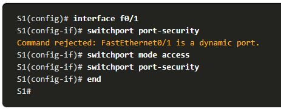

Utilisez la commande`show port-security interface` pour afficher les paramètres de sécurité de port actuels pour FastEthernet0/1.

- Remarquez que la sécurité des ports est activée, le mode de violation est shutdown et le nombre maximal d'adresses MAC est 1.
- Si un périphérique se connecte au port, le commutateur ajoute automatiquement l'adresse MAC du périphérique en tant que MAC sécurisé. Dans cet exemple, aucun périphérique n'est connecté au port.

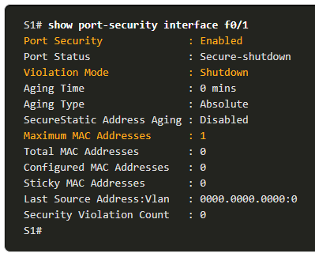

### Limiter le nombre d’adresses MAC

Pour définir le nombre maximal d'adresses MAC autorisées sur un port, utilisez la
commande suivante :

```bash
Switch(config-if)# switchport port-security maximum value
```

- La valeur de sécurité du port par défaut est 1.
- Le nombre maximal d'adresses MAC sécurisées pouvant être configurées dépend du commutateur et de l'IOS.
- Dans cet exemple, le maximum est 8192.

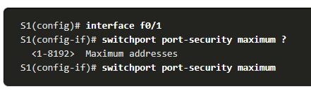

L'exemple illustre une configuration de sécurité de port complète pour FastEthernet0/1.

- L'administrateur spécifie un maximum de 4 adresses MAC, configure manuellement une adresse MAC sécurisée, puis configure le port pour apprendre dynamiquement des adresses MAC sécurisées supplémentaires jusqu'à 4 adresses MAC sécurisées au maximum.
- Utilisez les commandes `show port-security interface` et `show port-security address` pour vérifier la configuration.

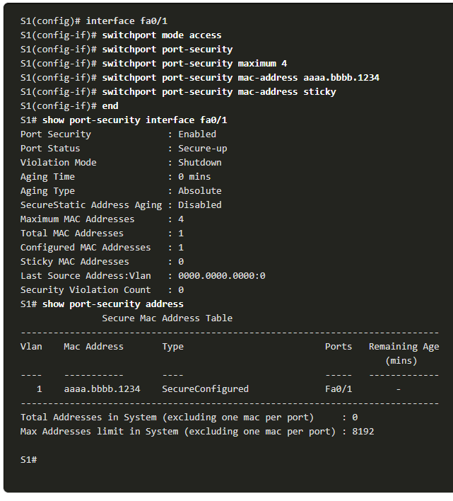

### Obsolescence de la sécurité des ports

L'obsolescence de la sécurité des ports peut être utilisée pour définir le temps d'obsolescence des adresses sécurisées statiques et dynamiques sur un port.

- Absolute - Les adresses sécurisées sur le port sont supprimées après le temps d'obsolescence spécifié.
- Inactivity - Les adresses sécurisées sur le port sont supprimées si elles sont inactives pendant une durée spécifiée.

Utilisez l'obsolescence pour supprimer les adresses MAC sécurisées sur un port sans supprimer manuellement les adresses MAC sécurisées existantes.

- l'obsolescence des adresses sécurisées configurées statiquement peut être activé ou désactivé par port.

Utilisez la commande `switchport port-security aging` pour activer ou désactiver l'obsolescence statique pour le port sécurisé, ou pour définir le temps ou le type d'obsolescence.

```bash
Switch(config-if)# switchport port-security aging {static | time time | type {absolute | inactivity}}
```

L'exemple montre un administrateur configurant le type d'obsolescence à 10 minutes d'inactivité.
La commande `show port-security interface` confirme les modifications.

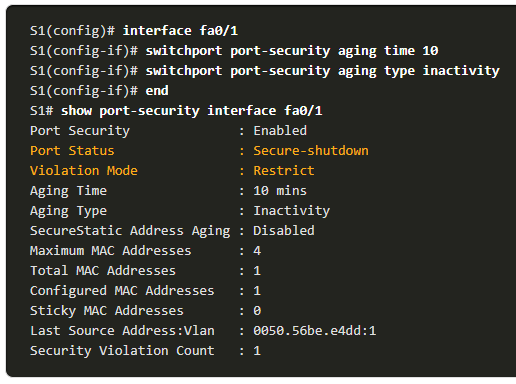

### Modes de violation de la sécurité des ports

Pour définir le mode de violation de sécurité du port, utilisez la commande suivante :

```bash
Switch(config-if)# switchport port-security violation {shutdown | restrict | protect}
```

Le tableau suivant montre comment un commutateur réagit en fonction du mode de violation configuré.

| Mode | Description |
| ---- | ---- |
| **shutdown** (par défaut) | Le port passe immédiatement à l'état désactivé par erreur, éteint la LED du port et envoie un message Syslog. Il incrémente le compteur de violations. Lorsqu'un port sécurisé est dans l'état désactivé par erreur, un administrateur doit le réactiver en entrant les commandes shutdown and no shutdown |
| **restrict** | Le port supprime les paquets dont l'adresse source est inconnue jusqu'à ce que vous supprimiez un nombre suffisant d'adresses MAC sécurisées pour passer en dessous de la valeur maximale ou que vous augmentiez la valeur maximale. Ce mode entraîne l'incrémentation du compteur de violation de sécurité et génère un message syslog. |
| **protect** | Il s'agit du mode de violation de sécurité le moins sécurisé. Le port supprime les paquets avec des adresses source MAC inconnues jusqu'à ce que vous supprimiez un nombre suffisant d'adresses MAC sécurisées pour descendre en dessous de la valeur maximale ou que vous augmentiez la valeur maximale. Aucun message Syslog n'est envoyé. |

L'exemple montre un administrateur remplaçant la violation de sécurité par «Restrict».
La sortie de la commande `show port-security interface` confirme que la modification a été effectuée.

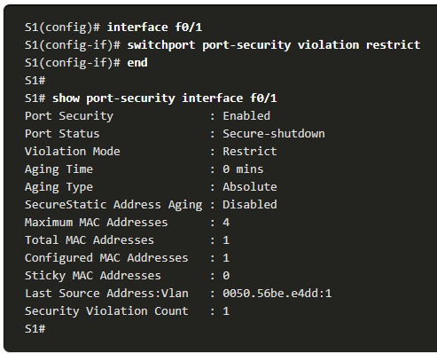

### Ports en état désactivé par erreur

Quand un port est désactivé et placé dans l'état error-disabled, aucun trafic n'est envoyé ou reçu sur ce port.
Une série de messages liés à la sécurité des ports s'affiche sur la console, comme illustré dans l'exemple suivant.

**Remarque**: Le protocole de port et l'état de la liaison passent à l'état bas et le voyant du port est éteint.

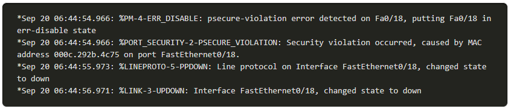

- Dans l'exemple, la commande `show interface` identifie l'état du port comme étant **err-disabled**.
- La sortie de la commande `show port-security interface`affiche désormais l'état du port comme étant **secure-shutdown**. Le compteur de violation de sécurité incrémente de 1.
- L'administrateur doit déterminer la cause de la violation de sécurité. Si un périphérique non autorisé est connecté à un port sécurisé, la menace de sécurité est éliminée avant de réactiver le port.
- Pour réactiver le port, utilisez d'abord la commande `shutdown` puis utilisez la commande `no shutdown`.

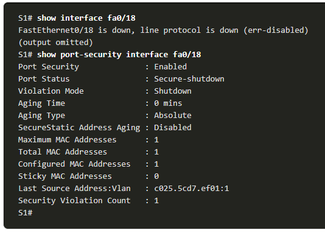

### Vérifier la sécurité des ports

Après avoir configuré la sécurité des ports sur un commutateur, vérifiez chaque interface pour vérifier que la sécurité des ports est correctement définie et assurez-vous que les adresses MAC statiques ont été correctement configurées.

Pour afficher les paramètres de sécurité des ports pour le commutateur, utilisez la commande `show port-security`

- L'exemple indique que les 24 interfaces sont configurées avec la commande `switchport port-security` car le maximum autorisé est 1 et le mode de violation est **shutdown**.
- Aucun périphérique n'est connecté, par conséquent, le CurrentAddr(Count) est 0 pour chaque interface.

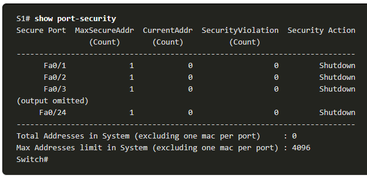

Utilisez la commande `show port-security interface` pour afficher les détails d'une interface spécifique.

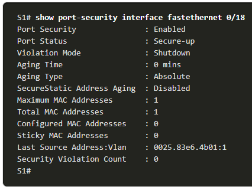

Pour vérifier que les adresses MAC sticky sont enregistrées dans la configuration, utilisez la commande `show run` comme indiqué dans l'exemple pour FastEthernet0/19.

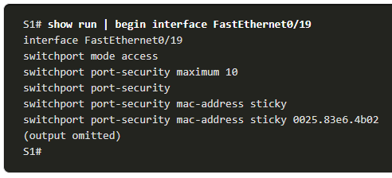

Pour afficher toutes les adresses MAC sécurisées configurées manuellement ou apprises dynamiquement sur toutes les interfaces de commutateur, utilisez la commande `show port-security address`

## 11.2 Atténiuer les attaques VLAN

### Revue des attaques VLAN

Une attaque par saut de VLAN peut être lancée de trois manières :

- Usurpation des messages DTP de l'hôte attaquant pour que le commutateur passe en mode de trunking. À partir de là, l'attaquant peut envoyer du trafic étiqueté avec le VLAN cible, et le commutateur délivre ensuite les paquets à la destination.
- Présentation d'un commutateur indésirable et activation de trunking. L'attaquant peut alors accéder à tous les VLAN sur le commutateur victime à partir du commutateur non autorisé.
- Un autre type d'attaque par saut de VLAN est une attaque à double étiquette (ou à double encapsulation). Cette attaque tire partie du fonctionnement du matériel sur la plupart des commutateurs.

#### VLAN Double-Tagging Attack

##### Step 1 - double tagging attack

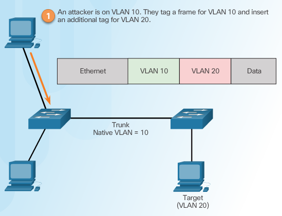

##### Step 2 - double tagging attack

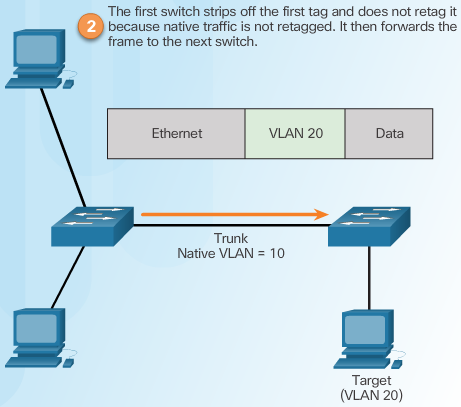

##### Step 3 - double tagging attack

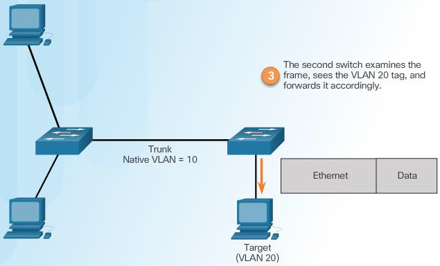

### Étapes pour atténuer les attaques de saut de VLAN

Utilisez les étapes suivantes pour atténuer les attaques par saut de VLAN :

- **Étape 1**: désactivez les négociations DTP sur les ports sans trunkà l'aide de la commande de configuration de l'interface `switchport mode access`.
- **Étape 2**: désactivez les ports inutilisés et placez-les dans un VLAN inutilisé.
- **Étape 3**: Activez manuellement la liaison trunksur un port trunkà l'aide de la commande `switchport mode` trunk.
- **Étape 4**: désactivez les négociations DTP (trunking automatique) sur les ports trunk à l'aide de la commande `switchport nonegotiate`.
- **Étape 5**: définissez le VLAN natif sur un VLAN autre que VLAN 1 à l'aide de la commande `switchport trunk native vlan vlan_number`.

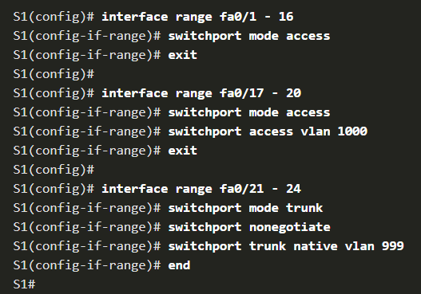

## 11.3 Atténuer les attaques DHCP

### Surveillance du DHCP

L'espionnage DHCP détermine si les messages DHCP proviennent d'une source de confiance ou non approuvée configurée administrativement. Il filtre ensuite les messages DHCP et limite la fiabilité du trafic DHCP de sources qui ne sont pas approuvées.

Les périphériques sous contrôle administratif (par exemple, les commutateurs, les routeurs et les serveurs) sont des sources fiables.

Tout appareil placé en dehors du pare-feu ou en dehors du réseau est une source non fiable.
Par ailleurs, tous les ports d'accès sont généralement traités comme des sources non fiables.

Une table DHCP est créée qui inclut l'adresse MAC source d'un périphérique sur un port non approuvé et l'adresse IP attribuée par le serveur DHCP à ce périphérique.

- L'adresse MAC et l'adresse IP sont liées ensemble.
- Par conséquent, cette table est appelée table de liaison d'espionnage DHCP.

### Étapes pour implémenter la surveillance du DHCP

Utilisez les étapes suivantes pour activer la surveillance DHCP (snooping) :

- **Étape 1**. Activez la surveillance DHCP à l'aide de la commande de configuration globale `ip dhcp snooping`.
- **Étape 2**. Sur les ports approuvés, utilisez la commande de configuration de l'interface `ip dhcp snooping trust`.
- **Étape 3**: sur les interfaces non fiables, limitez le nombre de messages de découverte DHCP pouvant être reçus à l'aide de la commande de configuration d'interface `ip dhcp snooping limit rate packets-per-second`.
- **Étape 4**: Activez la surveillance DHCP par VLAN, ou par plage de VLAN, en utilisant la commande de configuration globale `ip dhcp snooping vlan`.

### Exemple de configuration de surveillance DHCP

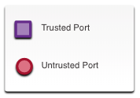 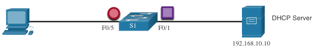

- La surveillance DHCP est d'abord activé sur S1.
- L'interface en amont du serveur DHCP est explicitement approuvée.
- F0 / 5 à F0 / 24 ne sont pas approuvés et sont donc limités à six paquets par seconde.
- Enfin, la surveillance DHCP est activée sur les VLANS 5, 10, 50, 51 et 52.

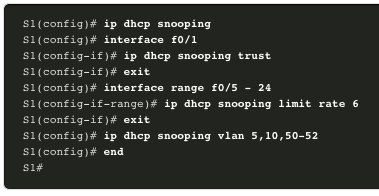

## 11.4 Aténuer les attaques d'ARP

### Directives d'implémentation DAI

Pour atténuer les risques d'usurpation ARP et d'empoisonnement ARP, suivez ces directives d'implémentation DAI :

- Activez globalement la surveillance DHCP.
- Activez la surveillance DHCP sur les VLAN sélectionnés.
- Activez l'inspection ARP dynamique (DAI) sur les VLAN sélectionnés.
- Configurer les interfaces approuvées avec l'espionnage DHCP et l'inspection ARP.

Il est généralement conseillé de configurer tous les ports de commutateur d'accès comme non approuvés et de configurer tous les ports de liaison montante qui sont connectés à d'autres commutateurs comme approuvés.

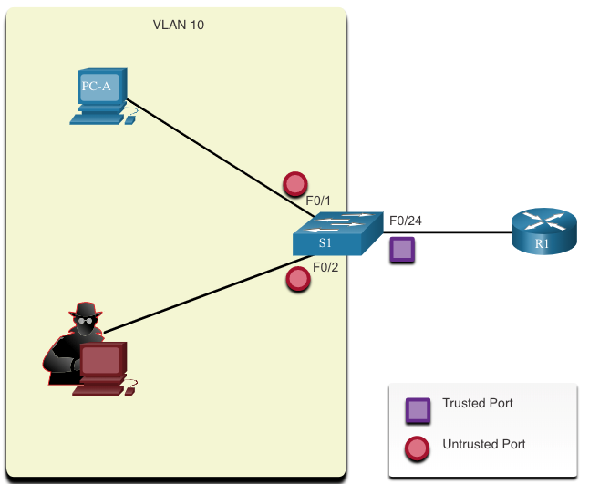

### Exemple de configuration DAI

Dans la topologie précédente, S1 connecte deux utilisateurs sur le VLAN 10.

- DAI sera configuré pour atténuer les attaques d'usurpation ARP et d'empoisonnement ARP.
- La surveillance DHCP est activée car DAI nécessite la table de liaison de surveillance DHCP pour fonctionner.
- Ensuite, la surveillance DHCP et l'inspection ARP sont activés pour les PC sur VLAN10.
- Le port de liaison montante vers le routeur est approuvé et est donc configuré comme approuvé pour la surveillance DHCP et l'inspection ARP.

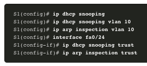

DAI peut également être configuré pour vérifier les adresses MAC et IP de destination ou de source :

- **MAC destination** - vérifie l'adresse MAC de destination dans l'en-tête Ethernet par rapport à l'adresse MAC cible dans la trame ARP.
- **MAC source** - vérifie l'adresse MAC source dans l'en-tête Ethernet par rapport à l'adresse MAC de l'expéditeur dans la trame ARP.
- **Adresse IP** - Vérifie la trame ARP pour les adresses IP invalides et inattendues, y compris les adresses 0.0.0.0, 255.255.255.255 et toutes les adresses de multidiffusion IP.

La commande de configuration globale `ip arp inspection validate{[src-mac][dst-mac][ip]}` est utilisée pour configurer DAI pour supprimer les paquets ARP lorsque les adresses IP ne sont pas valides.

- Il peut être utilisé lorsque les adresses MAC dans le corps des paquets ARP ne correspondent pas aux adresses spécifiées dans l'en-tête Ethernet.
- Une seule commande peut être configurée.
- Par conséquent, la saisie de plusieurs commandesiparpinspection validateécrase la commande précédente.
- Pour inclure plusieurs méthodes de validation, saisissez-les sur la même ligne de commande comme indiqué dans la sortie.

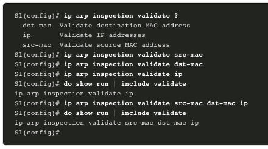

## 11.5 Atténuer les attaques STP

### PortFast et BPDU Guard

Les attaquants du réseau peuvent manipuler le protocole STP (SpanningTreeProtocol) pour mener une attaque en usurpant le pont racine et en modifiant la topologie d'un réseau.
Pour atténuer les attaques STP, on utilise PortFastet Bridge Protocol Data Unit (BPDU) Guard :

#### PortFast

- PortFast amène immédiatement un port à l'état de transfert à partir d'un état de blocage, en contournant les états d'écoute et d'apprentissage.
- Appliquer à tous les ports d'accès d'utilisateur final.

#### BPDU Guard

- BPDU guard – Désactive immédiatement par erreur un port qui reçoit une unité BPDU.
- Comme PortFast, la protection BPDU (BPDU guard) ne doit être configurée que sur les interfaces connectées aux périphériques d'extrémité.

### Configurer PortFast

PortFast contourne les états d'écoute et d'apprentissage STP pour minimiser le temps que les ports d'accès doivent attendre pour que STP converge.

- Activez PortFast uniquement sur les ports d'accès.
- PortFast sur les liaisons inter-commutateurs peut créer une boucle de spanning-tree.

PortFast peut être activé:

- **Sur une interface** - Utilisez la commande de configuration d'interface `spanning-treeportfast`.
- **Globalement** - Utilisez la commande de configuration  globale `spanning-tree portfast default` pour activer PortFast sur tous les ports d'accès.

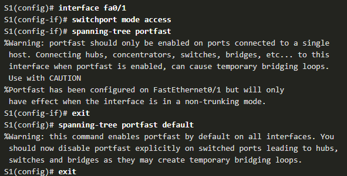

Pour vérifier si PortFastest activé globalement, vous pouvez utiliser soit:

- `show running-config | begin span commande`
- `show spanning-tree summary`

Pour vérifier si PortFast est activé sur une interface, utilisez la commande `show running-config interface type/number`.
La commande `spanning-tree interface type/number detail` peut également être utilisée pour la vérification.

### Configurer BPDU Guard

Un port d'accès pourrait recevoir des BPDU inattendues accidentellement ou parce qu'un utilisateur a connecté un commutateur non autorisé au port d'accès.

- Si une BPDU est reçue sur un port d'accès activé par BPDU Guard, le port est mis en état désactivé par erreur.
- Cela signifie que le port est arrêté et doit être réactivé manuellement ou récupéré automatiquement par la commande globale `errdisable recovery cause psecure_violation`.

BPDU Guard peut être activé:

- **Sur une interface** - Utilisez la commande de configuration d'interface `spanning-tree bpduguard` enable.
- **Globalement** - Utilisez la commande de configuration globale `spanning-tree portfast bpduguard default` pour activer BPDU Guard sur tous les ports d'accès.

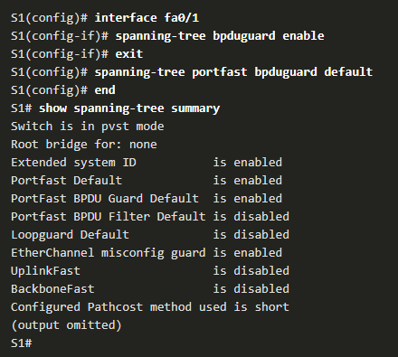
