# CCNA 2 - Notions de base sur la commutation, le routage et sans fil

## Chapitre 1 : Configuration de base du périphérique

### 1.1 Configurer un commutateur avec les paramètres d'origine

#### Séquence de démarrage du commutateur

1. Autotest a la mise sous tension
2. Executer le programme de démarrage
3. Initialisation précise du processeur
4. Initialisation du file system de la memoire Flash
5. Localise et charge dans la RAM une image du logiciel IOS

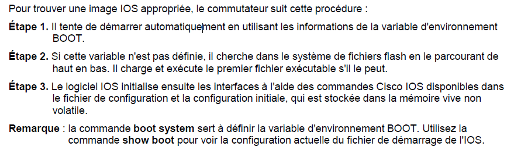

#### Récupération après une panne système

Le programme de démarrage peut également être utilisé pour gérer le commutateur s'il est impossible de charger l'IOS

Il est accessible via une connexion console. Pour cela

1. Connectez un PC via un câble de console au port de console du commutateur. Débranchez le cordon d'alimentation du commutateur.
2. Rebranchez le cordon d'alimentation sur le commutateur et maintenez le bouton Mode enfoncé.
3. La LED système devient brièvement orange, puis verte. Relâchez le bouton Mode.

L'invite switch: du programme de démarrage s'affiche dans le logiciel d'émulation de terminal sur le PC

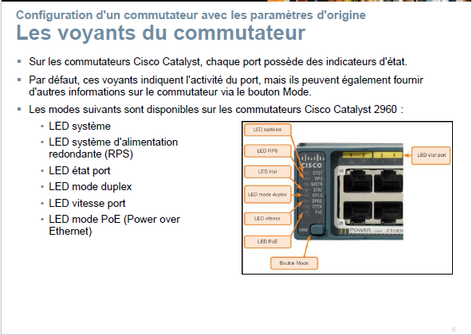

#### Les voyants du commutateur

Sur les commutateurs Cisco Catalyst, chaque port possède des indicateurs d'état.
Par défaut, ces voyants indiquent l'activité du port, mais ils peuvent également fournir d'autres informations sur le commutateur via le bouton Mode.

Les modes suivants sont disponibles sur les commutateurs Cisco Catalyst 2960:

- LED système
- LED système d'alimentation redondante (RPS)
- LED étatport
- LED mode duplex
- LED vitesse port
- LED mode PoE (Power over Ethernet)

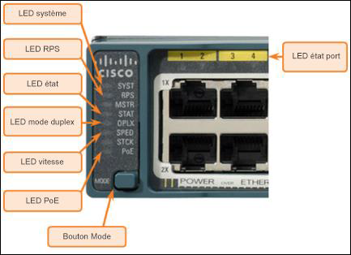

#### Préparation à la gestion de commutateur de base

Pour gérer à distance un commutateur Cisco, celui-ci doit être configuré pour accéder au réseau.

- Un câble console est utilisé pour connecter un PC au port de console d'un commutateur, à des fins de configuration.
- Les informationsIP (adresse, masque de sous-réseau, passerelle) doivent être attribuées à une interface virtuelle commutée (SVI).
- Si la gestion du commutateur s'effectue à partir d'un réseau distant, il faut également configurer une passerelle par défaut.
- Bien que ces paramètresIP permettent l'accès à distance au commutateur et sa gestion, celui-ci ne pourra pour autant acheminer les paquets de couche3.

#### La configuration de l'accès à la gestion du commutateur

| Tâche | Commandes IOS |
| ------------ | ------------ |
| Passez en mode de configuration globale. | S1#configure terminal |
| Passez en mode de configuration d'interface pour SVI. | S1(config)# interface vlan 99 |
| Configurez l'adresse IPv4 de l'interface de gestion. | S1(config-if)# ipaddress172.17.99.11 255.255.255.0 |
| Configurez l'adresse IPv6 de l'interface de gestion. | S1(config-if) # ipv6 address 2001:db8:acad:99::1/64 |
| Activez l'interface de gestion. | S1(config-if)# no shutdown |
| Repassez en mode d'exécution privilégié | S1(config-if)# end |
| Enregistrez la configuration en cours dans la configuration de démarrage. | S1# copy running-config startup-config |

#### Configuration de la passerelle par défaut du commutateur

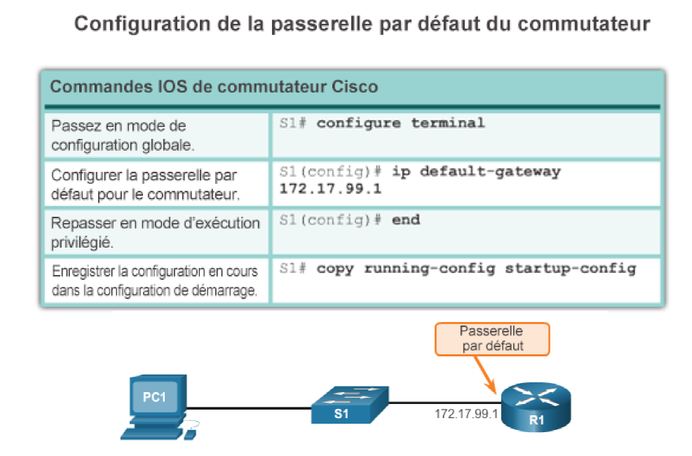

#### Vérification de la configuration de l'interface de gestion du commutateur

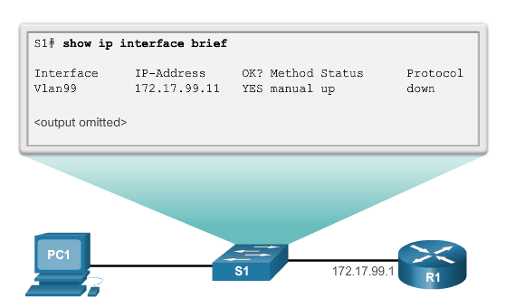

### 1.2 Configurer les ports du commutateur

#### La communication en mode duplex

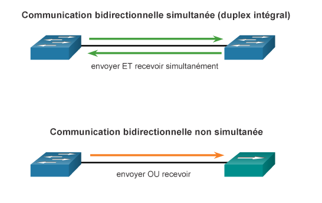

#### Configurer des ports de commutateur sur la couche physique

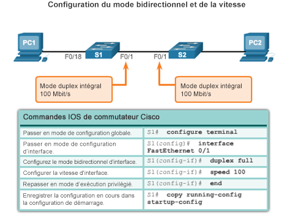

#### Auto-MDIX

Permet de ne plus se poser la question entre "Câble droit ou câble croisé?"

- Certains types de câbles (droits ou croisés) étaient indispensables pour connecter des appareils.
- La fonction Auto-MDIX (interface croisée dépendante du support) élimine ce problème.
- Lorsque cette fonction est activée, l'interface détecte automatiquement la connexion et la configure en conséquence.
- Lorsque la fonction Auto-MDIX est utilisée sur une interface, la vitesse et le mode duplex de celle-ci doivent être réglés sur Auto.
- Pour examiner le paramètre Auto-MDIX pour une interface spécifique, utilisez la commande `show controllersethernet-controller`

#### Configuration de la fonction auto-MDIX

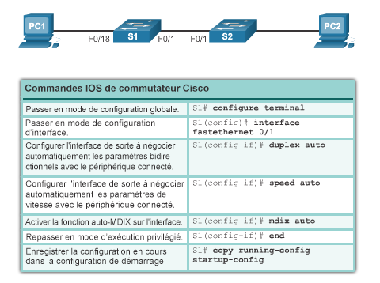

#### Les problèmes de la couche d'accès réseau

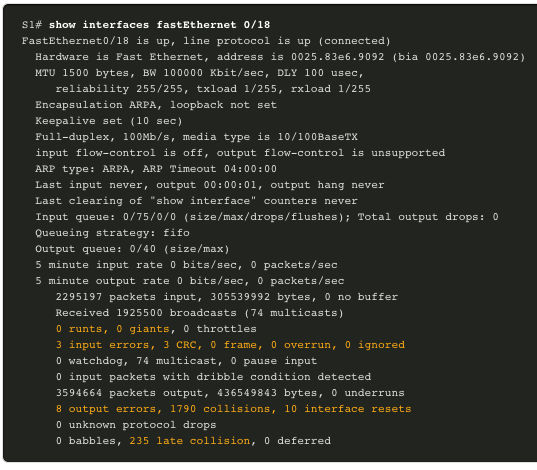

#### Erreurs en entrée de l'interface

Les erreurs en entrée signalées par la commande `show interfaces` sont notamment :

- **Trames incomplètes (RuntFrames)** -trames Ethernet plus courtes que la longueur minimale autorisée de 64 octets. Le mauvais fonctionnement des NIC est la cause habituelle d'un nombre excessif de trames incomplètes, mais il peut aussi être causé par des collisions.
- **Giants-trames** Ethernet qui dépassent la taille maximale autorisée
- **Erreurs CRC** -indiquent généralement une erreur relative au support ou au câble. Parmi les causes les plus courantes : les interférences électriques, des connexions lâches ou endommagées, ou l'utilisation d'un câble incorrect.

#### Erreurs en sortie de l'interface

Les erreurs en sortie signalées par la commande `show interfaces` sont notamment :

- **Collisions** - Les collisions dans les opérations en semi-duplex sont normales. Cependant, on ne doit pas observer de collisions sur une interface configurée pour la communication bidirectionnelle simultanée.
- **Collisions tardives** - Une collision tardive est une collision qui se produit après que 512 bits de la trame ont été transmis. La cause la plus fréquente : longueurs de câble excessives, mauvaise configuration des duplex. Par exemple, une extrémité d'une connexion peut être configurée pour le duplex intégral et l'autre pour le semi-duplex. Un réseau correctement conçu et configuré ne devrait jamais avoir de collisions tardives.

80% des problèmes de réseau proviennent de la couche physique

### 1.3 Accès à distance sécurisé

Deux protocoles : Telnet et SSH

- Telnet n'étant pas sécurisé, privilégier SSH

#### Le fonctionnement de SSH

- Secure Shell (SSH) est un protocole qui permet de se connecter de manière sécurisée (connexion chiffrée) à un appareil distant via une ligne de commande.
- En raison de la fiabilité de ses fonctions de chiffrement, SSH devrait remplacer Telnet pour les connexions de gestion.
- SSH utilise le port TCP22 par défaut.
- Telnet utilise le port TCP23.
- Il faut disposer d'une version du logicielIOS comprenant des fonctions et des fonctionnalités chiffrées pour pouvoir utiliser SSH sur les commutateurs Catalyst2960.

#### La configuration de SSH

1. Vérifiez que SSH est pris en charge: `show ip ssh`
2. Configurez le domaine IP.
3. Générez des paires de clés RSA.
4. Configurez l'authentification utilisateur.
5. Configurez les lignes vty.
6. Activez SSH version2.

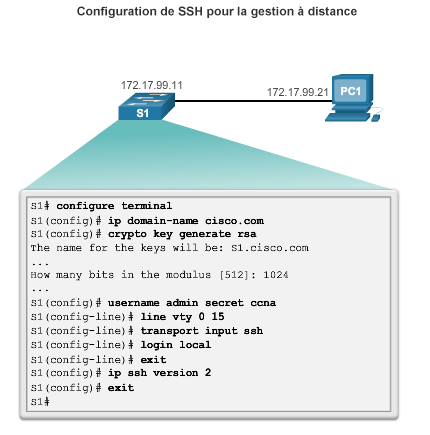

#### La vérification de SSH

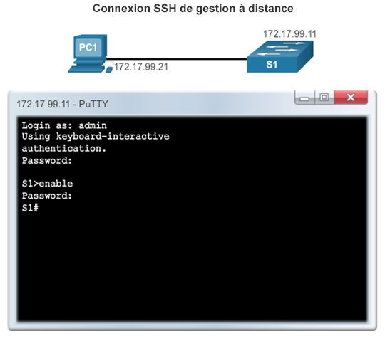
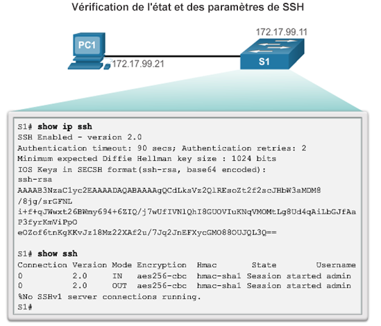

### 1.4 Configuration de base du Routeur

#### Paramètres de base du routeur

#### Configurer les paramètres de base du routeur

- Attribuer un nom à l'appareil: permet de le distinguer des autres routeurs.

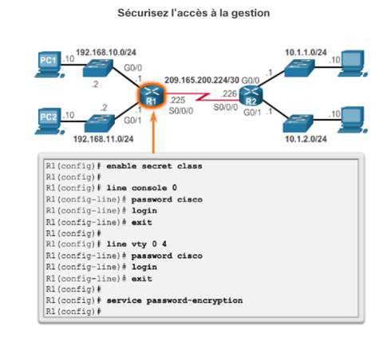

- Sécuriser l'accès à la gestion: sécurise l'accès en mode d'exécution privilégié, en mode d'exécution utilisateur et via Telnet, et chiffre les mots de passe.

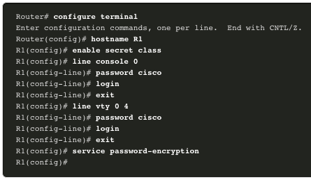

- Configurer une bannière: fournit une mention légale concernant les accès non autorisés.

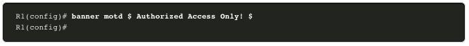

- Sauvegarder la configuration

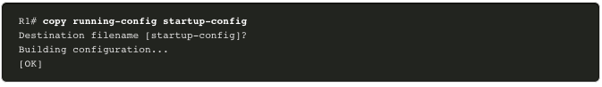

#### Configurer une interface de routeur IPv4

Pour être disponible, une interface de routeur doit être :

- configurée avec une adresse et un masque de sous-réseau ;
- activée avec la commande no shutdown(par défaut, les interfaces LAN et WAN ne sont pas activées) ;
- configurée avec la commandede fréquence d'horloge à l'extrémité DCE du câble série.

Une description peut être incluse (facultatif).

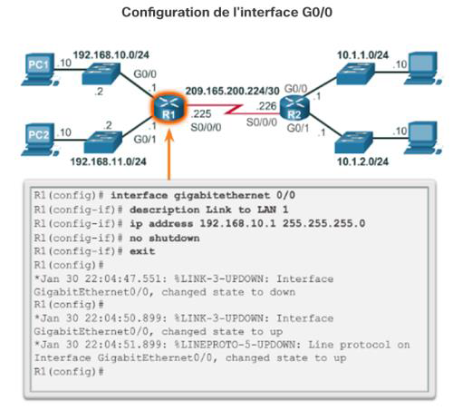

#### Configurer une interfacd de routeur IPv6

Configurez l'interface avec une adresse IPv6 et un masque de sous-réseau:

- Utilisez la commande de configuration d'interface `ipv6 address ipv6-address` / `ipv6-length[link-local | eui-64]`
- Activez-la à l'aide de la commande `no shutdown`

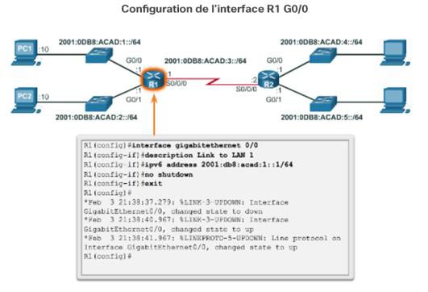

**Les interfaces IPv6 peuvent prendre en charge plusieurs adresses:**

- Configurez une adresse unicast globale spécifiée: `ipv6address ipv6-address` / `ipv6-length`
- Configurez une adresseIPv6 globale avec un identifiant d'interface (ID) situé dans les 64bits de poids faible: `ipv6address ipv6-address` / `ipv6-length eui-64`
- Configurez une adresse link-local: `ipv6addressipv6-address` / `ipv6-length link-local`

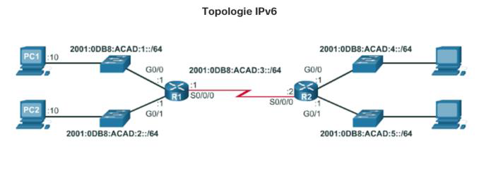

#### Configurer une interface de bouclage IPv6

**L'interface de bouclage est une interface logique interne du routeur.**

- Elle n'est pas attribuée à un port physique et est considérée comme une interface logicielle réglée automatiquement sur l'état «UP».
- Une interface de bouclage est utile à des fins de test.
- Elle joue un rôle important dans le routage OSPF.

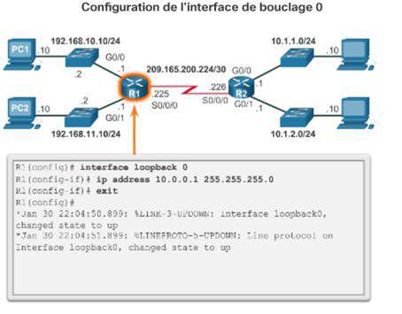

#### Vérification de la connectivité des réseaux connectés directement

#### Vérifier les paramètres d'interface

Les commandes show sont utilisées pour vérifier le fonctionnement et la configuration de l'interface :

- `show ip interfaces brief`
- `show ip route`
- `show running-config`

Certaines commandes show permettent de recueillir des informations plus détaillées sur l'interface :

- `show interfaces`
- `show ip interfaces`

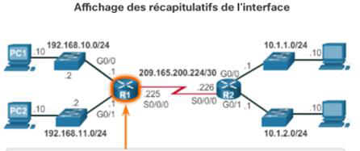
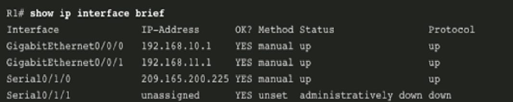

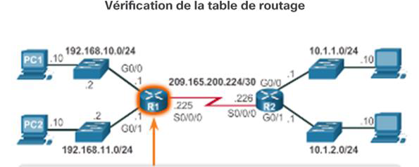
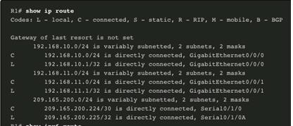

#### Vérifier les paramètres d'interface IPv6

**Utilisez les commandes suivantes pour vérifier la configuration de l'interface IPv6 :**

- `show ipv6 interface brief` : affiche un résumé pour chacune des interfaces.
- `show ipv6 interface gigabitethernet0/0` : affiche l'état de l'interface et toutes les adressesIPv6 associées à celle-ci.
- `show ipv6 route` : vérifie que les réseaux IPv6 et les adresses d'interface IPv6 spécifiques ont été intégrés dans la table de routage IPv6.

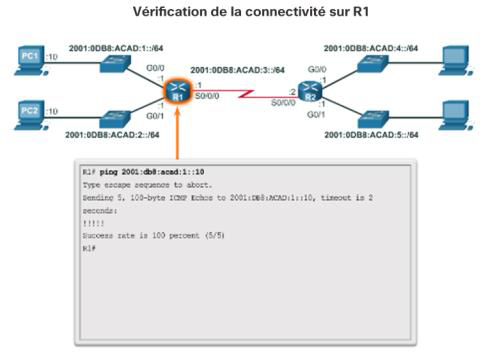

#### Filtrer les résultats des commandes show

Les résultats de la commande show peuvent être gérés à l'aide de la commande et des filtres suivants :

- Utilisez la commande terminal length nombrepour indiquer le nombre de lignes à afficher.
- Pour filtrer des résultats spécifiques, utilisez le symbole|après la commande show. Après ce symbole, les paramètres suivants peuvent être utilisés:
  - **section, include, exclude, begin**

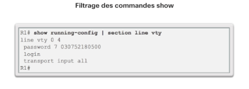 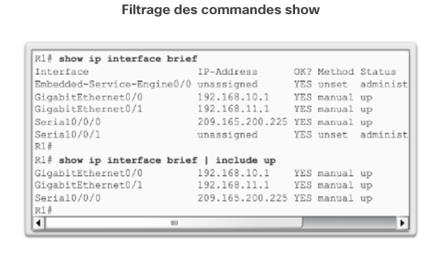

#### La fonction d'historique de commande

La fonction d'historique de commande stocke provisoirement la liste des commandes exécutées pour permettre l'accès:

- Pour rappeler des commandes, appuyez sur **Ctrl+P** ou **la flèche vers le haut**.
- Pour revenir aux commandes plus récentes, appuyez sur **Ctrl+N** ou la flèche vers le bas.
- Par défaut, l'historique de commande est activé et le système enregistre les 10 dernières commandes dans sa mémoire tampon. Utilisez la commande d'exécution privilégiée `show history` pour afficher le contenu de la mémoire tampon.
- Utilisez la commande d'exécution utilisateur `terminal history size` pour augmenter ou réduire la taille du tampon.

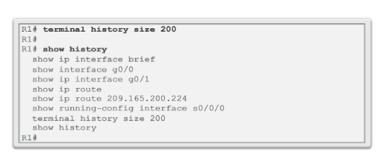
