# Chapitre 10 - Concepts de sécurité du réseau local LAN

## 10.1 Sécurité des terminaux

### Les attaques des résaux d'aujourd'hui

Les médias d'information couvrent généralement les attaques contre les réseaux d'entreprise. Recherchez simplement sur Internet les «dernières attaques réseau» pour trouver des informations à jour sur les attaques en cours. Probablement, ces attaques impliqueront un ou plusieurs des éléments suivants:

- **Déni de service distribué (DDoS)** – Il s'agit d'une attaque coordonnée de nombreux périphériques, appelés zombies, dans le but de dégrader ou d'interrompre l'accès du public au site Web et aux ressources d'une organisation.
- **Violation de données** – Il s'agit d'une attaque dans laquelle les serveurs de données ou les hôtes d'une organisation sont compromis pour voler des informations confidentielles.
- **Programme malveillant** – Il s'agit d'une attaque dans laquelle les hôtes d'une organisation sont infectés par des logiciels malveillants qui provoquent divers problèmes. Par exemple, un ransomware tel que WannaCry, illustré sur la figure, chiffre les données sur un hôte et verrouille l'accès jusqu'à ce qu'une rançon soit payée.


### Appareils de sécurité de réseau

Divers appareils de sécurité du réseau sont nécessaires pour protéger le périmètre du réseau contre tout accès extérieur. Ces périphériques peuvent inclure un routeur activé avec un réseau privé virtuel (VPN), un pare-feu de nouvelle génération (NGFW) et un périphérique de contrôle d'accès au réseau (NAC).

- **VPN - routeur activé** : Un routeur activé VPN fournit une connexion sécurisée aux utilisateurs distants sur un réseau public et dans le réseau d'entreprise. Les services VPN peuvent être intégrés au pare-feu.
- **Pare-feu de nouvelle génération** : Un NGFW fournit une inspection des paquets avec état, une visibilité et un contrôle des applications, un système de prévention des intrusions de nouvelle génération (NGIPS), une protection avancée contre les logiciels malveillants (AMP) et un filtrage d'URL.
- **NAC** : Un périphérique NAC comprend des services d'authentification, d'autorisation et de comptabilité (AAA). Dans les grandes entreprises, ces services peuvent être intégrés dans une appliance capable de gérer les politiques d'accès sur une grande variété d'utilisateurs et de types d'appareils. Le moteur de services d'identité de Cisco (ISE) est un exemple de périphérique NAC.

### Protection des terminaux

Les périphériques LAN tels que les commutateurs, les contrôleurs LAN sans fil (WLC) et d'autres périphériques de point d'accès (AP) interconnectent les points de terminaison. La plupart de ces périphériques sont sensibles aux attaques liées au réseau local couvertes par ce module.

Mais de nombreuses attaques peuvent également provenir de l'intérieur du réseau. Une fois qu'un hôte interne est infecté, il peut devenir un point d'entrée pour un hacker qui souhaite accéder à des éléments critiques du système, tels que les serveurs et les informations sensibles.

Les terminaux sont des hôtes qui se composent généralement d'ordinateurs portables, d'ordinateurs de bureau, de serveurs et de téléphones IP, ainsi que d'appareils appartenant aux employés qui sont généralement appelés apporter vos propres appareils (BYOD). Les terminaux sont particulièrement sensibles aux attaques liées aux logiciels malveillants qui proviennent de la messagerie électronique ou de la navigation Web. Ces terminaux ont généralement utilisé des fonctionnalités de sécurité traditionnelles basées sur l'hôte, telles que l'antivirus / anti-programme malveillant, les pare-feu basés sur l'hôte et les systèmes de prévention des intrusions (HIPS) basés sur l'hôte. Cependant, aujourd'hui, les terminaux sont mieux protégés par une combinaison de NAC, d'un logiciel AMP basé sur l'hôte, d'une appliance de sécurité de messagerie (ESA) et d'une appliance de sécurité Web (WSA). Les produits de protection avancée contre les logiciels malveillants (AMP) incluent des solutions des terminaux telles que Cisco AMP pour les terminaux.

La figure est une topologie simple représentant tous les périphériques de sécurité des réseaux et solutions des terminaux discutés dans ce module.

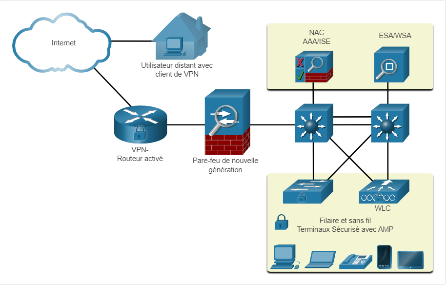

### Appliance de Sécurisation de La Messagerie Cisco

Les appliances de sécurité du contenu incluent un contrôle précis des e-mails et de la navigation Web pour les utilisateurs d'une organisation.

Selon le Talos Intelligence Group de Cisco, en juin 2019, 85% de tous les e-mails envoyés étaient du spam. Les attaques d'hameçonnage sont une forme de spam particulièrement virulente. Rappelons qu'une attaque d'hameçonnage incite l'utilisateur à cliquer sur un lien ou à ouvrir une pièce jointe. L'hameçonnage cible les employés ou les cadres supérieurs qui peuvent avoir des identifiants de connexion élevés. Ceci est particulièrement crucial dans l'environnement actuel où, selon le SANS Institute, 95% de toutes les attaques sur les réseaux d'entreprise sont le résultat d'une attaque d'hameçonnage réussie.

Cisco ESA est un appareil conçu pour surveiller le protocole SMTP (Simple Mail Transfer Protocol). Cisco ESA est constamment mis à jour par des flux en temps réel de Cisco Talos, qui détecte et corrèle les menaces et les solutions en utilisant un système de surveillance de base de données mondial. Ces données de renseignement sur les menaces sont extraites par Cisco ESA toutes les trois à cinq minutes. Voici quelques-unes des fonctions de Cisco ESA:

- Bloquer les menaces connues.
- Traitement contre les logiciels malveillants furtifs qui ont échappé à la détection initiale.
- Jeter les e-mails contenant des liens incorrects (comme indiqué sur la figure).
- Bloquer l'accès aux sites nouvellement infectés.
- Chiffrer le contenu des e-mails sortants pour éviter la perte de données.

Dans la figure, Cisco ESA rejette l'e-mail avec des liens incorrects.

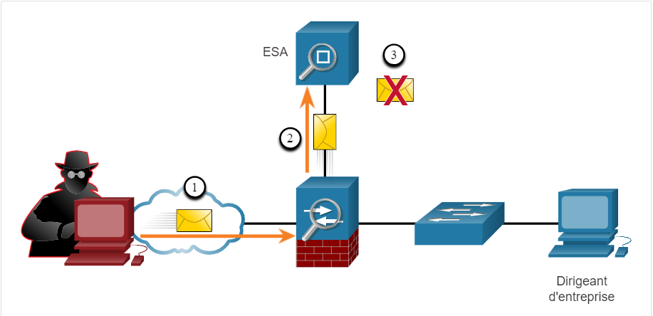

- L'acteur de menace envoie une attaque d'hameçonnage à un hôte important du réseau.
- Le pare-feu transmet tous les e-mails à l'ESA.
- L'ESA analyse le courrier électronique, l'enregistre et, s'il s'agit d'un logiciel malveillant, le jette.

### Appliance Cisco pour la Sécurité du Web

L'appliance de sécurité Web Cisco (WSA) est une technologie d'atténuation des menaces Web. Il aide les organisations à relever les défis de la sécurisation et du contrôle du trafic Web. Cisco WSA combine une protection avancée contre les logiciels malveillants, la visibilité et le contrôle des applications, des contrôles de politique d'utilisation acceptable et des rapports.

Cisco WSA offre un contrôle complet sur la façon dont les utilisateurs accèdent à Internet. Certaines fonctionnalités et applications, telles que le chat, la messagerie, la vidéo et l’audio, peuvent être autorisées, restreintes avec des limites de temps et de bande passante, ou bloquées, selon les besoins de l’organisation. Le WSA peut effectuer la liste noire des URL, le filtrage des URL, l'analyse des logiciels malveillants, la catégorisation des URL, le filtrage des applications Web et le chiffrement et le déchiffrement du trafic Web.

Dans la figure, un employé interne de l'entreprise utilise un smartphone pour essayer de se connecter à un site connu sur liste noire.

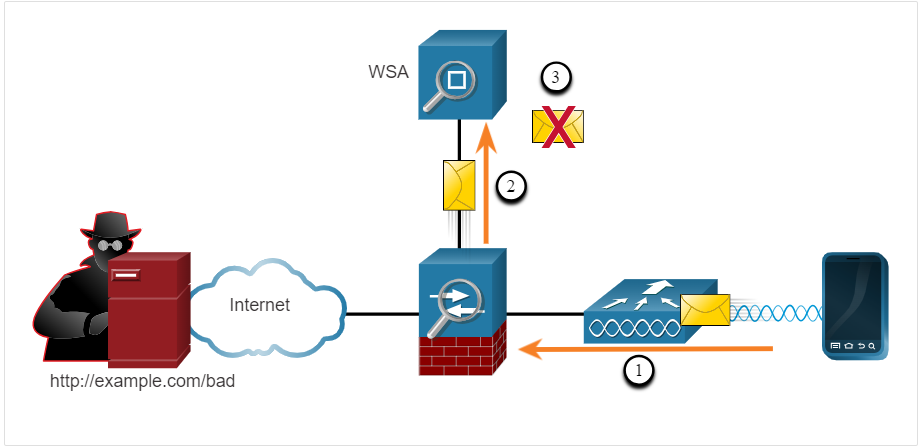

1. Un utilisateur essaye de se connecter à un site Web.
2. Le pare-feu transmet la demande de site Web à la WSA.
3. Le WSA évalue l'URL et détermine qu'il s'agit d'un site connu sur liste noire. Le WSA rejette le paquet et envoie un message d'accès refusé à l'utilisateur.

## 10.2 Contrôle d'accès

### Authentification avec un mot de passe Local

De nombreux types d'authentification peuvent être effectués sur des périphériques réseau, et chaque méthode offre différents niveaux de sécurité. La méthode d'authentification d'accès à distance la plus simple consiste à configurer une combinaison d'identifiant et de mot de passe sur la console, les lignes vty et les ports auxiliaires, comme indiqué dans les lignes vty de l'exemple suivant. Cette méthode est la plus simple à mettre en œuvre, mais elle est aussi la plus faible et la moins sécurisée. Cette méthode n'assure aucune responsabilité et le mot de passe est envoyé en clair. Toute personne disposant du mot de passe peut accéder à l'appareil.

```cisco
R1(config)# line vty 0 4
R1(config-line)# password ci5c0
R1(config-line)# login
```

SSH est une forme d'accès à distance plus sécurisée:

Il nécessite un nom d'utilisateur et un mot de passe, tous deux chiffrés lors de la transmission.
Le nom d'utilisateur et le mot de passe peuvent être authentifiés par la méthode de la base de données locale.
Il offre plus de responsabilité car le nom d'utilisateur est enregistré lorsqu'un utilisateur se connecte.
L'exemple suivant illustre SSH et les méthodes d'accès distant à la base de données locale.

```cisco
R1(config)# ip domain-name example.com
R1(config)# crypto key generate rsa general-keys modulus 2048
R1(config)# username Admin secret Str0ng3rPa55w0rd
R1(config)# ip ssh version 2
R1(config)# line vty 0 4
R1(config-line)# transport input ssh
R1(config-line)# login local
```

La méthode de la base de données locale présente certaines limites:

Les comptes d'utilisateurs doivent être configurés localement sur chaque périphérique. Dans un environnement de grande entreprise avec plusieurs routeurs et commutateurs à gérer, la mise en œuvre et la modification des bases de données locales sur chaque périphérique peuvent prendre du temps.
La configuration de la base de données locale ne fournit aucune méthode d'authentification de secours. Par exemple, que se passe-t-il si l'administrateur oublie le nom d'utilisateur et le mot de passe d'un périphérique ? À défaut d'une méthode de secours pour l'authentification, la récupération du mot de passe est la seule option.
Une meilleure solution consiste à faire en sorte que tous les périphériques se réfèrent à la même base de données de noms d'utilisateur et de mots de passe à partir d'un serveur central.

### Composants du AAA 

AAA signifie Authentification, Autorisation et Comptabilité. Le concept AAA est similaire à l'utilisation d'une carte de crédit, comme le montre la figure. La carte de crédit identifie qui peut l'utiliser, combien cet utilisateur peut dépenser et tient un compte des articles ou services achetés par l'utilisateur.

AAA fournit le cadre principal pour configurer le contrôle d'accès sur un périphérique de réseau. L'AAA est un moyen de contrôler qui est autorisé à accéder à un réseau (authentifier), ce qu'ils peuvent faire pendant qu'ils sont là (autoriser), et de vérifier quelles actions ils ont effectuées lors de l'accès au réseau (comptabilité).

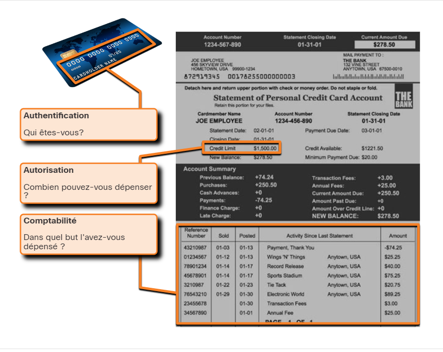

### Authentification 

#### Authentification AAA locale

L'AAA local stocke les noms d'utilisateur et les mots de passe localement dans un périphérique réseau tel que le routeur Cisco. Les utilisateurs s'authentifient auprès de la base de données locale, comme illustré dans la figure. L'authentification AAA locale est idéale pour les réseaux de petite taille.

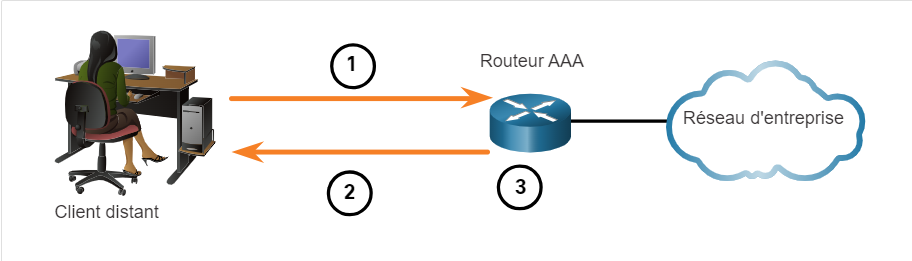

1. Le client établit une connexion avec le routeur.
2. Le routeur AAA invite l'utilisateur à saisir un nom d'utilisateur et un mot de passe.
3. Le routeur authentifie le nom d'utilisateur et le mot de passe à l'aide de la base de données locale, tandis que l'utilisateur obtient un accès au réseau en fonction des informations contenues dans la base de données locale.

#### Authentification AAA basée sur le serveur

Avec la méthode basée sur le serveur, le routeur accède à un serveur AAA central, comme indiqué sur la figure. Le serveur AAA contient les noms d'utilisateur et mot de passe pour tous les utilisateurs. Le routeur utilise les protocoles RADIUS (Service utilisateur d'accès à distance par authentification) ou TACACS+ (Contrôleur d'accès aux terminaux Système de contrôle d'accès) pour communiquer avec le serveur AAA. Lorsqu'il y a plusieurs routeurs et commutateurs, l'AAA sur serveur est plus approprié.

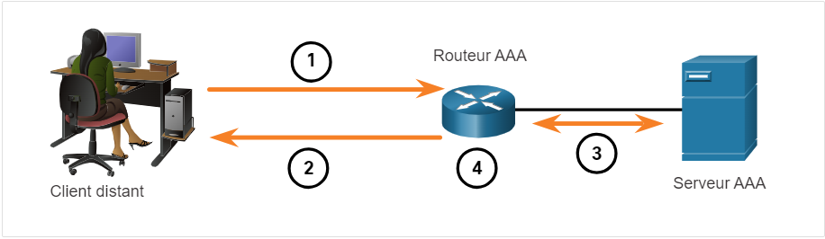

1. Le client établit une connexion avec le routeur.
2. Le routeur AAA invite l'utilisateur à saisir un nom d'utilisateur et un mot de passe.
3. Le routeur authentifie le nom d'utilisateur et le mot de passe à l'aide d'un serveur AAA.
4. L'utilisateur obtient un accès au réseau en fonction des informations contenues dans le serveur AAA distant.

### Autorisation

L'autorisation AAA est automatique et ne nécessite pas que les utilisateurs effectuent des étapes supplémentaires après l'authentification. L'autorisation régit ce que les utilisateurs peuvent et ne peuvent pas faire sur le réseau après leur authentification.

L'autorisation utilise un ensemble d'attributs qui décrivent l'accès de l'utilisateur au réseau. Ces attributs sont utilisés par le serveur AAA pour déterminer les privilèges et les restrictions pour cet utilisateur, comme illustré dans la figure.

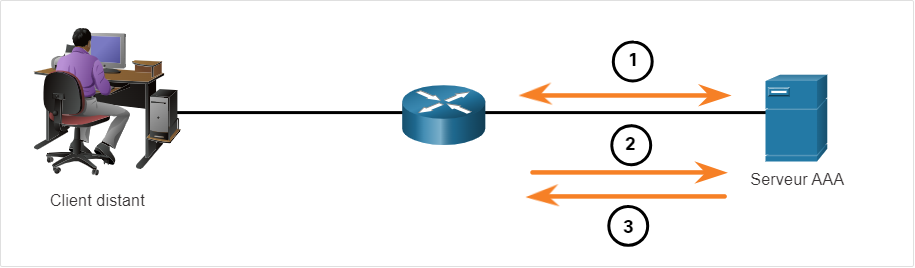

1. Lorsqu'un utilisateur a été authentifié, une session est établie entre le routeur et le serveur AAA.
2. Le routeur demande l'autorisation du serveur AAA pour le service demandé par le client.
3. Le serveur AAA renvoie une réponse PASS / FAIL pour autorisation.

### Comptabilité

La comptabilité AAA collecte et rapporte les données d'utilisation. Ces données peuvent être utilisées à des fins d'audit ou de facturation, par exemple. Les données recueillies peuvent indiquer les heures de début et de fin des connexions, les commandes exécutées, le nombre de paquets et le nombre d'octets.

Une utilisation principale de la comptabilité est de la combiner avec l'authentification AAA. Le serveur AAA conserve un journal détaillé de ce que l'utilisateur authentifié fait exactement sur le périphérique, comme indiqué sur la figure. Ce journal comprend toutes les commandes EXEC et les commandes de configuration exécutées par l'utilisateur. Il contient de nombreux champs de données, à savoir le nom d'utilisateur, la date et heure ainsi que les commandes saisies par l'utilisateur. Ces informations sont utiles lors du dépannage des appareils. Il fournit également des preuves lorsque des individus commettent des actes malveillants.

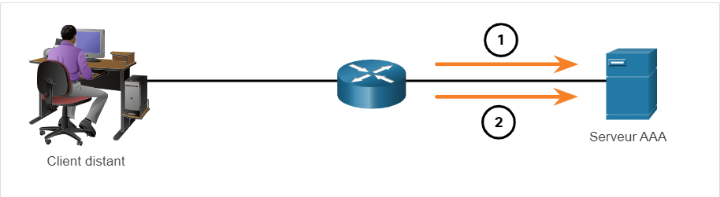

1. Lorsqu'un utilisateur a été authentifié, le processus de gestion des comptes AAA génère un message de démarrage pour commencer le processus.
2. Lorsque l'utilisateur a terminé, un message d'arrêt est enregistré et le processus de gestion des comptes s'arrête.

### 802.1X

La norme IEEE 802.1X est un protocole de contrôle d'accès et d'authentification basé sur les ports. Ce protocole empêche les stations de travail non autorisées de se connecter à un réseau local via des ports de commutation accessibles au public. Avant de mettre à disposition les services offerts par le commutateur ou le LAN, le serveur d'authentification authentifie chaque station de travail connectée à un port de commutation.

Avec l'authentification basée sur le port 802.1X, les périphériques du réseau ont des rôles spécifiques, comme illustré dans la figure.

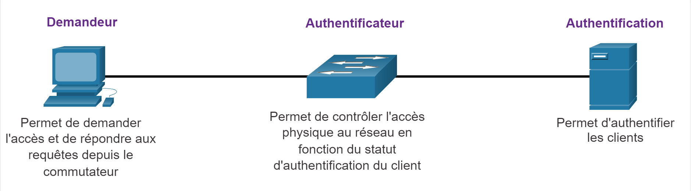

- **Client (Demandeur)** - Il s'agit d'un périphérique équipé d'un logiciel client conforme à la norme 802.1X, disponible pour les périphériques avec ou sans fil.
- **Commutateur (Authentificateur)** - Le commutateur sert d'intermédiaire entre le client et le serveur d'authentification. Il demande les informations d'identification du client, vérifie ces informations auprès du serveur d'authentification, puis transmet une réponse au client. Un autre dispositif qui pourrait servir d'authentificateur est un point d'accès sans fil.
- **Serveur d'authentification** – Le serveur valide l'identité du client et informe le commutateur ou le point d'accès sans fil que le client est ou n'est pas autorisé à accéder au LAN et aux services de commutateur.

## 10.3 Menaces pour la sécurité de niveau 2

### Les Catégories d'Attaque du Commutateur

Layer 2 Attacks

| Catégorie	| Exemples |
| ---- | ---- |
| Attaques de Table MAC	| Comprend les attaques par inondation de l'adresse MAC. |
| Attaques de VLAN | Comprend les attaques par saut et par double marquage de VLAN. Il comprend également les attaques entre les périphériques sur un VLAN commun. |
| Attaques DHCP | Comprend la famine DHCP et les attaques d'usurpation DHCP. |
| Attaques ARP | Comprend l'usurpation d'identité ARP et les attaques d'empoisonnement ARP. |
| Attaques par usurpation d'adresse | Comprend les attaques d'usurpation d'adresse MAC et d'adresse IP. |
| Attaques STP | Comprend les attaques de manipulation du protocole Spanning Tree (arbre enjambant). |

### Les Techniques d'Atténuation des Attaques du Commutateur

Layer 2 Attack Mitigation

| Solution | Description |
| Sécurité des ports | Empêche de nombreux types d'attaques, y compris les attaques d'inondation d'adresses MAC et les attaques de famine DHCP. | 
| Surveillance DHCP | Empêche la famine du DHCP et les attaques d'usurpation du DHCP. |
| Inspection ARP dynamique (DAI) | Empêche l'usurpation d'ARP et les attaques d'empoisonnement d'ARP. |
| Protection de la source IP (IPSG) | Empêche les attaques d'usurpation d'adresse MAC et IP. |

Ces solutions de couche 2 ne seront pas efficaces si les protocoles de gestion ne sont pas sécurisés. Par exemple, les protocoles de gestion Syslog, Protocole de gestion de réseau simple (SNMP), Protocole de transfert de fichiers trivial (TFTP), telnet, Protocole de transfer de fichier (FTP) et la plupart des autres protocoles courants ne sont pas sécurisés; par conséquent, les stratégies suivantes sont recommandées:

- Utilisez toujours des variantes sécurisées de ces protocoles telles que SSH, Protocole de copie sécuriséel (SCP), FTP sécurisé (SFTP) et couche de socket sécurisée / Sécurité de la couche de transport (SSL / TLS).
- Envisagez d'utiliser un réseau de gestion hors bande pour gérer les périphériques.
- Utilisez un VLAN de gestion dédié sur lequel seul circule le trafic de gestion.
- Utilisez des listes de contrôle d'accès pour filtrer tout accès non souhaité.

## 10.4 Attaque de Table d'Adresses MAC

### Inondation de la Table d'Adresses MAC

Toutes les tables MAC ont une taille fixe et par conséquent, un commutateur peut manquer de ressources pour stocker les adresses MAC. Les attaques par inondation d'adresses MAC profitent de cette limitation en bombardant le commutateur avec de fausses adresses sources MAC jusqu'à ce que la table d'adresses MAC du commutateur soit pleine.

Lorsque cela se produit, le commutateur traite la trame comme une monodiffusion inconnue et commence à inonder tout le trafic entrant sur tous les ports du même VLAN sans référencer la table MAC. Cette condition permet désormais à un acteur de menace de capturer toutes les trames envoyées d'un hôte à un autre sur le LAN local ou le VLAN local.

**Remarque:** Le trafic n'est inondé que dans le LAN local ou le VLAN. L'acteur de menace ne peut capturer que le trafic au sein du LAN ou VLAN local auquel il est connecté.

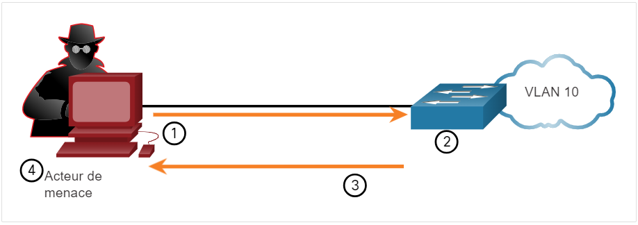

1. L'acteur de menace est connecté au VLAN 10 et utilise **macof** pour générer rapidement de nombreuses adresses MAC et IP de source et de destination aléatoires.
2. Sur une courte période, la table MAC du commutateur se remplit.
3. Lorsque la table MAC est pleine, le commutateur commence à inonder toutes les trames qu'il reçoit. Tant que macof continue de fonctionner, la table MAC reste pleine et le commutateur continue d'inonder toutes les trames entrantes sur chaque port associé au VLAN 10.
4. L'acteur de menace utilise ensuite un logiciel de reniflage de paquets pour capturer les trames de tous les appareils connectés au VLAN 10.

Si l'acteur de menace arrête l'exécution de macof ou est découvert et arrêté, le commutateur vieillit finalement les anciennes entrées d'adresse MAC de la table et recommence à agir comme un commutateur.

### Atténuation des attaques de Table d'Adresses MAC

Ce qui rend les outils tels que **macof** si dangereux, c'est qu'un attaquant peut créer une attaque de débordement de table MAC très rapidement. Par exemple, un commutateur Catalyst 6500 peut stocker 132 000 adresses MAC dans sa table d'adresses MAC. Un outil tel que **macof** peut inonder un interrupteur avec jusqu'à 8 000 faux trames par seconde; créer une attaque de débordement de la table d'adresses MAC en quelques secondes. L'exemple montre un exemple de sortie de la commande **macof** sur un hôte Linux.

```bash
# macof -i eth1
36:a1:48:63:81:70 15:26:8d:4d:28:f8 0.0.0.0.26413 > 0.0.0.0.49492: S 1094191437:1094191437(0) win 512 
16:e8:8:0:4d:9c da:4d:bc:7c:ef:be 0.0.0.0.61376 > 0.0.0.0.47523: S 446486755:446486755(0) win 512 
18:2a:de:56:38:71 33:af:9b:5:a6:97 0.0.0.0.20086 > 0.0.0.0.6728: S 105051945:105051945(0) win 512 
e7:5c:97:42:ec:1 83:73:1a:32:20:93 0.0.0.0.45282 > 0.0.0.0.24898: S 1838062028:1838062028(0) win 512 
62:69:d3:1c:79:ef 80:13:35:4:cb:d0 0.0.0.0.11587 > 0.0.0.0.7723: S 1792413296:1792413296(0) win 512 
c5:a:b7:3e:3c:7a 3a:ee:c0:23:4a:fe 0.0.0.0.19784 > 0.0.0.0.57433: S 1018924173:1018924173(0) win 512 
88:43:ee:51:c7:68 b4:8d:ec:3e:14:bb 0.0.0.0.283 > 0.0.0.0.11466: S 727776406:727776406(0) win 512 
b8:7a:7a:2d:2c:ae c2:fa:2d:7d:e7:bf 0.0.0.0.32650 > 0.0.0.0.11324: S 605528173:605528173(0) win 512 
e0:d8:1e:74:1:e 57:98:b6:5a:fa:de 0.0.0.0.36346 > 0.0.0.0.55700: S 2128143986:2128143986(0) win 512
```

Une autre raison pour laquelle ces outils d'attaque sont dangereux est qu'ils affectent non seulement le commutateur local, ils peuvent également affecter d'autres commutateurs de couche 2 connectés. Lorsque la table d'adresses MAC d'un commutateur est pleine, elle commence à déborder tous les ports, y compris ceux connectés à d'autres commutateurs de couche 2.

Pour atténuer les attaques de débordement de la table d'adresses MAC, les administrateurs réseau doivent implémenter la sécurité des ports. La sécurité des ports ne permettra d'apprendre qu'un nombre spécifié d'adresses sources MAC sur le port. La sécurité des ports est discuté plus en détail dans un autre module.

## 10.5 Attaques de Réseau LAN

### Attaques par saut de VLAN

Une attaque par saut de VLAN permet au trafic d'un VLAN d'être vu par un autre VLAN sans l'aide d'un routeur. Dans une attaque de saut de VLAN de base, l'acteur de menace configure un hôte pour qu'il agisse comme un commutateur afin de profiter de la fonction de port de trunking automatique activée par défaut sur la plupart des ports de commutateur.

L'acteur de menace configure l'hôte pour usurper la signalisation 802.1Q et le protocole DTP (Dynamic Trunking Protocol) propriétaire de Cisco pour signaler le trunk avec le commutateur de connexion. En cas de succès, le commutateur établit une liaison de trunk avec l'hôte, comme illustré dans la figure. L'acteur de menace peut désormais accéder à tous les VLAN sur le commutateur. L'acteur de menace peut envoyer et recevoir du trafic sur n'importe quel VLAN, sautant efficacement entre les VLAN.

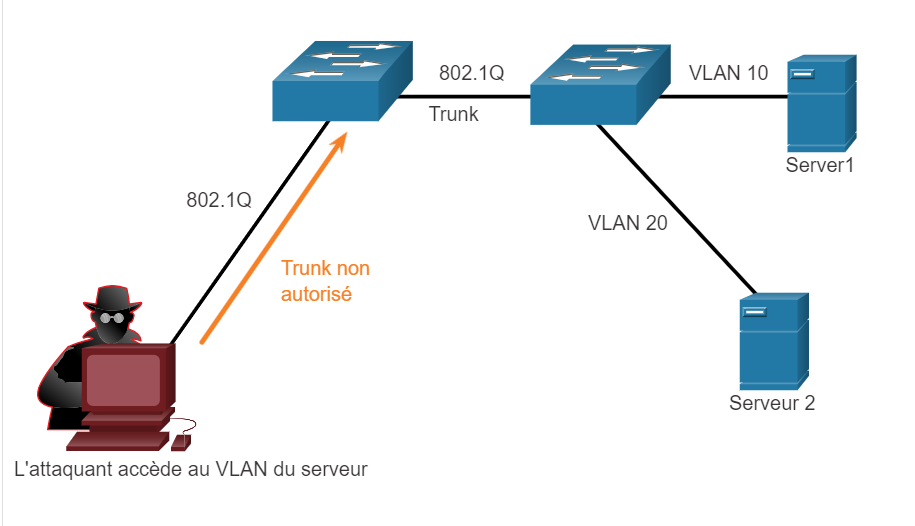

### Attaque de Double Marquage VLAN

Un acteur de menace dans des situations spécifiques pourrait intégrer une balise 802.1Q cachée dans le trame qui a déjà une balise 802.1Q. Cette balise permet au trame d'accéder à un VLAN que la balise 802.1Q d'origine n'a pas spécifié.

1. **Étape 1** - L'acteur de menace envoie un trame 802.1Q à double marquage au commutateur. L'en-tête externe a la balise VLAN de l'acteur de menace, qui est identique au VLAN natif du port de trunk. Pour les besoins de cet exemple, supposons qu'il s'agit du VLAN 10. La balise intérieure est le VLAN victime, dans cet exemple, le VLAN 20.
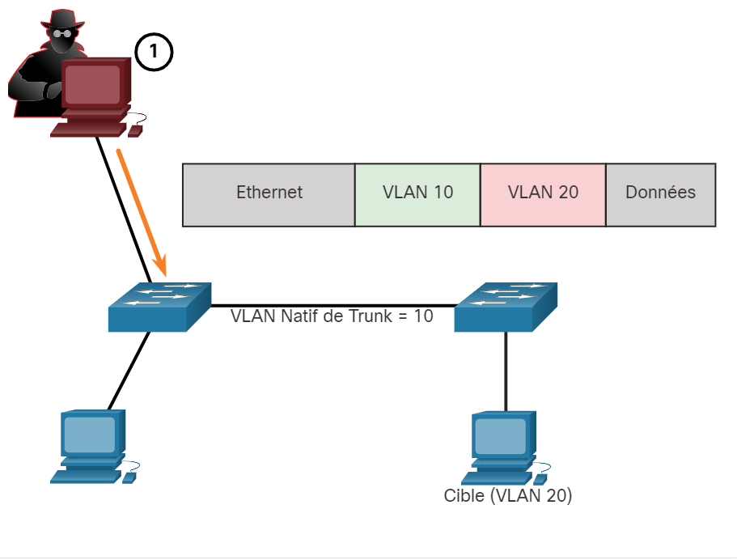
2. Le trame arrive sur le premier commutateur, qui examine la première balise 802.1Q de 4 octets. Le commutateur voit que le trame est destinée au VLAN 10, qui est le VLAN natif. Le commutateur transfère le paquet sur tous les ports VLAN 10 après avoir supprimé la balise VLAN 10. La trame n'est pas repérée car elle fait partie du VLAN natif. À ce stade, la balise VLAN 20 est toujours intacte et n'a pas été inspectée par le premier commutateur.
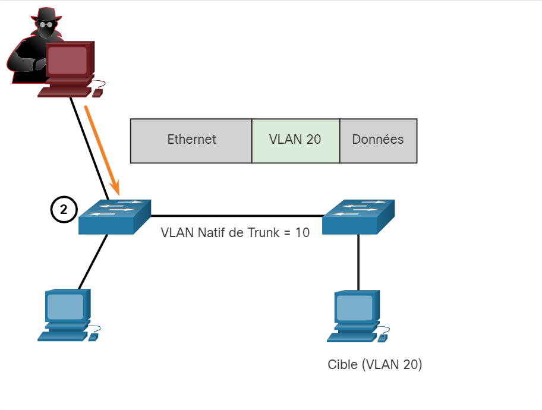
3. Le trame arrive au deuxième commutateur qui n'a aucune connaissance qu'elle était censée être pour le VLAN 10. Le trafic VLAN natif n'est pas balisé par le commutateur d'envoi comme spécifié dans la spécification 802.1Q. Le deuxième commutateur ne regarde que la balise 802.1Q interne que l'acteur de menace a insérée et voit que le trame est destinée au VLAN 20, le VLAN cible. Le deuxième commutateur envoie le trame à la cible ou l'inonde, selon qu'il existe une entrée de table d'adresses MAC existante pour la cible.
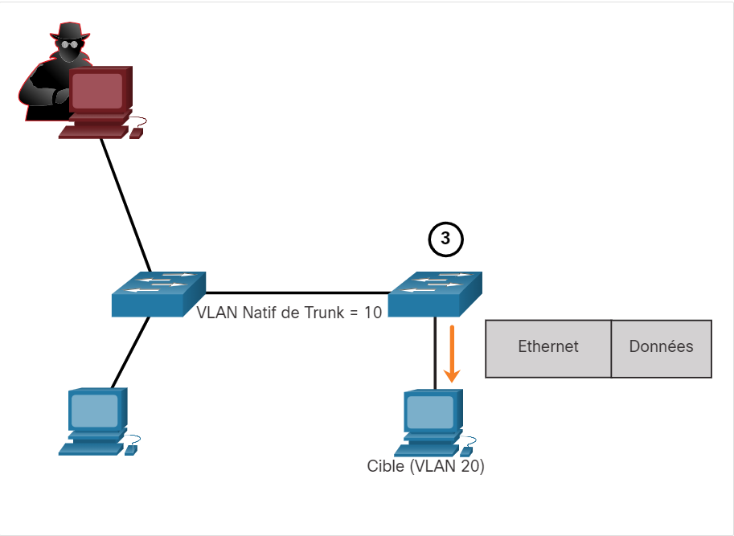

Une attaque de double marquage VLAN est unidirectionnelle et ne fonctionne que lorsque l'attaquant est connecté à un port résidant dans le même VLAN que le VLAN natif du port de trunk. L'idée est que le double marquage permet à l'attaquant d'envoyer des données à des hôtes ou des serveurs sur un VLAN qui autrement seraient bloqués par un certain type de configuration de contrôle d'accès. Vraisemblablement, le trafic de retour sera également autorisé, ce qui donnera à l'attaquant la possibilité de communiquer avec des périphériques sur le VLAN normalement bloqué.

#### Atténuation des Attaques VLAN

Les attaques de saut de VLAN et de double marquage VLAN peuvent être évitées en mettant en œuvre les directives de sécurité de jonction suivantes, comme indiqué dans un module précédent:

Désactivez le trunking sur tous les ports d'accès.
Désactivez le trunking automatique sur les liaisons de jonction afin que les trunks doivent être activées manuellement.
Assurez-vous que le VLAN natif n'est utilisé que pour les liaisons de trunk.

### Attaques DHCP

Deux types d'attaques DHCP sont la famine DHCP et l'usurpation DHCP. Les deux attaques sont atténuées par l'implémentation de l'espionnage DHCP.

#### Attaque de Famine DHCP

Le but de l'attaque de famine DHCP est de créer un DoS pour connecter les clients. Les attaques par épuisement des ressources DHCP reposent sur un outil d'attaque, Gobbler, par exemple.

Gobbler a la possibilité d'examiner l'intégralité des adresses IP louables et essaie de toutes les louer. Plus précisément, il crée des messages de découverte DHCP avec de fausses adresses MAC.

#### Attaque d'Usurpation DHCP

Une attaque par usurpation via le service DHCP se produit lorsqu'un serveur DHCP non autorisé (rogue) se connecte au réseau et fournit des paramètres de configuration IP incorrects aux clients légitimes. Un serveur malhonnête peut fournir toute une série d'informations trompeuses :

- Passerelle par défaut incorrecte - Le serveur escroc fournit une passerelle non valide ou l'adresse IP de son hôte pour créer une attaque d'homme au milieu. Cette approche peut passer totalement inaperçue, car l'intrus intercepte le flux de données via le réseau.
- Serveur DNS incorrect - Le serveur escroc fournit une adresse de serveur DNS incorrecte pointant l'utilisateur vers un site Web néfaste.
- Adresse IP incorrecte - TLe serveur escroc fournit une adresse IP invalide créant efficacement une attaque DoS sur le client DHCP.

1. **Étape 1** : Un acteur de menace connecte un serveur DHCP non autorisé
Un acteur de menace connecte avec succès un serveur DHCP non autorisé à un port de commutateur sur le même sous-réseau et les VLAN que les clients cibles. Le serveur non autorisé sert à fournir aux clients de fausses informations de configuration IP.
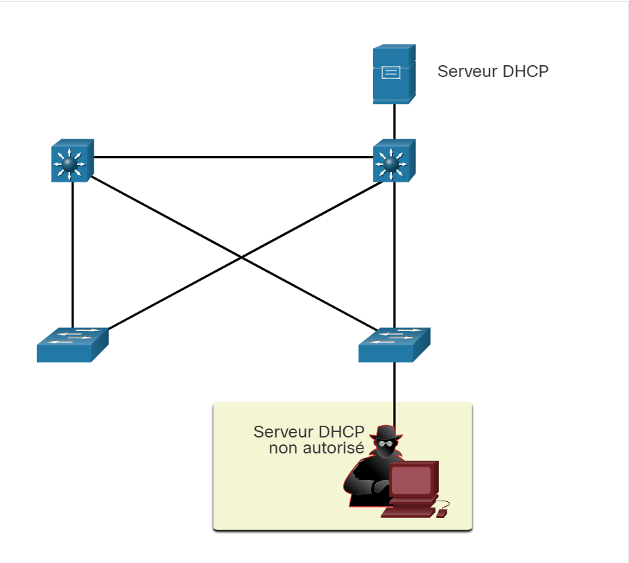

2. **Étape 2** : Le client diffuse des messages de découverte DHCP
Un client légitime se connecte au réseau et nécessite des paramètres de configuration IP. Par conséquent, le client diffuse une demande de découverte DHCP à la recherche d'une réponse d'un serveur DHCP. Les deux serveurs recevront le message et répondront.
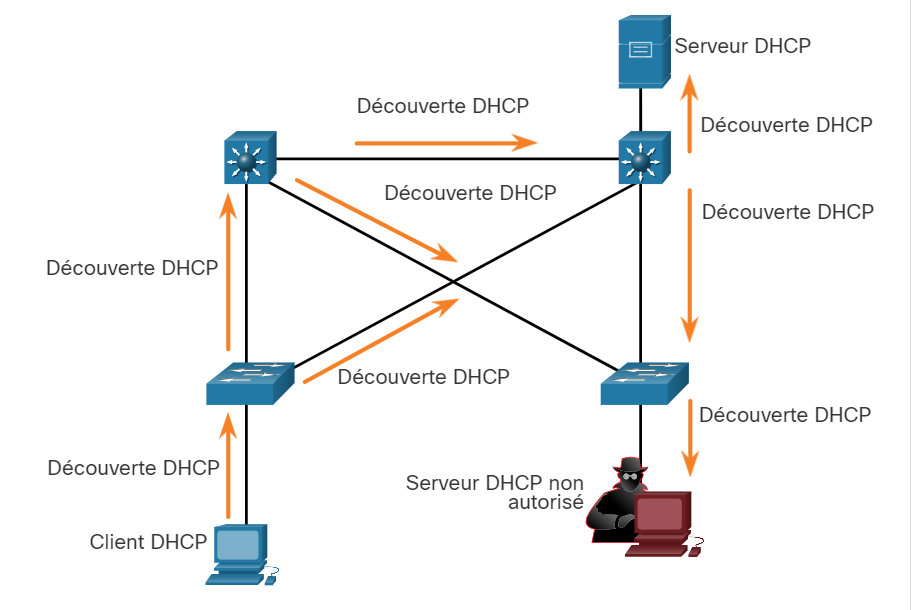
3. **Étape 3** : Réponse DHCP légitime et non autorisée
Le serveur DHCP légitime répond avec des paramètres de configuration IP valides. Cependant, le serveur escroc répond également par une offre DHCP contenant des paramètres de configuration IP définis par l'acteur de menace. Le client répond alors à la première offre reçue.
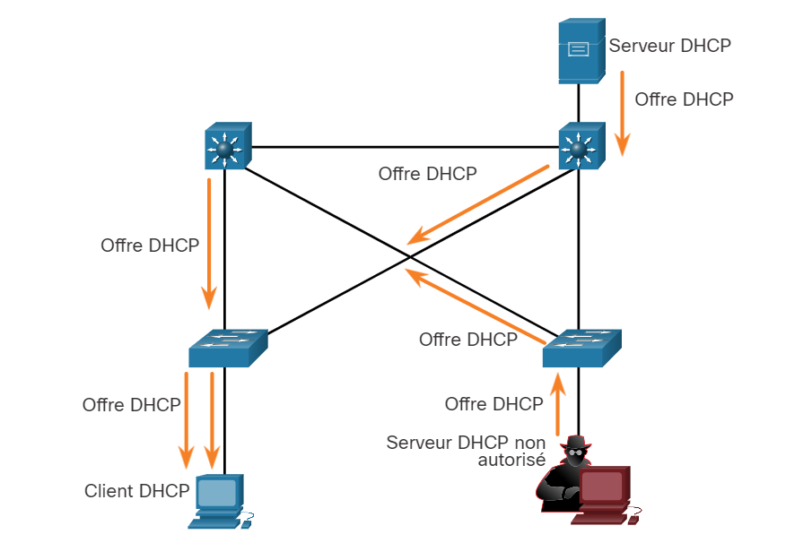
4. **Étape 4** : Le client accepte l'offre DHCP non autorisée
l'offre d'escroquerie a été reçue en premier et, par conséquent, le client diffuse une demande DHCP acceptant les paramètres IP définis par l'acteur de menace. Les serveurs légitime et non autorisé ont reçu la requête.
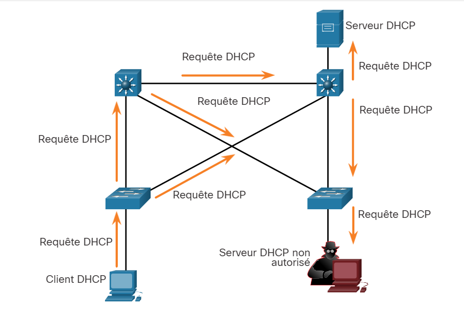
5. **Étape 5** : Serveur escroc confirme
Le serveur escorc monodiffuse un message de réponse au client pour accuser réception de sa demande. Le serveur légitime cesse de communiquer avec le client.
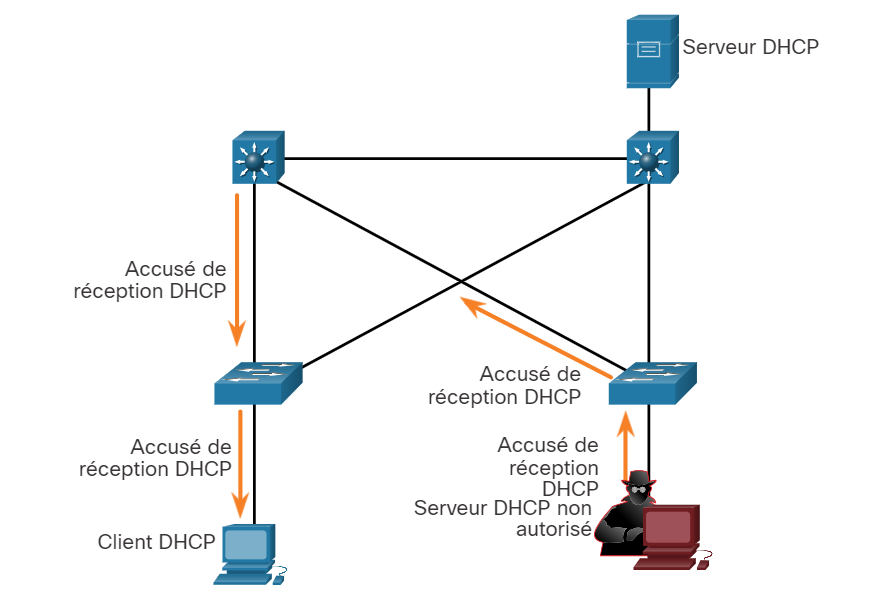

### Attaques ARP

Rappelons que les hôtes diffusent des requêtes ARP pour déterminer l'adresse MAC d'un hôte avec une adresse IP particulière. Cela est généralement fait pour découvrir l'adresse MAC de la passerelle par défaut. Tous les hôtes du sous-réseau reçoivent et traitent la requête ARP. L'hôte dont l'adresse IP correspond à la requête ARP envoie une réponse ARP.

Selon le RFC ARP, un client est autorisé à envoyer une réponse ARP non sollicitée appelée «ARP gratuit». Lorsqu'un hôte envoie une réponse ARP gratuite, les autres hôtes du sous-réseau stockent l'adresse MAC et l'adresse IP contenue par la réponse ARP gratuite dans leurs tableaux ARP.

Le problème est qu'un attaquant peut envoyer un message ARP gratuit contenant une adresse MAC usurpée à un commutateur, et le commutateur mettrait à jour sa table MAC en conséquence. Par conséquent, tout hôte peut prétendre être le propriétaire de toute combinaison d'adresses IP et MAC qu'il choisit. Dans une attaque typique, un acteur de menace peut envoyer des réponses ARP non sollicitées à d'autres hôtes du sous-réseau avec l'adresse MAC de l'acteur de menace et l'adresse IP de la passerelle par défaut.

Il existe de nombreux outils disponibles sur Internet pour créer des attaques ARP homme-au-milieu, notamment dsniff, Cain & Abel, ettercap, Yersinia et autres. IPv6 utilise le protocole de découverte de voisin ICMPv6 pour la résolution d'adresse de couche 2. IPv6 inclut des stratégies pour atténuer l'usurpation de publicité de voisin, de la même manière que IPv6 empêche une réponse ARP usurpée.

L'usurpation ARP et l'empoisonnement ARP sont atténués par l'implémentation de DAI.

1. **Étape 1** : État Normal avec Tables MAC Convergentes
Chaque périphérique a une table MAC précise avec les adresses IP et MAC correctes pour les autres périphériques sur le LAN
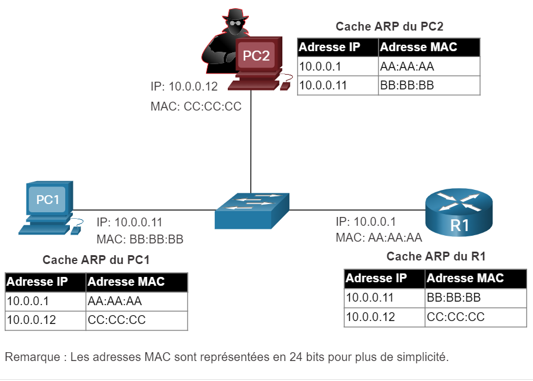
2. **Étape 2** : Attaque d'Usurpation ARP
L'acteur de menace envoie deux réponses ARP usurpées et gratuites pour tenter de remplacer R1 en tant que passerelle par défaut:
    1. Le premier informe tous les périphériques du LAN que l'adresse MAC de l'acteur de menace (CC: CC: CC) correspond à l'adresse IP de R1, 10.0.0.1.
    2. Le second informe tous les périphériques du LAN que l'adresse MAC de l'acteur de menace (CC: CC: CC) correspond à l'adresse IP du PC1, 10.0.0.11.
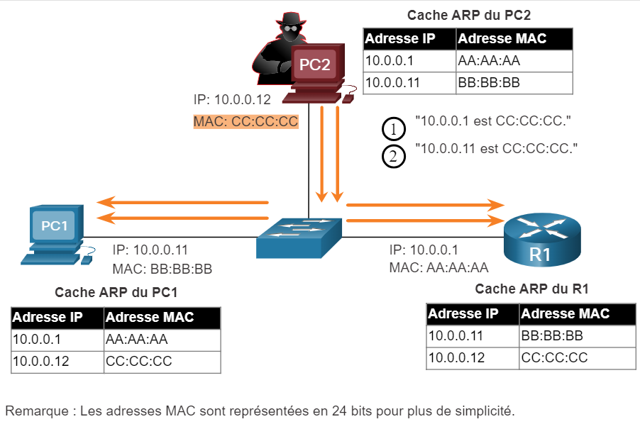
3. **Étape 3** : Attaque Empoisonnante avec Attaque de L'Homme-au-Milieu ARP
R1 et PC1 suppriment l'entrée correcte pour l'adresse MAC de l'un l'autre et la remplacent par l'adresse MAC de PC2. L'acteur de la menace a désormais empoisonné les caches ARP de tous les périphériques du sous-réseau. L'empoisonnement par ARP conduit à diverses attaques de l'homme au milieu, ce qui constitue une grave menace pour la sécurité du réseau.
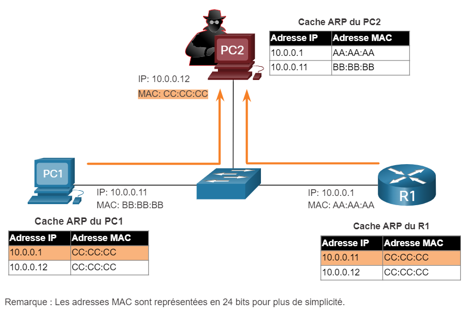

### Attaques par Usurpation d'Adresse

Les adresses IP et les adresses MAC peuvent être usurpées pour diverses raisons. L'usurpation d'adresse IP est lorsqu'un acteur de menace détourne une adresse IP valide d'un autre périphérique sur le sous-réseau ou utilise une adresse IP aléatoire. L'usurpation d'adresse IP est difficile à atténuer, en particulier lorsqu'elle est utilisée à l'intérieur d'un sous-réseau auquel appartient l'IP.

Les attaques d'usurpation d'adresse MAC se produisent lorsque les acteurs de menace modifient l'adresse MAC de leur hôte pour correspondre à une autre adresse MAC connue d'un hôte cible. L'hôte attaquant envoie ensuite un trame dans l'ensemble du réseau avec l'adresse MAC nouvellement configurée. Lorsqu'un commutateur reçoit le trame, il examine l'adresse MAC source. Le commutateur écrase l'entrée de table MAC actuelle et attribue l'adresse MAC au nouveau port, comme illustré dans la figure. Il transfère ensuite par inadvertance des trames destinées à l'hôte cible à l'hôte attaquant.

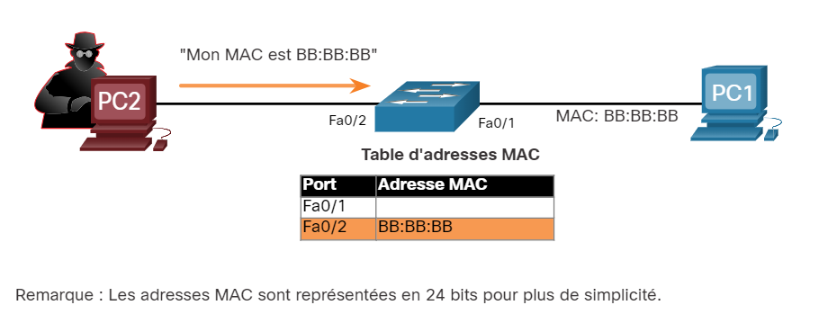

Lorsque l'hôte cible envoie du trafic, le commutateur corrige l'erreur, en réalignant l'adresse MAC sur le port d'origine. Pour empêcher le commutateur de ramener l'affectation de port à son état correct, l'acteur de menace peut créer un programme ou un script qui enverra constamment des trames au commutateur afin que le commutateur conserve les informations incorrectes ou usurpées. Il n'y a pas de mécanisme de sécurité au niveau de la couche 2 qui permet à un commutateur de vérifier la source des adresses MAC, ce qui le rend si vulnérable à l'usurpation d'identité.

L'usurpation d'adresse IP et MAC peut être atténuée en implémentant IPSG.

### Attaque STP

Les attaquants du réseau peuvent manipuler le protocole STP (Spanning Tree Protocol) pour mener une attaque en usurpant le pont racine et en modifiant la topologie d'un réseau. Les attaquants peuvent faire apparaître leurs hôtes comme des ponts racine; et par conséquent, capturez tout le trafic pour le domaine commuté immédiat.

Pour mener une attaque de manipulation STP, l'hôte attaquant diffuse des unités de données de protocole de pont STP (BPDU) contenant des modifications de configuration et de topologie qui forceront les recalculs de spanning-tree, comme illustré dans la figure. Les BPDU envoyés par l'hôte attaquant annoncent une priorité de pont inférieure pour tenter d'être élu pont racine.

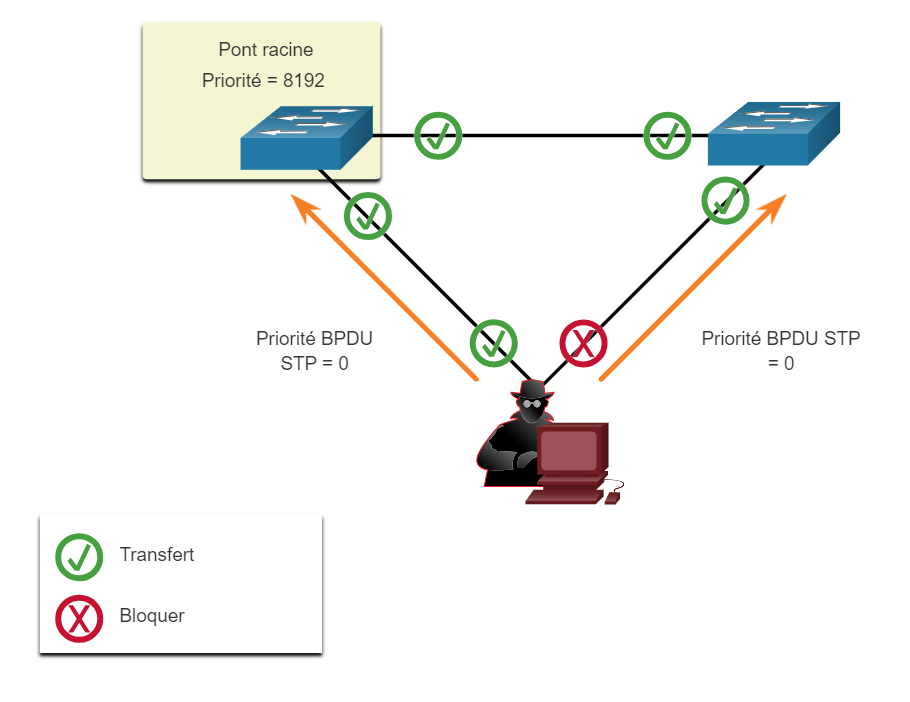

En cas de succès, l'hôte attaquant devient le pont racine, comme le montre la figure, et peut désormais capturer une variété de trames qui autrement ne seraient pas accessibles.

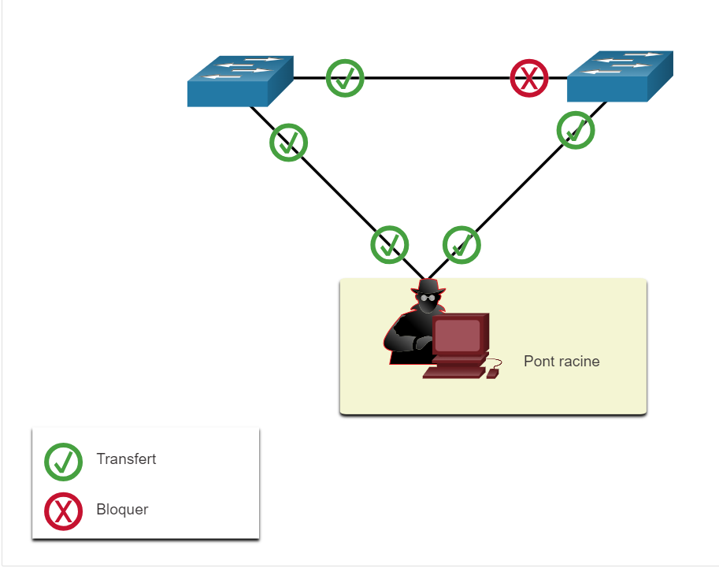

Cette attaque STP est atténuée par l'implémentation de BPDU Guard sur tous les ports d'accès. BPDU Guard est discuté plus en détail plus tard dans le cours.

### Reconnaissance CDP

Le protocole CDP (Cisco Discovery Protocol) est un protocole propriétaire de découverte de liaison de couche 2. Il est activé par défaut sur tous les périphériques Cisco. Le protocole CDP permet de détecter automatiquement d'autres périphériques CDP et ainsi d'aider à la configuration automatique de leur connexion. Les administrateurs réseau utilisent également le protocole CDP pour configurer et dépanner les périphériques réseau.

Les données CDP sont transmises à partir des ports compatibles de manière périodique et non chiffrée. Les données CDP incluent l'adresse IP du périphérique, la version logicielle IOS, la plate-forme, les fonctionnalités et le VLAN natif. Le périphérique qui reçoit le message CDP met à jour sa base de données CDP.

Les données CDP sont extrêmement utiles dans le cadre du dépannage réseau. Par exemple, le protocole CDP peut être utilisé pour vérifier une connectivité de couche 1 et 2. Si un administrateur ne peut pas envoyer de requête ping à une interface directement connectée, mais qu'il reçoit quand même les données CDP, le problème est probablement lié à la configuration de couche 3.

Cependant, les informations fournies par CDP peuvent également être utilisées par un acteur de menace pour découvrir les vulnérabilités de l'infrastructure du réseau.

Dans la figure, une capture Wireshark affichant le contenu d'un paquet CDP. L'acteur de menace peut identifier la version logicielle de Cisco IOS utilisée par le périphérique, et ainsi rechercher d'éventuelles failles de sécurité connues pour cette version.

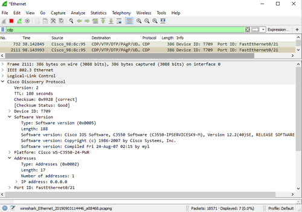

Les diffusions CDP ne sont ni chiffrées, ni authentifiées. Par conséquent, un acteur de menace peut compromettre l'infrastructure de réseau en envoyant de fausses trames CDP contenant de fausses informations aux périphériques Cisco connectés.

Pour réduire le risque d'attaque de CDP, limitez l'utilisation de ce protocole sur les périphériques et les ports. Par exemple, désactivez CDP sur les ports périphériques qui se connectent aux périphériques auxquels vous ne faites pas confiance.

Pour désactiver CDP globalement sur un périphérique, utilisez la commande du mode de configuration globale `no cdp run` . Pour activer CDP globalement, utilisez la commande de configuration globale `cdp run` .

Pour désactiver CDP sur un port, utilisez la commande de configuration d'interface `no cdp enable` . Pour activer CDP sur un port, utilisez la commande de configuration d'interface `cdp enable`.

**Remarque**: Le protocole LLDP (Link Layer Discovery Protocol) est également vulnérable aux attaques de reconnaissance. configurez no lldp run pour désactiver LLDP globalement. Pour désactiver LLDP sur l'interface, configurez `no lldp transmi`t et `no lldp receive`.
