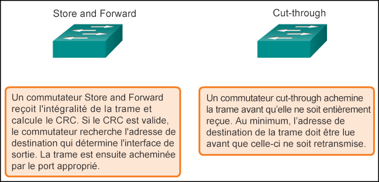
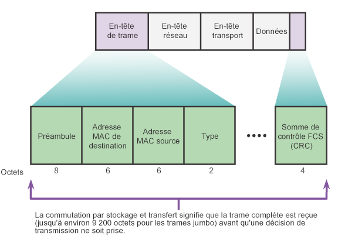
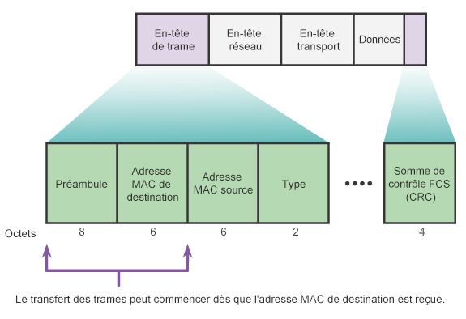
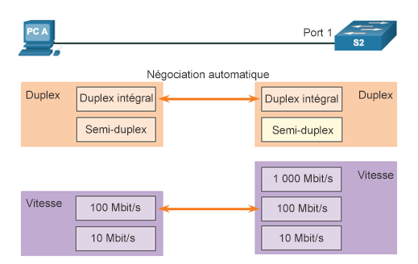

# Module 2 : Switching Concepts

## Transfert de trames

### La commutation comme concept général dans les réseaux et les télécommunications

- Un commutateur prend une décision en **fonction des ports d'entrée et de destination.**
- Un commutateur LAN gère **une table qu'il utilise pour déterminer comment acheminer le trafic.**
- Les commutateurs LAN Cisco transmettent des trames Ethernet **basées sur l'adresse MAC de destination des trames.**

### Le remplissage dynamique de la table d'adresses MAC d'un commutateur

- Un commutateur doit d'abord savoir quels équipements figurent sur chaque port avant de pouvoir transmettre une trame.
- À mesure que le commutateur découvre la relation entre les ports et les appareils, il remplit une **table appelée table d'adresses MAC** ou table **CAM (Content Addressable Memory).**
- Les informations de la table d'adresses MAC sont utilisées pour transmettre les trames.
- Lorsqu'un commutateur reçoit une trame entrante dont l'adresse MAC ne figure pas dans la table CAM, **il l'envoie à tous les ports, sauf à celui qui l'a reçue**.

### Les méthodes de transfert du commutateur

Les commutateurs prennent très rapidement les décisions de transfert de couche 2. Cela est dû aux logiciels sur les circuits intégrés spécifiques aux applications (ASIC). Les ASIC réduisent le temps de traitement des trames et permettent de gérer un nombre accru de trames sans dégradation des performances

### La commutation par stockage et transfert (Store and Forward)

- Cette méthode permet au commutateur de:
  - rechercher les erreurs (via le contrôle FCS) ;
  - réaliser une mise en mémoire tampon automatique ;
  - ralentir le processus de transfert.

### La commutation à la volée (Cut-Through)

- Cette méthode permet au commutateur de lancer le transfert en 10 microsecondes environ
- Pas de contrôle FCS
- Pas de mise en mémoire tampon automatique

## Domaines de commutation

### Les domaines de collision

Le domaine de collision est le segment sur lequel les appareils sont en concurrence les uns avec les autres pour communiquer.

Port de commutateur Ethernet:

- En mode semi-duplex, chaque segment est dans son propre domaine de collision.
- En mode duplex intégral, il élimine les collisions.
- Par défaut, il négocie automatiquement le mode duplex intégral lorsque l'appareil adjacent peut également fonctionner dans ce mode.

### Les domaines de diffusion

Le domaine de diffusion représente l'étendue du réseau dans laquelle une trame de diffusion peut être «entendue».

- Les commutateurs envoient les trames de diffusion à tous les ports et ne divisent donc pas les domaines de diffusion.
- Tous les ports d'un commutateur (doté de la configuration par défaut) appartiennent au même domaine de diffusion.
- Si deux ou plusieurs commutateurs sont connectés, les diffusions sont envoyées vers tous les ports de tous les commutateurs (à l'exception de celui qui les a initialement reçues).

### Réduction de la congestion des réseaux

Les commutateurs utilisent la table d'adresses MAC et le duplex intégral pour éliminer les collisions et éviter la congestion.
Les caractéristiques des commutateurs qui atténuent la congestion du réseau sont notamment les suivantes :
|Protocole|Fonction|
|----|----|
|Vitesse de port rapide|Selon le modèle, les commutateurs peuvent avoir des vitesses de port allant jusqu'à 100 Gbit/s.|
|Commutation interne rapide|Les commutateurs utilisent un bus interne rapide ou une mémoire partagée pour fournir des performances élevées.|
|Grandes mémoires tampons de trames|Les commutateurs utilisent de grandes mémoires tampons pour stocker temporairement les trames. Cela permet de transférer le trafic d'entrée à partir d'un port plus rapide (ex : 1 Gbit/s) vers un port de sortie plus lent (ex : 100 Mbit/s) sans perdre de trames.|
|Nombre de ports élevé|Un commutateur à haute densité de port réduit les coûts globaux car il réduit le nombre de commutateurs requis. Cela aide également à maintenir le trafic local, ce qui contribue à réduire la congestion.|
