# Chapitre 3 - Les VLAN

## 3.1 Présentation des VLAN

### Les définitions des VLAN

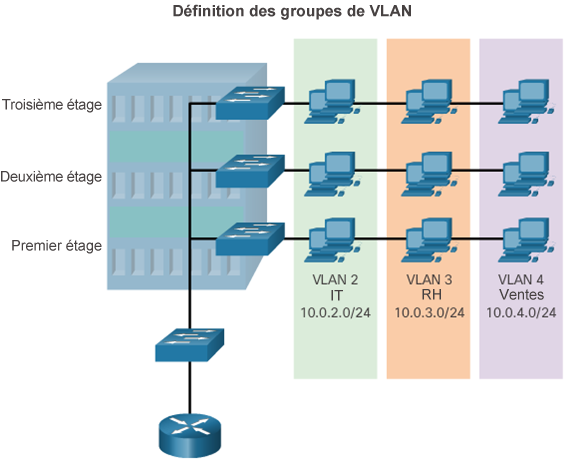

- Les VLAN permettent à un administrateur de segmenter les réseaux en fonction de facteurs tels que la fonction, l'équipe de projet ou l'application, quel que soit l'emplacement physique de l'utilisateur ou de l'appareil.
- Les VLAN permettent la mise en oeuvre des stratégies d'accès et de sécurité en fonction de groupes d'utilisateurs précis.
- Un VLAN est une partition logique d'un réseau de couche 2.
- Plusieurs partitions peuvent être créées pour permettre à plusieurs VLAN de coexister.
- Chaque VLAN constitue un domaine de diffusion, généralement avec son propre réseau IP.
- Les VLAN sont isolés les uns des autres et les paquets ne peuvent circuler entre eux qu'en passant par un routeur.
- La segmentation du réseau de couche 2 a lieu à l'intérieur d'un appareil de couche 2, généralement un commutateur.
- Les hôtes regroupés dans un VLAN ignorent l'existence de celui-ci.

### Types de VLAN

#### VLAN par défaut**

Le VLAN 1 est :

- Le VLAN par défaut
- Le VLAN natif par défaut
- Le VLAN de gestion par défaut
- Impossible à supprimer ou à renommer

**Remarque:** Bien que nous ne puissions pas supprimer VLAN1, Cisco recommande d'attribuer ces caractéristiques par défaut à un autre VLAN

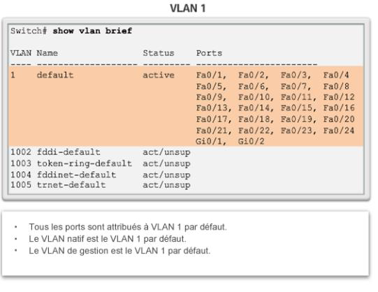

#### VLAN de données

- Dédié au trafic généré par l'utilisateur (trafic e-mail, web…).
- VLAN 1 est le VLAN de données par défaut car toutes les ports sont attribués à ce VLAN.

#### VLAN natif

- Utilisé uniquement pour les liaisons de trunk.
- Toutes les trames sont marquées sur une liaison de trunk **802.1Q**, à l'exception de celles sur le VLAN natif.

#### VLAN de gestion

- Utilisé pour le trafic SSH/Telnet vers les lignes VTY et doit être isolé du VLAN de données où circule le trafic des utilisateurs finaux.
- Par défaut, la SVI interface vlan 1 est utilisée pour l’administration du commutateur. (Il est recommandé de modifier le numéro du VLAN de gestion)

#### VLAN voix

- Un VLAN distinct est requis car le trafic de voix nécessite :
  - une bande passante consolidée
  - une priorité de QoS élevée
  - une capacité à éviter la congestion
  - un délai inférieur à 150 ms de la source à la destination
- L'ensemble du réseau doit être conçu pour prendre en charge la voix.

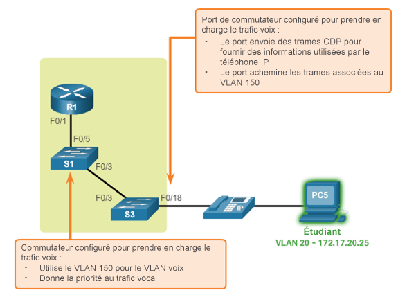

## 3.2 Les VLAN dans un environnement à plusieurs commutateurs

### Trunks de VLAN

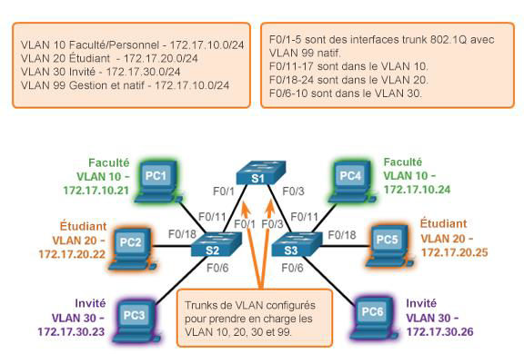

Les liaisons entre les commutateurs S1 et S2 ainsi que S1 et S3 sont configurées pour transmettre le trafic provenant des VLAN 10,20,30 et 99 sur tout le réseau. **Ce réseau ne peut pas fonctionner sans trunks de VLAN.**

### L'étiquetage des trames Ethernet pour l'identification des VLAN

L'étiquetage des trames consiste à ajouter un en-tête d'identification du VLAN à la trame.

- Il est utilisé pour transmettre correctement plusieurs trames VLAN via un trunk.
- Les commutateurs étiquettent les trames pour identifier le VLAN auquel elles appartiennent.
- Il existe différents protocoles d'étiquetage, IEEE 802.1Q étant le plus répandu.
- Le protocole définit la structure de l'en-tête d'étiquetage ajouté à la trame.
- Les commutateurs ajoutent des étiquettes VLAN aux trames avant de les placer dans les trunks. Ils les enlèvent avant de transmettre les trames via les autres ports (non trunk).
- Une fois qu'elles sont correctement étiquetées, les trames peuvent traverser tous les commutateurs via les trunks. Elles resteront dans le VLAN approprié pour atteindre leur destination.

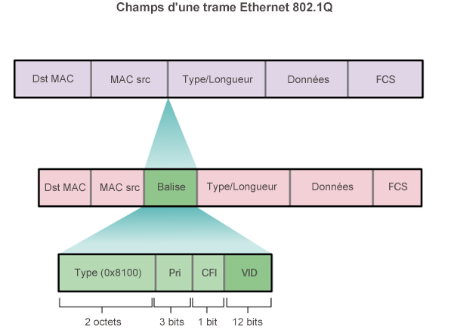

- **Type**: valeur de 2octets appelée ID de protocole d'étiquette (TPID). Pour Ethernet : 0x8100.
- **Priorité utilisateur**: valeur de 3bits qui prend en charge l'implémentation de niveaux ou de services.
- **CFI (Canonical Format Identifier)**: identificateur de 1 bit qui active les trames TokenRing à transmettre sur des liaisons Ethernet.
- **ID de VLAN (VID)**: numéro d'identification VLAN de 12bits qui prend en charge jusqu'à 4096 ID de VLAN.

### Exemple de érification d'un VLAN voix

La commande `show interfaces fa0/18 switchport` peut nous montrer à la fois les VLAN de données et de voix attribués à l'interface.

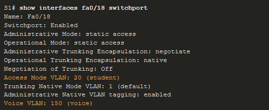

## 3.3 Configuration de VLAN

### La création de VLAN

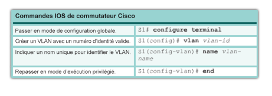

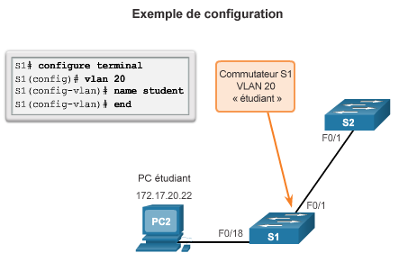

### L'attribution de ports aux VLAN

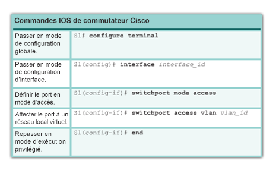

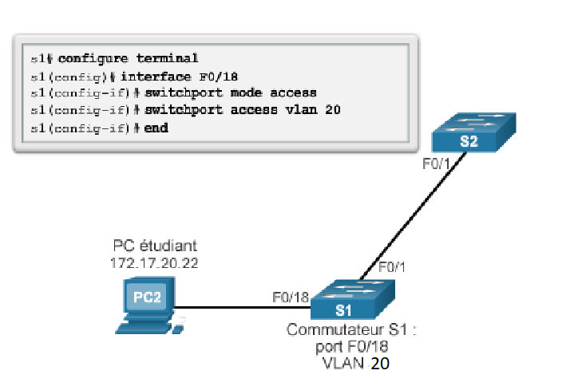

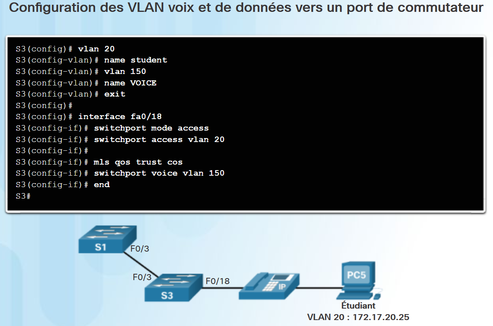

### La suppresion d'un VLAN

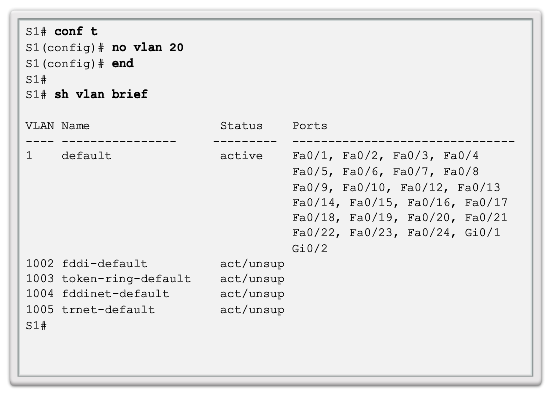

- Le fichier vlan.dat peut aussi être entièrement supprimé à l'aide de la commande `delete flash:vlan.dat` en mode d'exécution privilégié.
- La version abrégée de la commande (`delete vlan.dat`)peut être utilisée si le fichier vlan.dat n'a pas été déplacé de son emplacement par défaut.

## 3.4 Agrégations de VLAN

### La configuration des trunks IEEE 802.1Q

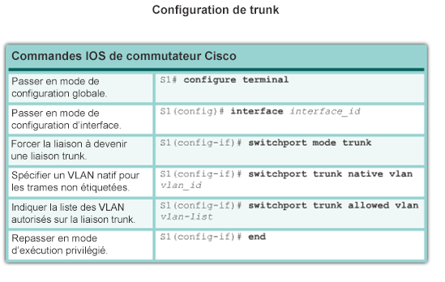
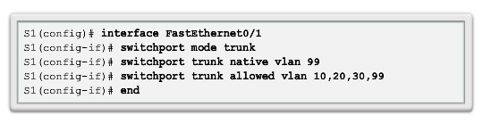

## 3.5 Protocole DTP (Dynamic Trunking Protocol)

### Présentation au protocole DTP

Le protocole DTP (Dynamic Trunking Protocol) est un protocole propriétaire à Cisco.
Ses caractéristiques sont les suivantes :

- activé par défaut sur les commutateurs Catalyst 2960 et 2950
- le mode **dynamic auto** est définit par défaut sur les commutateurs 2960 et 2950
- peut être désactivé avec le paramètre **nonegotiate**
- peut être réactivé en réglant le port sur le mode **dynamic auto**
- La configuration d’un port en tant que trunk statique avec `switchport mode trunk` ou en tant que port d’accès statique `switchport mode access`,empêchera les problèmes de négociation.

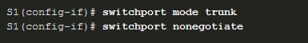

### Modes de ports négociés

Utilisez `switchport nonegotiate` pour arrêter la négociation DTP.
`switchport mode` comporte des options supplémentaires.

| Option | Description |
| ---- | ---- |
| **access** | Mode d'accès permanent qui négocie pour convertir la liaison voisine en une liaison d'accès |
| **dynamic auto** | Le port devient un trunksi le port voisin est configuré en **mode trunk** ou **dynamic desirable**. |
| **dynamic desirable** | Cherche activementà devenir un trunk en négociant avec d'autres ports configurés en **dynamic auto** ou **dynamic desirable** |
| **trunk** | Mode de trunking permanent qui négocie pour convertir le liaison voisine en une liaison trunk |

### Résultats d'une configuration du protocole DTP

Les options de configuration du protocole DTP sont les suivantes :

| | dynamicauto |dynamicdesirable | trunk |access |
| ---- | ---- | ---- |---- | ---- |
| **dynamicauto** | Accès | Trunk | Trunk | Accès |
| **dynamicdesirable** | Trunk | Trunk | Trunk | Accès |
| **trunk** | Trunk | Trunk | Trunk | Connectivité limitée |
| **access** | Accès | Accès | Connectivité limitée | Accès |
