# Chapitre 4 : Routage inter-VLAN

## 4.1 fonctionnement du routage inter-VLAN

### Qu'est ce que le routage inter-VLAN ?

- Les commutateurs de couche 2 **ne peuvent pas** acheminer le trafic entre les VLAN sans l'aide d'un routeur.
- Le routage inter-VLAN est une technique d'acheminement du trafic réseau d'un VLAN à un autre **qui repose sur l'utilisation d'un routeur**.

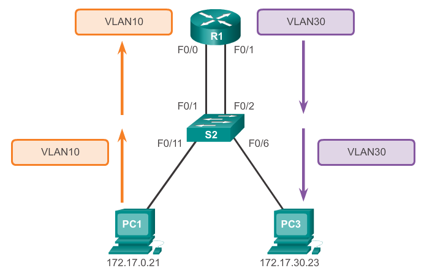

### L'ancien routage inter-VLAN

*Auparavant:*

- Chaque VLAN était connecté à une interface physique différente du routeur.
- Les paquets arrivaient sur le routeur par l'une des interfaces, étaient routés, puis ressortaient par une autre.
- Comme les interfaces du routeur étaient connectées aux VLAN et avaient des adresses IP correspondant au VLAN concerné, cela permettait d'assurer le routage entre les VLAN.
- C'était une solution simple, mais non évolutive. Les grands réseaux avec beaucoup de VLAN nécessitaient de nombreuses interfaces de routeur.

### Routage inter-VLAN avec la méthode «Router-on-a-stick»

- La technique dite **«Router-on-a-stick»** utilise un chemin différent pour le routage entre les VLAN.
- Une des interfaces physiques du routeur est configurée en tant que **port trunk 802.1Q**. Elle est alors capable d'interpréter les étiquettes VLAN.
- Des **sous-interfaces logiques** sont ensuite créées (une par VLAN) (50 VLANs maximum)
- Chaque sous-interface est configurée avec **une adresse IP** du VLAN qu'elle représente.
- Les membres (hôtes) du VLAN sont configurés pour utiliser **l'adresse de la sous-interface comme passerelle par défaut**.
- Une seule interface physique du routeur est utilisée.

### Routage inter-VLAN des commutateurs multicouches

- Les commutateurs multicouches peuvent exécuter des fonctions de couche 2 et de couche 3. **Les routeurs ne sont plus nécessaires**.
- **Chaque VLAN** présent dans le commutateur est une **interface SVI**.
- Les interfaces SVI sont considérées comme des **interfaces de couche 3**.
- Le commutateur reconnaît les unités de données de protocole (PDU) de la couche réseau, de sorte qu'il peut acheminer le trafic entre ses interfaces SVI de **la même façon qu'un routeur entre ses interfaces**.
- Avec un commutateur multicouche, le trafic est **routé à l'intérieur du périphérique de commutation**.
- Cette solution est **très évolutive**.

## 4.2 Routage inter-VLAN «Router-on-a-Stick»

### «Router-on-a-Stick»

- Pour remplacer l'ancien routage inter-VLAN, on **utilise l'agrégation (trunking) de VLAN et les sous-interfaces**.
- Le trunking de VLAN permet à **une seule interface physique du routeur** d'acheminer le trafic de **plusieurs VLAN**.
- Cette interface physique doit être connectée à une **liaison trunk sur le commutateur adjacent**.
- Sur le routeur, **des sous-interfaces** sont créées pour **chacun des VLAN du réseau**.
- Chaque sous-interface **reçoit une adresse IP** spécifique selon son sous-réseau/VLAN et est également **configurée pour étiqueter les trames en fonction du VLAN** destinataire.

### Configuration du commutateur

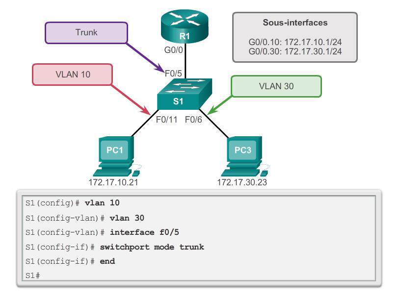

### Configuration des interfaces du routeur

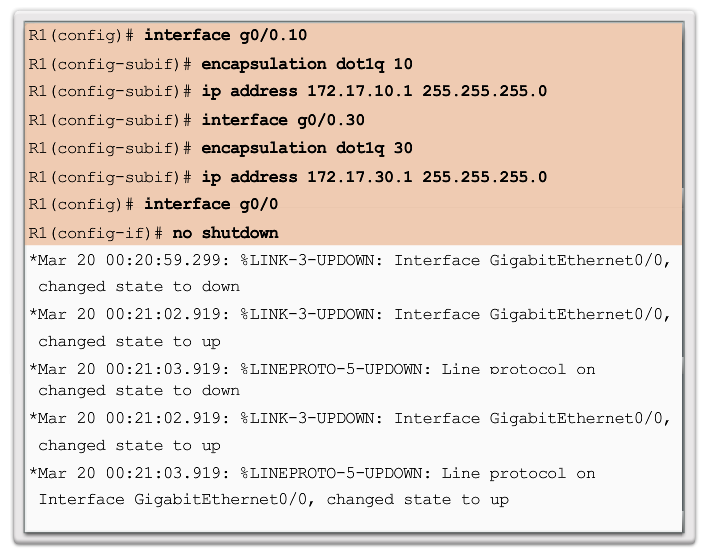

### Vérification des sous-interfaces

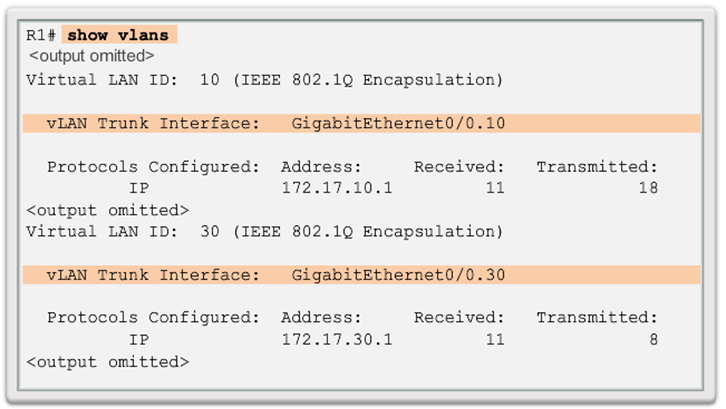

## 4.3 Routage inter-VLAN à l'aide de commutateurs de couche 3

### Présentation de la commutation de couche 3

- Les commutateurs de couche 3 offrent généralement des débits élevés de commutation de paquets, de l'ordre de plusieurs millions par seconde (pps).
- Tous les commutateurs Catalyst prennent en charge deux types d'interfaces de couche3:
  - **Port routé**: interface de couche 3 pure similaire à une interface physique sur un routeur Cisco IOS.
  - **Interface virtuelle de commutateur (SVI)**: interface VLAN virtuelle pour le routage inter-VLAN. En d'autres termes, les interfaces SVI sont des interfaces VLAN virtuellement acheminées.
- Les commutateurs hautes performances, tels que le Catalyst 6500 et le Catalyst 4500, sont capables d'assumer la plupart des fonctions d'un routeur.
- Mais plusieurs modèles Catalyst nécessitent un logiciel spécial pour des fonctions spécifiques des protocoles de routage.

### Routage inter-VLAN au moyen de SVI

- Aujourd'hui, le routage est devenu plus rapide et économique et peut s'adapter à la vitesse du matériel.
- Il peut être transféré des périphériques centraux aux périphériques de distribution avec peu d'impact, voire aucun, sur les performances du réseau.
- De nombreux utilisateurs se trouvent sur des VLAN séparés, dont chacun constitue généralement un sous-réseau distinct.
- Cela implique que **chaque commutateur de distribution doit avoir des adresses IP qui correspondent à chaque VLAN de commutateur d'accès**.
- Les ports de couche 3 (routés) sont généralement implémentés entre la couche de distribution et la couche coeur de réseau.

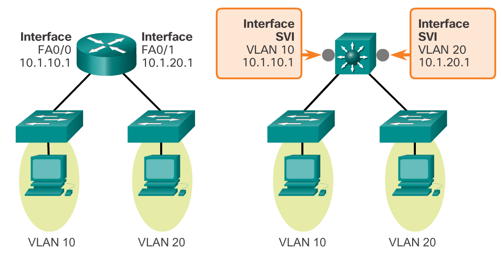

- Par défaut, une interface SVI est créée pour le VLAN par défaut (VLAN1). **Cela rend possible l'administration à distance du commutateur**.
- Toutes les interfaces SVI supplémentaires **doivent être créées** par l'administrateur.
- Elles sont créées la première fois que le mode de configuration d'interface VLAN est utilisé pour une interface SVI VLAN particulière.
- La commande `interface vlan 10` utilisée pour la première fois crée une interface SVI appelée VLAN10.
- Le numéro de VLAN indiqué correspond à l'étiquette de VLAN associée aux trames de données d'un trunk encapsulé 802.1Q.

### Configuration du commutateur de couche 3

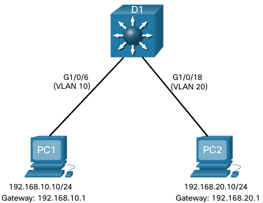

Effectuez les étapes suivantes pour configurer S1 avec les VLANs et le trunking:

- **Étape 1**. Créez les VLANs. Dans l'exemple, les VLANs 10 et 20 sont utilisés.

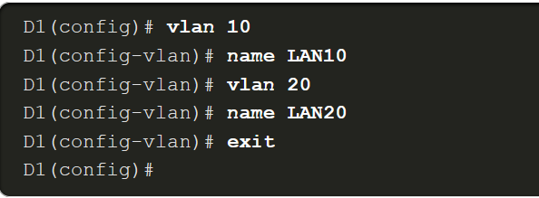

- **Étape 2**. Créez les interfaces VLAN SVI. L'adresse IP configurée servira de passerelle par défaut pour les hôtes du VLAN respectif.

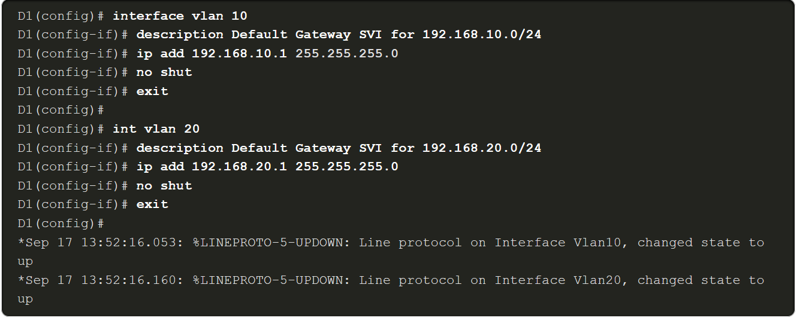

- **Étape 3**. Configurez les ports d'accès. Attribuez le port approprié au VLAN requis.

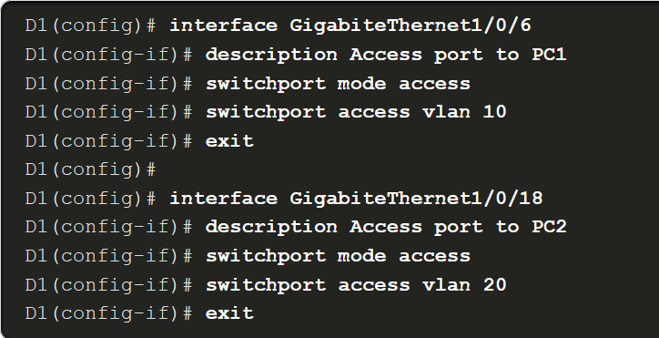

- **Étape 4**. Activez le routage IP. Émettez la commande de configuration globale iproutingpour permettre l'échange de trafic entre les VLANs 10 et 20. Cette commande doit être configurée pour activer le routage inter-vlan sur un commutateur de couche 3 pour IPv4.

```ruby
D1 (config)# iprouting
```

### Routage sur un commutateur de couche 3

Si les VLANs doivent être accessibles par d'autres périphériques de couche 3, ils doivent être annoncés à l'aide d'un routage statique ou dynamique. Pour activer le routage sur un commutateur de couche 3, un port routé doit être configuré.

Un port routé est créé sur un commutateur de couche 3 en désactivant la fonction de port de commutation sur un port de couche 2 connecté à un autre périphérique de couche 3. Plus précisément, la configuration de la commande de configuration de l'interface `no switchport`sur un port de couche 2 le convertit en une interface de couche 3. Ensuite, l'interface peut être configurée avec une configuration IPv4 pour se connecter à un routeur ou à un autre commutateur de couche 3.

### Scénario de routage sur un commutateur de couche 3

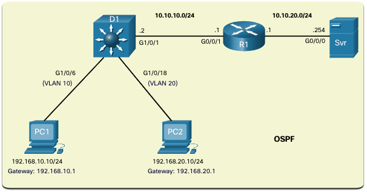
Le commutateur D1 de couche 3 configuré précédemment est maintenant connecté à R1. R1 et D1 sont tous deux dans un domaine de protocole de routage OSPF (Open ShortestPath First). Supposons qu'Inter-VLAN a été implémenté avec succès sur D1. L'interface G0/0/1 de R1 a également été configurée et activée. En outre, R1 utilise OSPF pour annoncer ses deux réseaux, 10.10.10.0/24 et 10.20.20.0/24.

Effectuez les étapes suivantes pour configurer D1 afin de router avec R1 :

- **Étape 1**. Configurez le port routé. Utilisez la commande `no switchport` pour convertir le port en port routé, puis attribuez une adresse IP et un masque de sous-réseau. Activez le port.
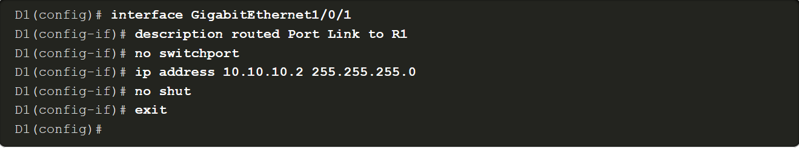
- **Étape 2**. Activez le routage. Utilisez la commande de configuration globale iproutingpour activer le routage.

- **Étape 3**. Configurez le routage. Utilisez une méthode de routage appropriée. Dans cet exemple, la zone unique OSPFv2 est configurée
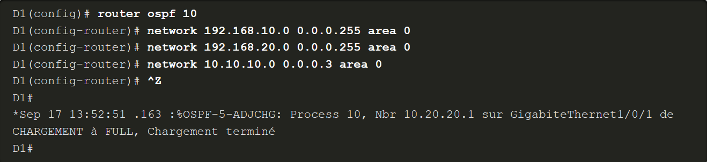
- **Étape 4**. Vérifiez le routage. Utilisez la commande `show ip route` .
- **Étape 5**. Vérifiez la connectivité. Utilisez la commande `ping` pour vérifier l'accessibilité.
