# Module 5 : Concepts du protocole STP (Spanning Tree Protocol)

Pour éviter les collisions, choix du chemin le plus court de manière dynamique in order to have un chemin de secours

## 5.1 Objectif du protocole STP

### Objectif du mode Spanning Tree

- La redondance au niveau des couches 1 et 2 du modèle OSI (Open System Interconnection)
  - Lorsqu'il **existe plusieurs chemins** entre deux appareils d'un réseau et que le protocole STP n'a pas été implémenté sur les commutateurs, **une boucle de couche 2 se produit**.
- Les problèmes liés à la redondance de la couche 1: **instabilité de la base de données MAC**
- **Aucun mécanisme Ethernet** n'est activé pour **bloquer la propagation continue** de ces trames entre les commutateurs sur un réseau commuté.
- Les problèmes liés à la redondance de la couche 1: **tempêtes de broadcast**
- Une tempête de broadcast se produit lorsque **toute la bande passante disponible est consommée** en raison du nombre trop élevé de trames de diffusion prises dans une boucle de couche 2.

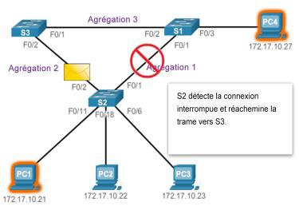

- Les problèmes liés à la redondance de la couche 1: **trames unicast en double**
- Une trame unicast inconnue se produit lorsque le commutateur n'a **pas d'adresse MAC de destination dans sa table d'adresses MAC** et qu'il doit réacheminer la trame à tous les ports, à l'exception du port d'entrée.
- Lorsque des trames unicast inconnues sont envoyées dans un réseau comportant des boucles, des trames **peuvent arriver en double sur l'appareil de destination**.

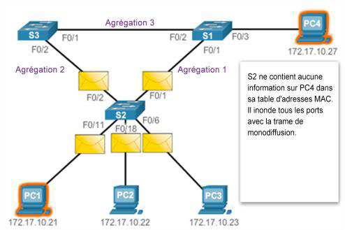

## 5.2 Fonctionnement du protocole STP

### Étapes vers une topologie sans boucle

À l'aide de l’algorithme spanning tree(STA), le protocole STP **crée une topologie sans boucle** en quatre étapes:

1. Choisir le pont racine
2. Choisir les ports racine.
3. Choisir les ports désignés.
4. Choisir des ports alternatifs (bloqués).

- Pendant le fonctionnement de STA et de STP, les commutateurs utilisent des **BPDU (Bridge Protocol Data Units)** pour partager des informations sur eux-mêmes et sur leurs connexions. Les BPDU permettent de choisir le pont racine, les ports racine, les ports désignés et les ports alternatifs.
- Chaque trame BPDU **contient un ID de pont** (bridge ID) qui identifie le commutateur ayant envoyé la trame BPDU.
- L'ID de pont **contient une valeur de priorité**, **l'adresse MAC du commutateur** et **un ID système étendu**. La valeur d'ID de pont **la plus basse** est déterminée par **une combinaison de ces trois champs**.

### Fonctionnement du protocole STP

#### Introduction

- Le protocole STP **garantit la présence d'un seul chemin logique** entre toutes les destinations sur le réseau **en bloquant intentionnellement les chemins redondants** susceptibles de provoquer une boucle.

#### Rôles des ports

- **Ports racine** : les ports **les plus proches** du pont racine.
- **Ports désignés** :les ports **autres que la racine** autorisés à transférer du trafic.
- **Ports alternatifs et de secours** : **blocage** pour empêcher les boucles.
- **Ports désactivés** : un port désactivé est un **port de commutation arrêté**.

#### Pont racine

- Le pont racine sert de **point de référence pour tous les calculs STP**.
- **Le commutateur avec le BID le plus faible deviendra le pont racine**.

## Coût du chemin racine

- Les coûts du port par défaut **dépendent de la vitesse de fonctionnement du port**.

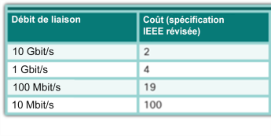

- Le coût du **chemin racine interne** est la **somme des coûts de chaque port** tout au long du chemin **depuis le commutateur jusqu'au pont racine**.
- La commande de configuration d'interface `spanning-tree cost value` aux deux extrémités d'une liaison **permet d’appliquer un coût personnalisé**.

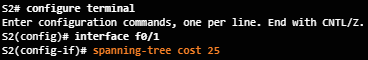

- La commande `show spanning-tree` permet de **vérifier le coût du port et du chemin racine interne** jusqu'au pont racine.

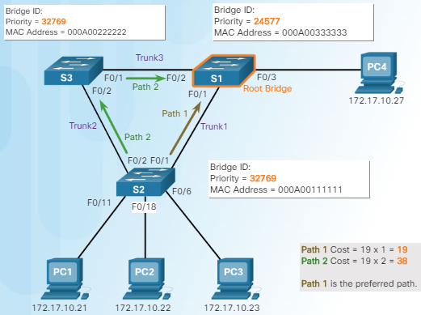

- Le format de trame **BPDU 802.1D**
- L'algorithme Spanning Tree repose sur l'échange de trames BPDU
- Les unités BPDU sont envoyées **vers toutes les interfaces toutes les deux secondes** (valeur par défaut - paramétrable).
- Des informations relatives à la trame BPDU sont **incluses dans la partie Données d'une trame Ethernet** et identifient les champs suivants:

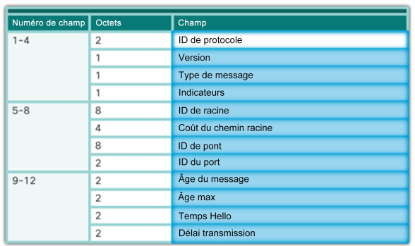

#### Propagation et processus BPDU 802.1D

- Par défaut, des trames BPDU sont envoyées **toutes les deux secondes**.
- Chaque commutateur conserve des informations **sur son propre BID, l'ID racine et coût du chemin racine**.

#### L'ID système étendu

- L'ID de pont (BID) permet de déterminer **le pont racine d'un réseau**. Le champ BID d'une trame BPDU contient **trois champs distincts**:
  - **Priorité de pont** : valeur par défaut 32768 (2^15)
  - **ID de système étendu** : identifie le VLAN qui participe au protocole STP
  - **Adresse MAC** : lorsque les priorités de pont sont identiques, l'adresse MAC permet de choisir le commutateur qui deviendra le pont racine

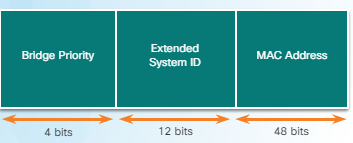

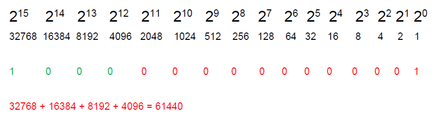

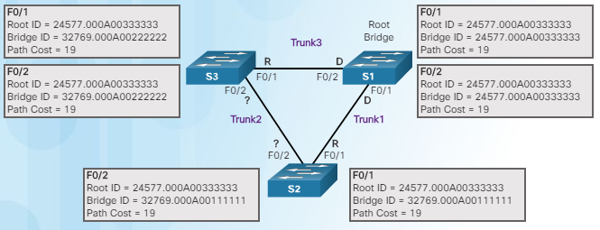

- F0/2 sur S2 : designated port
- F0/2 sur S3 : port désactivé, passe enmode de blocage

### Détails opérationnels de chaque état du port

Le tableau récapitule les détails opérationnels de chaque état du port.

| État du port      | BPDU                | Table d'adresses MAC | Transmission de trames de données |
|-------------------|---------------------|----------------------|----------------------------------|
| Blocage           | Uniquement Recevoir | Pas de mise à jour  | Non                              |
| Écoute            | Recevoir et envoyer | Pas de mise à jour  | Non                              |
| Apprentissage     | Recevoir et envoyer | Mise à jour de la table | Non                          |
| Acheminement      | Recevoir et envoyer | Mise à jour de la table | Oui                              |
| Désactivé         | Aucun envoi ou reçu | Pas de mise à jour  | Non                              |

## 5.3 Évolution du protocole STP

### Présentation

#### Les types de protocoles STP

- Plusieurs protocoles Spanning Tree Protocol (STP) sont apparus depuis la création du protocole IEEE802.1D d'origine.

#### Les caractéristiques des protocoles STP

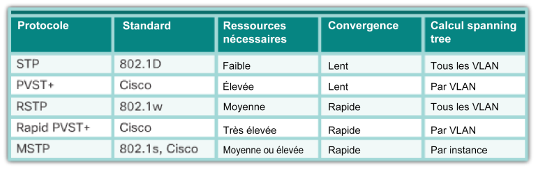

### Protocole PVST+ (par défaut)

#### Présentation du protocole PVST+

- Permet à un réseau d'exécuter une instance indépendante de l’implémentation IEEE 802.1D pour chacun des VLAN.

#### Les états des ports et le fonctionnement de PVST+

- Les protocoles STP et PVST+ utilisent cinq états de ports: blocage, écoute, apprentissage, acheminement et désactivé.

#### L'ID système étendu et le fonctionnement de PVST+

- Grâce à l'ID de système étendu, les commutateurs possèdent un BID uniquepour chaque VLAN.
- Pour modifier le processus de sélection du pont racine, on peut affecter une priorité inférieure au commutateur du pont racine souhaité pour un ou plusieurs VLAN.

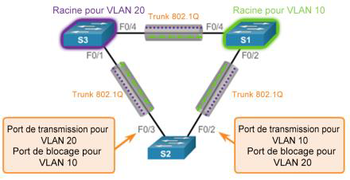

### Protocole RSTP

- RSTP peut atteindre une convergence beaucoup plus rapide.
- Rapid PVST+ est l'implémentation Cisco du protocole PVRSTP (Per-VLAN RSTP).

#### Trames BPDU du protocole RSTP

- RSTP utilise des trames BPDU de type2, le champ de version est défini sur2 pour indiquer qu'il s'agit de RSTP.

#### Ports de périphérie (Edge Port)

- Le port de périphérie RSTP est un port de commutateur qui n'est jamais supposé être connecté à un autre commutateur.
- Il passe immédiatement à l'état de réacheminement lorsqu'il est activé

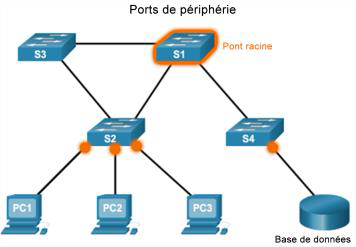

#### États de port RSTP et rôles de port

- Il n'y a que trois états de port dans le RSTP qui correspondent aux trois états opérationnels possibles dans le STP. Les états 802.1D désactivés, de blocage et d'écoute sont fusionnés en un état unique de suppression de 802.1w.

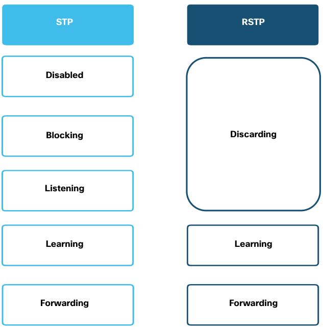

- Les ports racine et les ports désignés sont les mêmes pour STP et RSTP. Toutefois, il existe deux rôles de port RSTP qui correspondent à l'état de blocage de STP. Dans STP, un port bloqué est défini comme n'étant pas le port désigné ou le port racine. RSTP a deux rôles de port à cet effet.

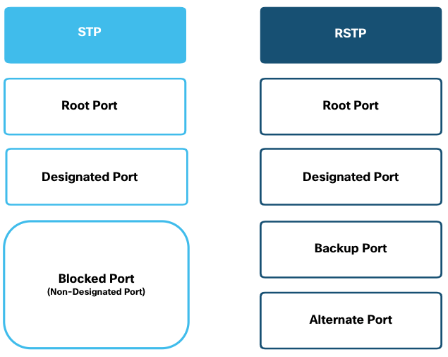

- Le port alternatif (Alternate port) a un chemin d'accès alternatif au pont racine.
- Le port de secours (Backup port) est une veille sur un support partagé, tel qu'un concentrateur.Un port de secours est moins commun car les concentrateurs sont désormais considérés comme des périphériques anciens.

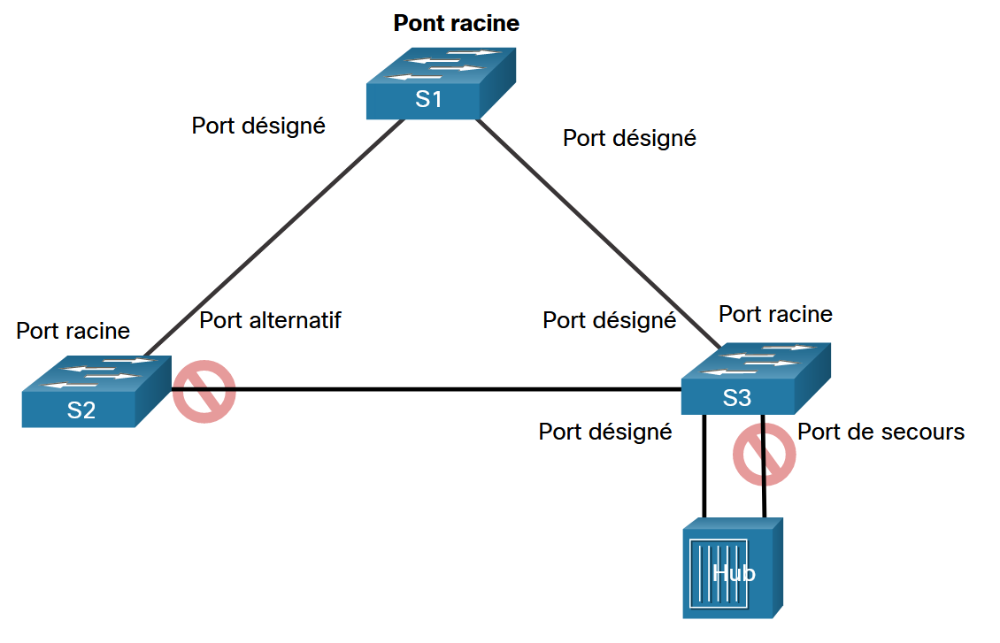

### Configuration PVST+

#### La configuration par défaut d'un commutateur Catalyst2960

- Le mode STP par défaut est PVST+.

#### La configuration et la vérification de l'ID de pont

- **Méthode 1**
  - Utilisez la commande de configuration globale `spanning-tree vlan id-vlan root primary ou secondary`
- **Méthode 2**
  - Utilisez la commande de configuration globale `spanning-tree vlan id-vlan priority value`.
- Utilisez la commande `show spanning-tree` pour vérifier la priorité du pont d'un commutateur.

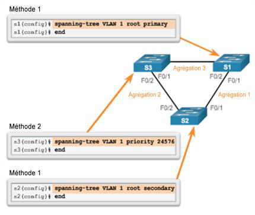

#### PortFast et protection BPDU

- **PortFast remplace immédiatement le mode de blocage d'un port d'accès par le mode de transfert, tandis que la protection BPDU définit l'état d'un port d'accès sur errdisabled (désactivé en raison d'une erreur) en cas de réception d'une trame BPDU.**
- Utilisez la commande `spanning-tree port fast` en mode de configuration d'interface **pour activer PortFast sur un port de commutateur**.
- Utilisez la commande `spanning-tree bpduguard enable` en mode de configuration d'interface pour **activer la protection BPDU sur un port d'accès de couche 2**.

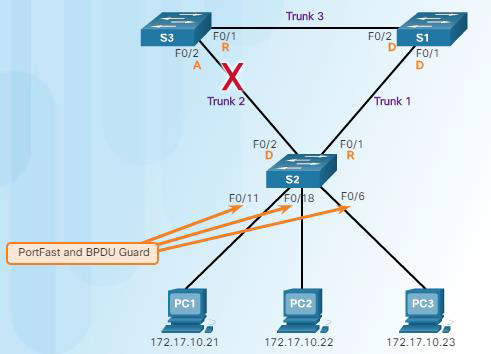

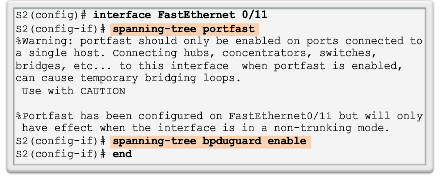

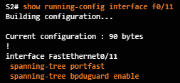

#### L'équilibrage de la charge de PVST+

- L'objectif consiste à configurer **au moins deux ponts racine** pour différents jeux de VLAN et **à utiliser des liaisons redondantes**.

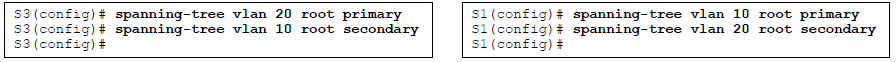

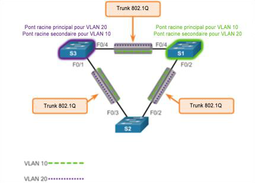