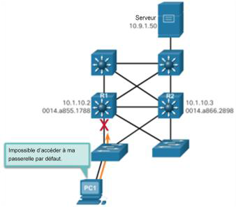
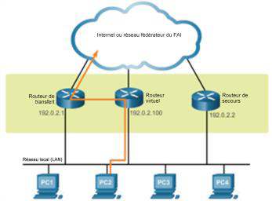
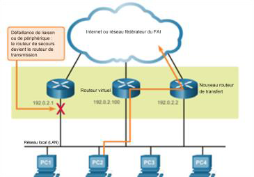
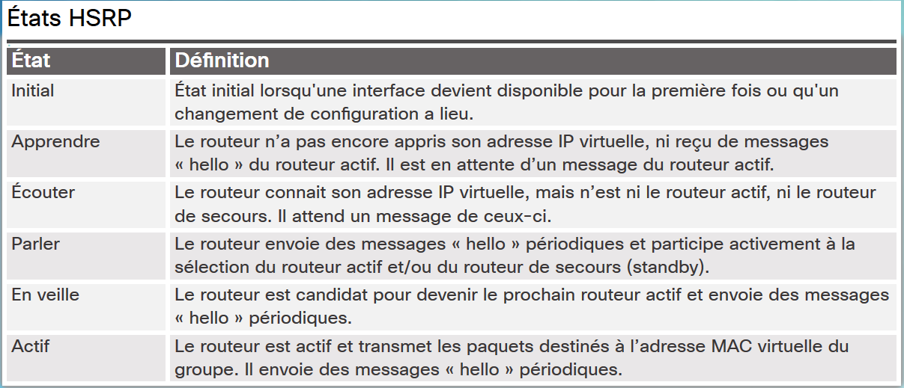
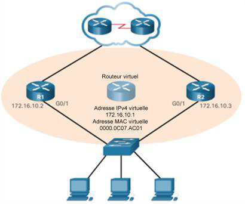

# Chapitre 9 : Concepts du FHRP

## 9.1 Protocoles de redondance au premier saut

### Concept de protocoles de redondance au premier saut

#### Les limitations de passerelle par défaut

- Sur un réseau commuté, chaque client reçoit uniquement une passerelle par défaut et il est impossible d'utiliser une passerelle secondaire, même s'il existe un deuxième chemin pour acheminer des paquets en dehors du segment local.
- En cas de défaillance d'un routeur ou d'une interface de routeur (servant de passerelle par défaut), les hôtes configurés avec cette passerelle par défaut sont isolés des réseaux extérieurs.
- Les protocoles de redondance de premier saut (FHRP) sont des mécanismes qui fournissent des passerelles par défaut alternatives dans les réseaux commutés où deux routeurs ou plus sont connectés aux mêmes VLAN.



#### La redondance de routeur

- Deux ou plusieurs routeurs partagent une adresseIP virtuelle et une adresseMAC.
- Les routeurs identifient un routeur de transmission actif et un routeur de secours redondant.



#### Étapes relatives à la redondance du routeur

Si le routeur actif tombe en panne:

1. Le routeur de secours cesse de voir les messages Hello du routeur actif.
2. Le routeur de secours prend le relais du routeur actif.
3. Les appareils hôtes ne constatent aucune interruption de service.



#### Protocoles de redondance au premier saut

- **Protocole IRDP (ICMP Router Discovery Protocol)** : une solutionFHRP existante spécifiée dans le document RFC1256.
- **Protocole HSRP (Hot Standby Router Protocol)** : un protocoleFHRP Cisco propriétaire qui assure la redondance pour les hôtesIPv4.
- **HSRP pour IPv6** : la même fonctionnalité que HSRP dans un environnementIPv6.
- **ProtocoleVRRPv2 (Virtual Router Redundancy Protocol version 2)**:un protocole non propriétaire similaire à HSRP.
- **VRRPv3**: prend en charge les adressesIPv4 et IPv6, est compatible avec les environnements multifournisseurs et est plus évolutif que VRRPv2.
- **Protocole GLBP (Gateway Load Balancing Protocol)** : un protocole FHRP Cisco propriétaire comme HSRP qui assure l'équilibrage de la charge entre les routeurs redondants.
- **GLBP pour IPv6** : la même fonctionnalité que GLBP dans un environnement IPv6.

## 9.2 HSRP

### Fonctionnement du protocole HSRP

#### Présentation du protocole HSRP

- Les routeurs sélectionnent le routeurHSRP actif qui fournit des services de passerelle par défaut aux hôtes.
- Si le routeur actif tombe en panne, le routeur de secours prend le relais du routeur actif sans imposer de modification de la configuration sur les hôtes.

#### Versions HSRP

- La version HSRP par défaut pour CiscoIOS15 est la version1.
- HSRP version2 modifie le nombre de groupes pris en charge: de 0 à 255 pour HSRPv1 à 0 à 4095 avec HSRPv2.
- HSRPv1 utilise l'adresse multicast224.0.0.2, tandis que HSRP version2 utilise l'adresse multicast224.0.0.102 ou FF02::66 pour IPv6.
- En outre, HSRPv2 prend en charge l'authentificationMD5, laquelle sort du cadre de ce cours.

#### La priorité et la préemption HSRP

- Les rôles des routeurs actifet de secours sont déterminés lors de la sélection HSRP. Le routeur qui dispose de l'adresseIPv4 la plus élevée devient le routeur actif.
- La commande d'interface standby priorityprioritypeut être utilisée pour attribuer une priorité plus élevée à un routeur actif (la priorité par défaut est égale à 100). Si les priorités sont identiques, le routeur avec l'adresse IPv4 la plus élevée devient le routeur actif.
- La plage de priorité HSRP va de 0 à 255.
- Un routeur restera actif même si un autre routeur avec une prioritéHSRP plus élevée se connecte.
- Pour imposer une nouvelle sélection, utilisez la commande d'interface `standby preempt`.

#### Les états et les minuteurs HSRP

Les routeurs HSRP passent progressivement par les états suivants: *Initial, Learn, Listen, Speak, Standby et Active*.



### Configuration du protocole HSRP

#### Les commandes de configurationHSRP

1. Configurez HSRPv2 à l'aide de la commande d'interface standby `version 2`.
2. Configurez l'adresse IP virtuelle du groupe à l'aide de la commande d'interface `standby [group-number] ip-address`.
3. Configurez la priorité du routeur actif souhaité pour qu'elle soit supérieure à 100 avec la commande d'interface `standby [group-number] priority [priority-value]`.
4. Configurez le routeur actif de sorte qu'il prenne la main sur le routeur de secours à l'aide de la commande d'interface `standby [group-number] preempt`.

#### Exemple de configuration HSRP



```js
R1(config)# int g0/1
R1(config-if)# ip add 172.16.10.2 255.255.255.0
R1(config-if)# standby version 2
R1(config-if)# standby 1 ip 172.16.10.1
R1(config-if)# standby 1 priority 150
R1(config-if)# standby 1 preempt
R1(config-if)# no shutdown
R1(config-if)#
%LINK-5-CHANGED: Interface GigabitEthernet0/1,
changed state to up
%LINEPROTO-5-UPDOWN: Line protocol on Interface
GigabitEthernet0/1, changed state to up
R1(config-if)#
%HSRP-6-STATECHANGE: GigabitEthernet0/1 Grp 1
state Speak -> Standby
%HSRP-6-STATECHANGE: GigabitEthernet0/1 Grp 1
state Standby -> Active
```

```js
R2(config)# int g0/1
R2(config-if)# ip add 172.16.10.3 255.255.255.0
R2(config-if)# standby version 2
R2(config-if)# standby 1 ip 172.16.10.1
R2(config-if)# no shut
R2(config-if)#
%LINK-5-CHANGED: Interface GigabitEthernet0/1,
changed state to up
%LINEPROTO-5-UPDOWN: Line protocol on Interface
GigabitEthernet0/1, changed state to up
%HSRP-6-STATECHANGE: GigabitEthernet0/1 Grp 1
state Init -> Init
%HSRP-6-STATECHANGE: GigabitEthernet0/1 Grp 1
state Speak -> Standby
```

#### Vérifier le protocole HSRP

- Utilisez la commande `show standby` pour vérifier la configuration HSRP.
- Utilisez la commande `show standby brief` pour vérifier l'état HSRP.

```js
R1# show standby
GigabitEthernet0/1 - Group 1 (version 2)
State is Active
12 state changes, last state change 00:04:54
Virtual IP address is 172.16.10.1
Active virtual MAC address is 0000.0C9F.F001
Local virtual MAC address is 0000.0C9F.F001 (v2 default)
Hello time 3 sec, hold time 10 sec
Next hello sent in 1.519 secs
Preemption enabled
Active router is local
Standby router is 172.16.10.3
Priority 150 (configured 150)
Group name is hsrp-Gig0/0-1 (default)
R1#
R1# show standby brief
                            P indicates configured to preempt.
                            |
Interface   Grp     Pri     P   State   Active  Standby         Virtual IP
Gig0/1      1       150     P   Active  local   172.16.10.3     172.16.10.1
R1#
```
