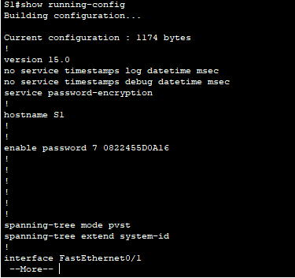

# Packet Tracer - Configure SSH
## Addressing Table
| Device | Interface | IP  Address | Subnet Mask |
| ----- | ----- | ----- |  ----- |
| S1 | VLAN 1 | 10.10.10.2 | 255.255.255.0 |
| PC1 | NIC | 10.10.10.10 | 255.255.255.0 |

## Objectives
Part 1: Secure Passwords

Part 2: Encrypt Communications

Part 3: Verify SSH Implementation

## Background
    SSH should replace Telnet for management connections. Telnet uses insecure plain text communications. SSH provides security for remote connections by providing strong encryption of all transmitted data between devices. In this activity, you will secure a remote switch with password encryption and SSH.

# Instructions
## Part 1: Secure Passwords
1. Using the command prompt on PC1, Telnet to S1. The user EXEC and privileged EXEC password is cisco.

`telnet 10.10.10.2`

2. Save the current configuration so that any mistakes you might make can be reversed by toggling the power for S1.

`copy running-config startup-config`

3. Show the current configuration and note that the passwords are in plain text. Enter the command that encrypts plain text passwords: `S1(config)# service password-encryption`

`S1#show running-config`

`S1#configure terminal`

`S1(config)#service password-encryption`

4. Verify that the passwords are encrypted.

`S1#show running-config`



## Part 2: Encrypt Communications
### Step 1: Set the IP domain name and generate secure keys.

It is generally not safe to use Telnet, because data is transferred in plain text. Therefore, use SSH whenever it is available.

5. Configure the domain name to be netacad.pka.

`S1(config)#ip domain-name netacad.pka`

6. Secure keys are needed to encrypt the data. Generate the RSA keys using a 1024 key length.

`S1(config)#crypto key generate rsa`

`How many bits in the modulus [512]: 1024`

### Step 2: Create an SSH user and reconfigure the VTY lines for SSH-only access.
1. Create an administrator user with cisco as the secret password.

`S1(config)#username admin secret cisco`

2. Configure the VTY lines to check the local username database for login credentials and to only allow SSH for remote access. Remove the existing vty line password.

```
S1(config)# line vty 0 15
S1(config-line)# transport input ssh
S1(config-line)# login local
S1(config-line)# no password
S1(config-line)# exit
```

### Step 3: Verify SSH Implementation
3. Exit the Telnet session and attempt to log back in using Telnet. The attempt should fail.

```
C:\>telnet 10.10.10.2
Trying 10.10.10.2 ...Open

[Connection to 10.10.10.2 closed by foreign host]
```

4. Attempt to log in using SSH. Type ssh and press Enter without any parameters to reveal the command usage instructions. Hint: The -l option is the letter “L”, not the number 1.

```
C:\>ssh
Cisco Packet Tracer PC SSH

Usage: SSH -l username target

C:\ssh -l admin 10.10.10.2
```

5. Upon successful login, enter privileged EXEC mode and save the configuration. If you were unable to successfully access S1, toggle the power and begin again at Part 1.
```
S1>enable
S1#copy running-config startup-config