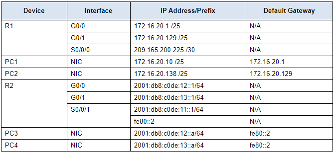

# Packet Tracer - Configure Router Interfaces
## Adressing table


## Objectives
Part 1: Configure IPv4 Addressing and Verify Connectivity

Part 2: Configure IPv6 Addressing and Verify Connectivity

## Background
Routers R1 and R2 each have two LANs. Your task is to configure the appropriate addressing on each device and verify connectivity between the LANs.

**Note**: The user EXEC password is cisco. The privileged EXEC password is class.

## Instructions
### Part 1: Configure IPv4 Addressing and Verify Connectivity
#### Step 1: Assign IPv4 addresses to R1 and LAN devices.
Referring to the Addressing Table, configure IP addressing for R1 LAN interfaces, PC1 and PC2. The serial interface has already configured.

```
R1>enable
Password: 
R1#conf

R1(config)#int gigabitEthernet 0/0
R1(config-if)#ip address 172.16.20.1 255.255.255.128
R1(config-if)#no shutdown

R1(config-if)#int
R1(config-if)#interface gigabit 0/1
R1(config-if)#ip address 172.16.20.129 255.255.255.128
R1(config-if)#no shutdown

R1(config-if)#interface serial 0/0/0
R1(config-if)#ip address 209.165.200.225 255.255.255.252
R1(config-if)#no shutdown
```

```
PC1 : Desktop>IP Configuration>

IP : 172.16.20.10 
Mask : 255.255.255.128
Gateway : 172.16.20.10
```

```
PC2 : Desktop>IP Configuration>

IP : 172.16.20.138
Mask : 255.255.255.128
Gateway : 172.16.20.129
```
#### Step 2: Verify connectivity.
PC1 and PC2 should be able to ping each other and the Dual Stack Server.

| Device | PC1 | PC2 | Dual Stack Server |
| ---- | ---- | ---- | ---- |
| PC1 | OK | OK | OK
| PC2 | OK | OK | OK

### Part 2: Configure IPv6 Addressing and Verify Connectivity
#### Step 1: Assign IPv6 addresses to R2 and LAN devices.
Referring to the Addressing Table, configure IP addressing for R2 LAN interfaces, PC3 and PC4. The serial interface is already configured.

```
R2(config)#interface gigabitEthernet 0/0
R2(config-if)#ipv6 address 2001:db8:c0de:12::1/64
R2(config-if)#no shutdown

R2(config)#interface gigabitEthernet 0/1
R2(config-if)#ipv6 add
R2(config-if)#ipv6 address 2001:db8:c0de:13::1/64
R2(config-if)#no shutdown

PC3>Desktop>IP Configuration
IPv6 : 2001:db8:c0de:12::a/64
Gateway : fe80::2

PC4>Desktop>IP Configuration
IPv6 : 2001:db8:c0de:13::a/64
Gateway : fe80::2
```

#### Step 2: Verify connectivity.
PC3 and PC4 should be able to ping each other and the Dual Stack Server.

| Device | PC3 | PC4 | Dual Stack Server |
| ---- | ---- | ---- | ---- |
| PC3 | OK | OK | OK
| PC4 | OK | OK | OK