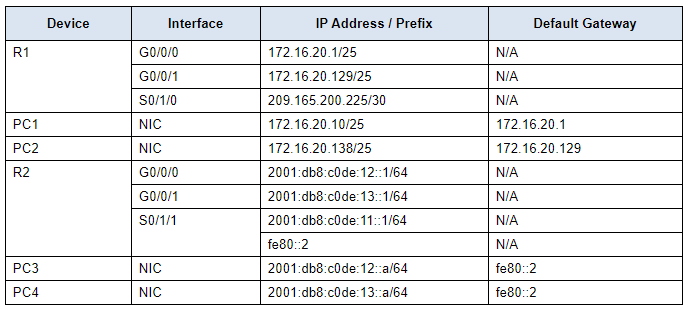
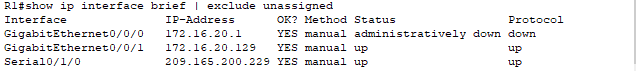
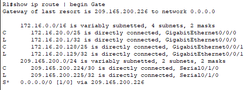
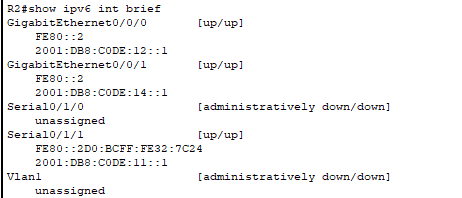
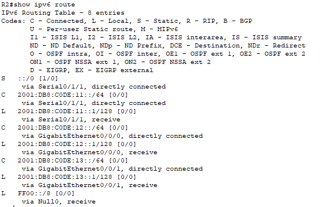
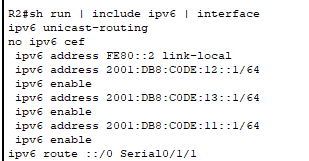

# Packet Tracer - Verify Directly Connected Networks

## Addressing Table


## Objectives
- Verify IPv4 Directly Connected Networks

- Verify IPv6 Directly Connected Networks

- Troubleshoot connectivity issues

## Background
Routers R1 and R2 each have two LANs. Your task is to verify the addressing on each device and verify connectivity between the LANs.

**Note:** The user EXEC password is cisco. The privileged EXEC password is class.

## Inscructions

### Part 1: Verify IPv4 Directly Connected Networks
#### Step 1: Verify IPv4 addresses and port status on R1.
1. Check the status of the configured interfaces by filtering the output.

Open configuration window

`R1# show ip interface brief | exclude unassigned`



2. Based on the output, correct any port status problems that you see.

GigabitEthernet0/0/0 is administratively down, need to up them

``R1(config)#interface gig 0/0/0
R1(config-if)#no shutdown``

3. Refer to the Addressing Table and verify the IP addresses configured on R1. Make any corrections to addressing if necessary.

**Answer:** Refering to the Addressing Table, the IP of the Serial interface is wrongly configurated.

```
R1(config)#int se 0/1/0
R1(config-if)#no ip address 209.165.200.229
R1(config-if)#ip address 209.165.200.225 255.255.255.252
```

4. Display the routing table by filtering to start the output at the word Gateway.

Note: Terms that are used to filter output can be shortened to match text as long as the match is unique. For example, Gateway, Gate, and Ga will have the same effect. G will not. Filtering is case-sensitive

`R1# show ip route | begin Gate`



**Question:**
What is the Gateway of last resort address?

**Answer:** The Gateway of last resort address is `209.165.200.226`

5. Display interface information and filter for Description or connected.

Note: When using include or exclude multiple searches can be performed by separating the search strings with a pipe symbol ( | )

`R1# show interface | include Desc|conn`

**Question:**
What is the Circuit ID displayed from your output?

**Answer:**
The Circuit ID displayed by the output is `BCB123450001`


6. Display specific interface information for G0/0/0 by filtering for duplex.

**Question:**
What is the duplex setting, speed, and media type?

`R1#show interfaces GigabitEthernet 0/0/0 | include duplex`


**Answer:**
The duplex setting is `Full-Duplex`, its speed is `100Mb/s`, media type is `RJ45`


#### Step 2: Verify connectivity.
PC1 and PC2 should be able to ping each other and the Dual Stack Server. If not, verify the status of the interfaces and the IP address assignments.

### Part 2: Verify IPv6 Directly Connected Networks
#### Step 1: Verify IPv6 addresses and port status on R2.
1. Check the status of the configured interfaces.

`R2# show ipv6 int brief`



**Question:**
What is the status of the configured interfaces?

**Answer:**

- GigabitEthernet0/0/0 is up

- GigabitEthernet0/0/1 is up

- Serial0/1/0 is down

- Serial0/1/1 is down


2. Refer to the Addressing Table and make any corrections to addressing as necessary.

Note: When changing an IPv6 address it is necessary to remove the incorrect address since an interface is capable of supporting multiple IPv6 networks.

**Question:**
Configure the correct address on the interface.

**Anwser:**
Refering to the adressing table, the IPv6 adress of the GigabitEthernet0/0/1 is wrongly set


```
R2(config)# int g0/0/1

R2(config-if)# no ipv6 address 2001:db8:c0de:14::1/64
R2(config-if)# ipv6 address 2001:db8:c0de:14::1/64
```

3. Display the IPv6 routing table.

`R2#show ipv6 route`



`Note:` Filtering commands do not presently work with the IPv6 commands.

4. Display all IPv6 addressing configured on interfaces by filtering the output of the running-config.

Filter the output on R2 for ipv6 or interface.

`R2# sh run | include ipv6|interface`



**Question:**
How many addresses are configured on each Gigabit interface?

**Answer:**
2 addresses are configured on GigabitEthernet0/0/0, and only 1 on GigabitEthernet0/0/1

### Step 2: Verify connectivity.
PC3 and PC4 should be able to ping each other and the Dual Stack Server. If not, verify the interface status and IPv6 address assignments.

| Device | PC3 | PC4 | Dual Stack Server |
| ---- | ---- | ---- | ---- |
| PC3 | OK | OK | OK
| PC4 | OK | OK | OK
