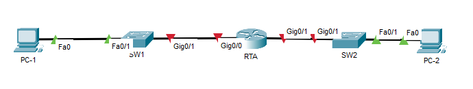

# Packet Tracer - Implement a Small Network

## Addressing Table

| Device | Interface | Address      | Subnet Mask      | Default Gateway |
|--------|-----------|--------------|------------------|-----------------|
| RTA    | G0/0      | 10.10.10.1   | 255.255.255.0   | N/A             |
| RTA    | G0/1      | 10.10.20.1   | 255.255.255.0   | N/A             |
| SW1    | VLAN1     | 10.10.10.2   | 255.255.255.0   | Blank           |
| SW2    | VLAN1     | 10.10.20.2   | 255.255.255.0   | Blank           |
| PC-1   | NIC       | 10.10.10.3        | 255.255.255.0   | Blank           |
| PC-2   | NIC       | 10.10.20.3        | 255.255.255.0   | Blank           |

## Objectives
Part 1: Create the Network Topology

Part 2: Configure Devices and Verify Connectivity

## Instructions
### Part 1: Create the Network Topology
#### Step 1: Obtain the required devices.
1. Click the Network Devices icon in the bottom tool bar.

2. Click the router icon in the submenu.

3. Locate the 1941 router icon. Click and drag the icon for the 1941 router into the topology area.

4. Click the switch entry in the submenu.

5. Locate the 2960 switch icon. Click and drag the icon for the 2960 switch into the topology area.

6. Repeat the step above so that there are two 2960 switches in the topology area.

7. Click the End Devices icon.

8. Locate the PC icon. Drag two PCs to the topology area.

9. Arrange the devices into a layout that you can work with by clicking and dragging.

#### Step 2: Name the devices.
The devices have default names that you will need to change. You will name the devices as shown in the Addressing Table. You are changing the display names of the devices. This is the text label that appears below each device. Your display names must match the information in the Addressing Table exactly. If a display name does not match, you will not be scored for your device configuration.

1. Click the device display name that is below the device icon. A text field should appear with a flashing insertion point. If the configuration window for the device appears, close it and try again, clicking a little further away from the device icon.

2. Replace the current display name with the appropriate display name from the Addressing Table.

3. Repeat until all devices are named.

#### Step 3: Connect the devices.
1. Click the orange lightning bolt connections icon in the bottom toolbar.

2. Locate the Copper Straight-Through cable icon. It looks like a solid black diagonal line.

3. To connect the device, click the Copper Straight-Through cable icon and then click the first device that you want to connect. Select the correct port and then click the second device. Select the correct port and the devices will be connected.

4. Connect the devices as specified in the table below.

| From Device | From Port      | To Device | To Port      |
|-------------|----------------|-----------|--------------|
| RTA         | G0/0           | SW1       | G0/1         |
| RTA         | G0/1           | SW2       | G0/1         |
| SW1         | F0/1           | PC-1      | Fastethernet0 |
| SW2         | F0/1           | PC-2      | Fastethernet0 |



### Part 2: Configure Devices
Record the PC addressing and gateway addresses in the addressing table. You can use any available address in the network for PC-1 and PC-2.

#### Step 1: Configure the router.

1. Configure basic settings.

    1)    Hostname as shown in the Addressing Table.

    `R1(config)#hostname RTA`

    2)    Configure Ciscoenpa55 as the encrypted password.

    `RTA(config)#enable secret Ciscoenpa55`

    3)    Configure Ciscolinepa55 as the password on the lines.

    `RTA(config)#line vty 0 15`

    `RTA(config-line)#password Ciscolinepa55`

    `RTA(config)#line console 0`

    `RTA(config-line)#password Ciscolinepa55`

    `RTA(config-line)#login`
    

    4)    All lines should accept connections.

    `RTA(config-line)#login`

    5)    Configure an appropriate message of the day banner.

    `RTA(config)#banner motd #RTA router#`


2. Configure interface settings.

    1)    Addressing.

    2)    Descriptions on the interfaces.

    3)    Save your configuration.

    ```
    RTA(config)#int gig0/0
    RTA(config-if)#ip address 10.10.10.1 255.255.255.0
    RTA(config-if)#description 'Vers LAN 10.10.10.0/24'
    RTA(config-if)#no shutdown

    RTA(config)#int g0/1
    RTA(config-if)#ip address 10.10.20.1 255.255.255.0
    RTA(config-if)#description 'Vers LAN 10.10.20.0/24'
    RTA(config-if)#no shutdown

    RTA#copy run star
    ```

#### Step 2: Configure switch SW1 and SW2.
1. Configure the default management interface so that it will accept connections over the network from local and remote hosts. Use the values in the addressing table.

```
    `SW1(config)#line vlan 1`
    `SW1(config-line)#ip address 10.10.10.2 255.255.255.0`
    `SW1(config-line)#no shutdown`

    `SW2(config)#line vlan 1`
    `SW2(config-line)#ip address 10.10.20.2 255.255.255.0`
    `SW2(config-line)#no shutdown`
```

2. Configure an encrypted password using the value in step 1a above.

```
    `SW1(config)#enable secret Ciscoenpa55`
```

3. Configure all lines to accept connections using the password from step 1a above.

```
    `SW1(config)#line console 0`
    `SW1(config-line)#password Ciscolinepa55`
    `SW1(config-line)#login`
    `SW1(config-line)#line vty 0 15`
    `SW1(config-line)#password Ciscolinepa55`
    `SW1(config-line)#login`
```


4. Configure the switches so that they can send data to hosts on remote networks.

```
    `SW1(config)#ip default-gateway 10.10.10.1`
    `SW2(config)#ip default-gateway 10.10.20.1`
```

5. Save your configuration.

```
    `SW1#copy run start`
```


#### Step 3: Configure the hosts.
Configure addressing on the hosts. If your configurations are complete, you should be able to ping all devices in the topology.

