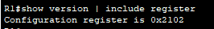
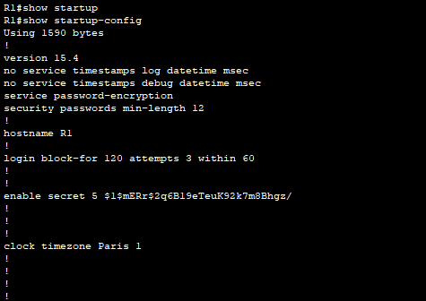
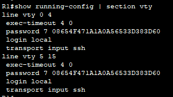
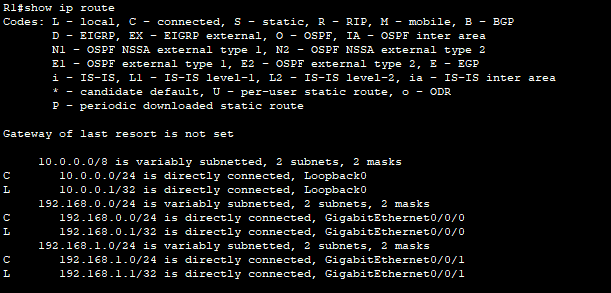
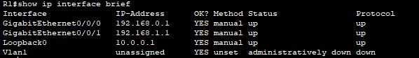
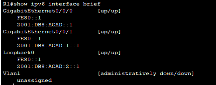
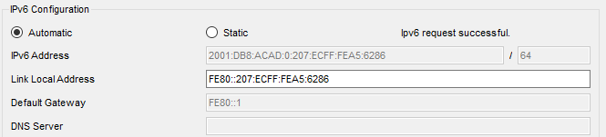
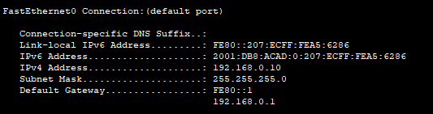

# Display Router Information
In Part 3, you will use show commands from an SSH session to retrieve information from the router.

## Use the `show version` command to answer questions about the router.

**Questions:**
What is the name of the IOS image that the router is running?

`Cisco IOS XE Software, Version 03.16.05.S - Extended Support Release`

How much non-volatile random-access memory (NVRAM) does the router have?

`32768K bytes of non-volatile configuration memory.`

How much Flash memory does the router have?

`3223551K bytes of flash memory at bootflash:.`

> The `show` commands often provide multiple screens of outputs. Filtering the output lets you display certain sections of the output. To enable the filtering command, enter a pipe (`|`) character after a `show` command, followed by a filtering parameter and a filtering expression. You can match the output to the filtering statement by using the `include` keyword to display all lines from the output that contain the filtering expression. 

## Filter the `show version` command, using `show version | include register` to answer the following question.

**Question:**
What would be the boot process for the router on the next reload if the configuration register was 0x2142?

**Answer:**
With a configuration register of 0x2142, the router ignores the startup configuration in NVRAM during the initial boot.

# Display the startup configuration.
## Use the `show startup-config` command on the router to answer the following question.

**Question:**
How are passwords presented in the output?

**Answer:**
Password are encrypted

## Use the `show running-config | section vty` command.

**Question:**
What is the result of using this command?

# Display the routing table on the router.
## Use the `show ip route` command on the router to answer the following questions.

**Questions:**

What code is used in the routing table to indicate a directly connected network?

`According to the legend, the code used in the routing table to indicate a directly connected network is C - connected`

How many route entries are coded with a C code in the routing table?

`3 route entries are codes with a C code in the routing table`

# Display a summary list of the interfaces on the router.
## Use the `show ip interface brief` command on the router to answer the following question.

**Question:**
What command changed the status of the Gigabit Ethernet ports from administratively down to up?

**Answer:**
The command that changed the status of the Gigabit Ethernet ports is `no shutdwon`

## Use the `show ipv6 int brief` command to verify IPv6 settings on R1.

**Question:**
What is the meaning of the [up/up] part of the output?

**Answer:**
The [up/up] part of the output means that the port is up and connected to another NIC

## On Server, change its configuration so that it no longer has a static IPv6 address. Then, issue the ipconfig command on Server to examine the IPv6 configuration.

**Questions:**

*What is the IPv6 address assigned to Server?*

The IPv6 address assigned to Server is `2001:DB8:ACAD:0:207:ECFF:FEA5:6286`

*What is the default gateway assigned to Server?*

The default gateway assigned to Server is `FE80::1` and `192.168.0.1`

*From PC-B, issue a ping to the R1 default gateway link local address. Was it successful?*

The ping was successful

From Server, issue a ping to the R1 IPv6 unicast address 2001:db8:acad::1. Was it successful?

The ping was successful

Reflection Questions
*In researching a network connectivity issue, a technician suspects that an interface was not enabled. What `show` command could the technician use to troubleshoot this issue?*

The technician could use the command `show ip interface brief`

*In researching a network connectivity issue, a technician suspects that an interface was assigned an incorrect subnet mask. What show command could the technician use to troubleshoot this issue?*

The technician could use the command `show ip interface brief`