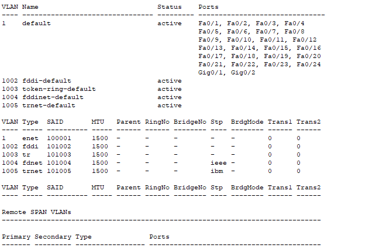
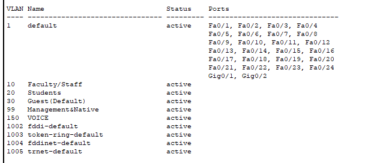
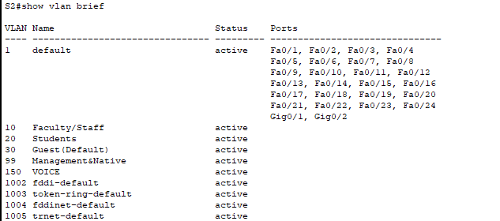
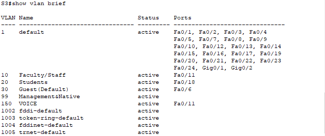

# Packet Tracer - VLAN Configuration

## Addressing Table

| Device | Interface | IP Address | Subnet Mask   | VLAN |
|--------|-----------|------------|---------------|------|
| PC1    | NIC       | 172.17.10.21 | 255.255.255.0 | 10   |
| PC2    | NIC       | 172.17.20.22 | 255.255.255.0 | 20   |
| PC3    | NIC       | 172.17.30.23 | 255.255.255.0 | 30   |
| PC4    | NIC       | 172.17.10.24 | 255.255.255.0 | 10   |
| PC5    | NIC       | 172.17.20.25 | 255.255.255.0 | 20   |
| PC6    | NIC       | 172.17.30.26 | 255.255.255.0 | 30   |

## Objectives

**Part 1: Verify the Default VLAN Configuration**

**Part 2: Configure VLANs**

**Part 3: Assign VLANs to Ports**

## Background

VLANs are helpful in the administration of logical groups, allowing members of a group to be easily moved, changed, or added. This activity focuses on creating and naming VLANs, and assigning access ports to specific VLANs.

## Part 1: View the Default VLAN Configuration

**Step 1: Display the current VLANs.**

On S1, issue the command that displays all VLANs configured. By default, all interfaces are assigned to VLAN 1.

`S1#show vlan`



**Step 2: Verify connectivity between PCs on the same network.**

Notice that each PC can ping the other PC that shares the same subnet:

- PC1 can ping PC4
- PC2 can ping PC5
- PC3 can ping PC6

Pings to hosts on other networks fail.

| PC   | PC1   | PC2   | PC3   | PC4   | PC5   | PC6   |
|------|-------|-------|-------|-------|-------|-------|
| PC1  | -     | NOK   | NOK   | OK    | NOK   | NOK   |
| PC2  | NOK   | -     | NOK   | NOK   | OK    | NOK   |
| PC3  | NOK   |  NOK  | -     | NOK   | NOK   |OK     |
| PC4  | OK    | NOK   | NOK   | -     | NOK   | NOK   |
| PC5  | NOK   |  OK   | NOK   | NOK   | -     |  NOK  |
| PC6  | NOK   | NOK   | OK    | NOK   | NOK   | -     |


**Question:**

What benefits can VLANs provide to the network?

**Answer:**

VLAN can segmentize LANs, so that computers that don't need to, cannot communicate

## Part 2: Configure VLANs

**Step 1: Create and name VLANs on S1.**

a. Create the following VLANs. Names are case-sensitive and must match the requirement exactly:

- VLAN 10: Faculty/Staff

```bash
S1#(config)# vlan 10
S1#(config-vlan)# name Faculty/Staff
```

b. Create the remaining VLANS.

- VLAN 20: Students
- VLAN 30: Guest(Default)
- VLAN 99: Management&Native
- VLAN 150: VOICE

**Step 2: Verify the VLAN configuration.**

```bash
S1#show vlan
```



**Question:**

Which command will only display the VLAN name, status, and associated ports on a switch?

**Answer:**

The command that will only display the VLAN name, status, and associated ports on a switch is `show vlan brief`

**Step 3: Create the VLANs on S2 and S3.**

Use the same commands from Step 1 to create and name the same VLANs on S2 and S3.

**Step 4: Verify the VLAN configuration.**





## Part 3: Assign VLANs to Ports

**Step 1: Assign VLANs to the active ports on S2.**

a. Configure the interfaces as access ports and assign the VLANs as follows:

- VLAN 10: FastEthernet 0/11

```bash
S2(config)# interface f0/11
S2(config-if)# switchport mode access
S2(config-if)# switchport access vlan 10
```

b. Assign the remaining ports to the appropriate VLAN.

- VLAN 20: FastEthernet 0/18
- VLAN 30: FastEthernet 0/6

**Step 2: Assign VLANs to the active ports on S3.**

S3 uses the same VLAN access port assignments as S2. Configure the interfaces as access ports and assign the VLANs as follows:

- VLAN 10: FastEthernet 0/11
- VLAN 20: FastEthernet 0/18
- VLAN 30: FastEthernet 0/6

**Step 3: Assign the VOICE VLAN to FastEthernet 0/11 on S3.**

```bash
S3(config)# interface f0/11
S3(config-if)# mls qos trust cos
S3(config-if)# switchport voice vlan 150
```

**Step 4: Verify loss of connectivity.**

Previously, PCs that shared the same network could ping each other successfully.

Study the output of from the following command on S2 and answer the following questions based on your knowledge of communication between VLANS. Pay close attention to the Gig0/1 port assignment.

```bash
S2# show vlan brief
```

Try pinging between PC1 and PC4.

Ping timed out. 


**Questions:**

**Q:** *Although the access ports are assigned to the appropriate VLANs, were the pings successful? Explain.*

**A:** Pings are not successful, because GigabitEthernet ports are not configured to let VLAN go through.

**Q:** *What could be done to resolve this issue?*

**A:** I think we can configure Trunk on GigabitEthernet ports of the switchs to resolve this issue.