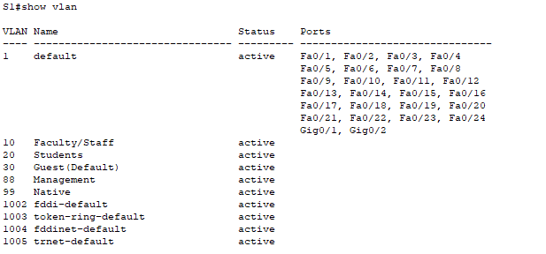
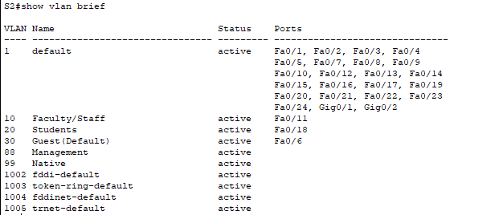
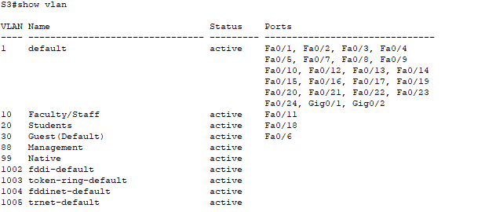
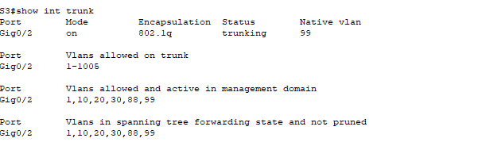
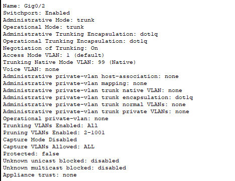

# Packet Tracer - Configure Trunks

## Addressing Table

| Device | Interface | IP Address | Subnet Mask   | Switch Port | VLAN |
|--------|-----------|------------|---------------|-------------|------|
| PC1    | NIC       | 172.17.10.21 | 255.255.255.0 | S2 F0/11    | 10   |
| PC2    | NIC       | 172.17.20.22 | 255.255.255.0 | S2 F0/18    | 20   |
| PC3    | NIC       | 172.17.30.23 | 255.255.255.0 | S2 F0/6     | 30   |
| PC4    | NIC       | 172.17.10.24 | 255.255.255.0 | S3 F0/11    | 10   |
| PC5    | NIC       | 172.17.20.25 | 255.255.255.0 | S3 F0/18    | 20   |
| PC6    | NIC       | 172.17.30.26 | 255.255.255.0 | S3 F0/6     | 30   |

## Objectives

**Part 1: Verify VLANs**

**Part 2: Configure Trunks**

## Background

Trunks are required to pass VLAN information between switches. A port on a switch is either an access port or a trunk port. Access ports carry traffic from a specific VLAN assigned to the port. A trunk port by default is a member of all VLANs. Therefore, it carries traffic for all VLANs. This activity focuses on creating trunk ports and assigning them to a native VLAN other than the default.

## Instructions

### Part 1: Verify VLANs

#### Step 1: Display the current VLANs.

a. On S1, issue the command that will display all VLANs configured. There should be ten VLANs in total. Notice that all 26 access ports on the switch are assigned to VLAN 1.

`S1#show vlan`


b. On S2 and S3, display and verify that all the VLANs are configured and assigned to the correct switch ports according to the Addressing Table.

`S2#show vlan`


`S3#show vlan`



#### Step 2: Verify loss of connectivity between PCs on the same network.

Ping between hosts on the same VLAN on the different switches. Although PC1 and PC4 are on the same network, they cannot ping one another. This is because the ports connecting the switches are assigned to VLAN 1 by default. In order to provide connectivity between the PCs on the same network and VLAN, trunks must be configured.

### Part 2: Configure Trunks

#### Step 1: Configure trunking on S1 and use VLAN 99 as the native VLAN.


a. Configure G0/1 and G0/2 interfaces on S1 for trunking.

```bash
S1(config)# interface range g0/1 - 2
S1(config-if)# switchport mode trunk
```

b. Configure VLAN 99 as the native VLAN for G0/1 and G0/2 interfaces on S1.

```bash
S1(config-if)# switchport trunk native vlan 99
```

The trunk port takes about a short time to become active due to Spanning Tree Protocol. Click Fast Forward Time to speed the process. After the ports become active, you will periodically receive the following syslog messages:

%CDP-4-NATIVE_VLAN_MISMATCH: Native VLAN mismatch discovered on GigabitEthernet0/2 (99), with S3 GigabitEthernet0/2 (1).

%CDP-4-NATIVE_VLAN_MISMATCH: Native VLAN mismatch discovered on GigabitEthernet0/1 (99), with S2 GigabitEthernet0/1 (1).

You configured VLAN 99 as the native VLAN on S1. However, S2 and S3 are using VLAN 1 as the default native VLAN as indicated by the syslog message.

**Question:**
Although you have a native VLAN mismatch, pings between PCs on the same VLAN are now successful. Explain.

#### Step 2: Verify trunking is enabled on S2 and S3.

On S2 and S3, issue the show interface trunk command to confirm that DTP has successfully negotiated trunking with S1 on S2 and S3. The output also displays information about the trunk interfaces on S2 and S3. You will learn more about DTP later in the course.

**Question:**
Which active VLANs are allowed to cross the trunk?

#### Step 3: Correct the native VLAN mismatch on S2 and S3.

a. Configure VLAN 99 as the native VLAN for the appropriate interfaces on S2 and S3.

```bash
S2(config)#interface gigabitEthernet 0/1
S2(config-if)#switchport mode trunk
S2(config-if)#switchport trunk native vlan 99

S3(config)#interface g0/2
S3(config-if)#switchport mode trunk
S3(config-if)#switchport trunk native vlan 99
```
#%SPANTREE-2-UNBLOCK_CONSIST_PORT: Unblocking GigabitEthernet0/2 on VLAN0099. Port consistency restored.

%SPANTREE-2-UNBLOCK_CONSIST_PORT: Unblocking GigabitEthernet0/2 on VLAN0001. Port consistency restored.


b. Issue `show interface trunk` command to verify the correct native VLAN configuration.



#### Step 4: Verify configurations on S2 and S3.

a. Issue the `show interface interface switchport` command to verify that the native VLAN is now 99.



b. Use the `show vlan` command to display information regarding configured VLANs.

**Question:**
Why is port G0/1 on S2 no longer assigned to VLAN 1?

**Answer:** The port G0/1 is no longer assigned to VLAN 1 because it has been assigned to VLAN 99