# Packet Tracer - Configure DTP

## Addressing Table

| Device | Interface | IP Address | Subnet Mask   |
|--------|-----------|------------|---------------|
| PC1    | NIC       | 192.168.10.1 | 255.255.255.0 |
| PC2    | NIC       | 192.168.20.1 | 255.255.255.0 |
| PC3    | NIC       | 192.168.30.1 | 255.255.255.0 |
| PC4    | NIC       | 192.168.30.2 | 255.255.255.0 |
| PC5    | NIC       | 192.168.20.2 | 255.255.255.0 |
| PC6    | NIC       | 192.168.10.2 | 255.255.255.0 |
| S1     | VLAN 99   | 192.168.99.1 | 255.255.255.0 |
| S2     | VLAN 99   | 192.168.99.2 | 255.255.255.0 |
| S3     | VLAN 99   | 192.168.99.3 | 255.255.255.0 |

## Objectives

- Configure static trunking
- Configure and Verify DTP

## Background / Scenario

As the number of switches in a network increases, the administration necessary to manage the VLANs and trunks can be challenging. To ease some of the VLAN and trunking configurations, trunk negotiation between network devices is managed by the Dynamic Trunking Protocol (DTP), and is automatically enabled on Catalyst 2960 and Catalyst 3650 switches.

In this activity, you will configure trunk links between the switches. You will assign ports to VLANs and verify end-to-end connectivity between hosts in the same VLAN. You will configure trunk links between the switches, and you will configure VLAN 999 as the native VLAN.

## Instructions

### Part 1: Verify VLAN configuration.

Verify the configured VLANs on the switches.

**a.** On S1, go to privileged EXEC mode and enter the show vlan brief command to verify the VLANs that are present.

```
S1# show vlan brief
```

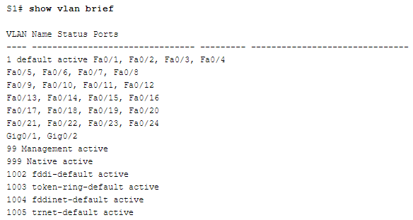

**Question:**
What VLANs are configured on the switches?

**Answer:** 
- VLAN 99 Management
- VLAN 999 Native

**b.** Repeat Step 1a on S2 and S3.

```
S2# show vlan brief
```

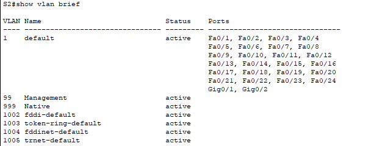

```
S3# show vlan brief
```

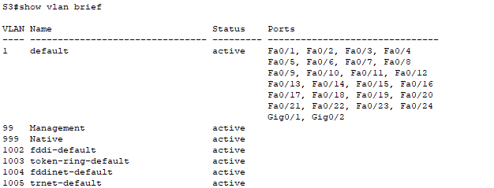

### Part 2: Create additional VLANs on S2 and S3.

**a.** On S2, create VLAN 10 and name it Red.

```
S2(config)# vlan 10
S2(config-vlan)# name Red
```

**b.** Create VLANs 20 and 30 according to the table below.

| VLAN Number | VLAN Name |
|-------------|-----------|
| 10          | Red       |
| 20          | Blue      |
| 30          | Yellow    |

**c.** Verify the addition of the new VLANs. Enter show vlan brief at the privileged EXEC mode.

**Question:**
In addition to the default VLANs, which VLANs are configured on S2?

**Answer:**

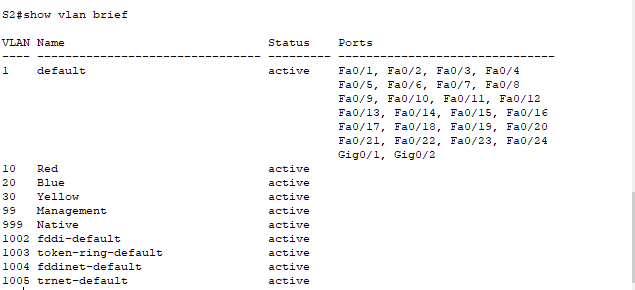

In addition to the default VLANs, the VLANs 10,20,30,99,999 are configured on S2

**d.** Repeat the previous steps to create the additional VLANs on S3.

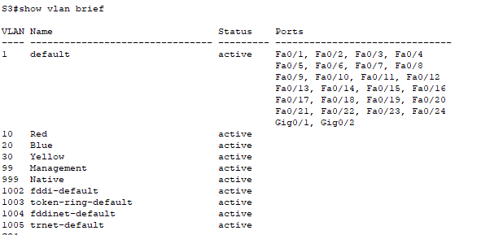

### Part 3: Assign VLANs to Ports

Use the switchport mode access command to set access mode for the access links. Use the `switchport access vlan vlan-id` command to assign a VLAN to an access port.

| Ports    | Assignments | Network          |
|----------|-------------|------------------|
| S2 F0/1 – 8 | VLAN 10 (Red)  | 192.168.10.0 /24 |
| S3 F0/1 – 8 | VLAN 10 (Red)  | 192.168.10.0 /24 |
| S2 F0/9 – 16 | VLAN 20 (Blue) | 192.168.20.0 /24 |
| S3 F0/9 – 16 | VLAN 20 (Blue) | 192.168.20.0 /24 |
| S2 F0/17 – 24 | VLAN 30 (Yellow) | 192.168.30.0 /24 |
| S3 F0/17 – 24 | VLAN 30 (Yellow) | 192.168.30.0 /24 |

**a.** Assign VLANs to ports on S2 using assignments from the table above.

```bash
S2(config)# interface range f0/1 - 8
S2(config-if-range)# switchport mode access
S2(config-if-range)# switchport access vlan 10

S2(config-if-range)# interface range f0/9 - 16
S2(config-if-range)# switchport mode access
S2(config-if-range)# switchport access vlan 20

S2(config-if-range)# interface range f0/17 - 24
S2(config-if-range)# switchport mode access
S2(config-if-range)# switchport access vlan 30
```

**b.** Assign VLANs to ports on S3 using the assignments from the table above.

Now that you have the ports assigned to VLANs, try to ping from PC1 to PC6.

**Question:**
Was the ping successful? Explain.

**Answer:**
Not yet. We need to configure the trunks on S1, S2, and S3

### Part 4: Configure Trunks on S1, S2, and S3.

Dynamic trunking protocol (DTP) manages the trunk links between Cisco switches. Currently, all the switchports are in the default trunking mode, which is dynamic auto. In this step, you will change the trunking mode to **dynamic desirable** for the link between switches S1 and S2. The link between switches S1 and S3 will be set as a static trunk. Use VLAN 999 as the native VLAN in this topology.

**a.** On switch S1, configure the trunk link to dynamic desirable on the GigabitEthernet 0/1 interface. The configuration of S1 is shown below.

```
S1(config)# interface g0/1
S1(config-if)# switchport mode dynamic desirable
```

**Question:**
What will be the result of trunk negotiation between S1 and S2?

**Answer:** Le trunk a été négocié dynamiquement, `show interface trunk` pour s'en rendre compte


**b.** On switch S2, verify that the trunk has been negotiated by entering the `show interfaces trunk` command. Interface GigabitEthernet 0/1 should appear in the output.

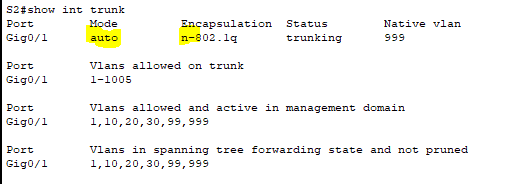

**Question:**
What is the mode and status for this port?

**Answer:**
Mode is : `Auto`; Status is `Trunking`

**c.** For the trunk link between S1 and S3, configure interface GigabitEthernet 0/2 as a static trunk link on S1. In addition, disable DTP negotiation on interface G0/2 on S1.

```
S1(config)# interface g0/2
S1(config-if)# switchport mode trunk
S1(config-if)# switchport nonegotiate
```

**d.** Use the show dtp command to verify the status of DTP.

```
S1# show dtp
```

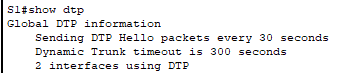

e. Verify trunking is enabled on all the switches using the `show interfaces trunk` command.

```
S1# show interfaces trunk
```

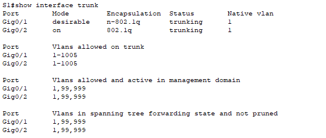

**Question:**
What is the native VLAN for these trunks currently?

**Answer:** Native VLAN for these trunks is VLAN 1

**f.** Configure VLAN 999 as the native VLAN for the trunk links on S1.

```
S1(config)# interface range g0/1 - 2
S1(config-if-range)# switchport trunk native vlan 999
```

**Question:**
What messages did you receive on S1? How would you correct it?

**Answer:** `%SPANTREE-2-BLOCK_PVID_LOCAL: Blocking GigabitEthernet0/1 on VLAN0999. Inconsistent local vlan.` Need to configure VLAN 999 as native VLAN on S2 and S3

**g.** On S2 and S3, configure VLAN 999 as the native VLAN.

**h.** Verify trunking is successfully configured on all the switches. You should be able ping one switch from another switch in the topology using the IP addresses configured on the SVI.

|Switch  | S1     | S2     | S3     |
|--------|--------|--------|--------|
| S1     | -      |OK      |OK      |
| S2     |OK      | -      |OK      |
| S3     |OK      |OK      | -      |


**i.** Attempt to ping from PC1 to PC6.

|Ping    | PC6     | 
|--------|---------|
| PC1    |NOK      |     


**Question:**
Why was the ping unsuccessful? (Hint: Look at the ‘show vlan brief’ output from all three switches. Compare the outputs from the ‘show interface trunk’ on all switches.)

**Answer:**
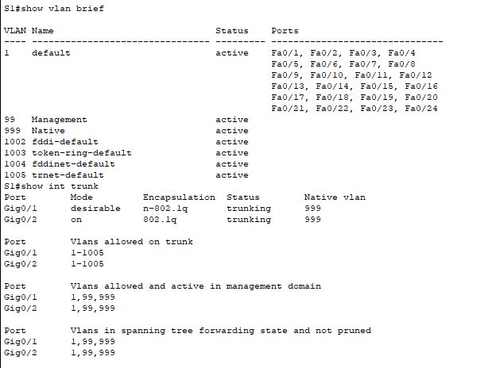
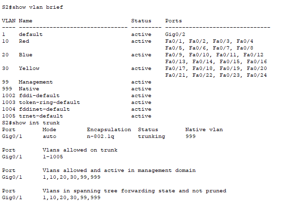
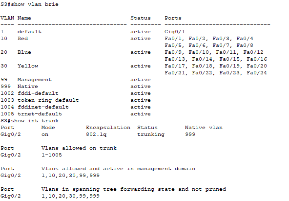

**j.** Correct the configuration as necessary.

### Part 5: Reconfigure trunk on S3.

**a.** Issue the ‘show interface trunk’ command on S3.


**Question:**
What is the mode and encapsulation on G0/2?

**Answer:**
Mode is `On`; Encapsulation is `802.1q`

**b.** Configure G0/2 to match G0/2 on S1.


According to the `show interface trunk`, G0/2 on S3 has the same configuration that G0/2 on S1

**Question:**
What is the mode and encapsulation on G0/2 after the change?

**Answer:** Mode is `On` and Encapsulation is `802.1q`

**c.** Issue the command `show interface G0/2 switchport` on switch S3.

**Question:**
What is the ’Negotiation of Trunking’ state displayed?

**Answer:**

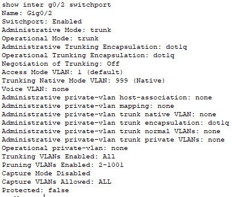
Negotation of Trunking is `off`

**Part 6: Verify end to end connectivity.**

**a.** From PC1 ping PC6.
**OK**

**b.** From PC2 ping PC5.
**OK**

**c.** From PC3 ping PC4.
**OK**
