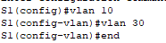
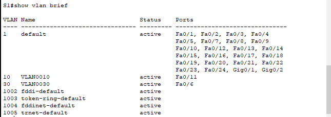
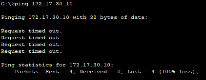
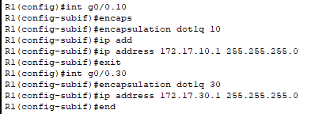
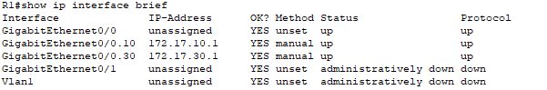
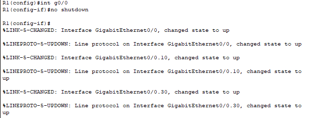
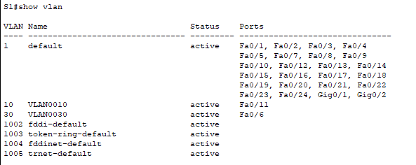
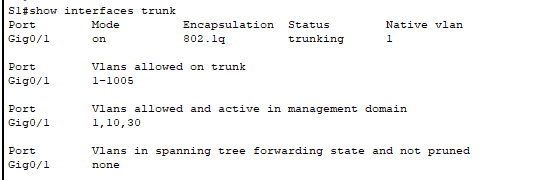
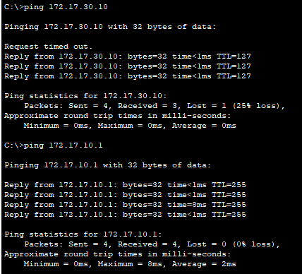

# Configuration du routage inter-VLAN avec la méthode "router-on-a-stick" dans Packet Tracer

## Table d'adressage

| Appareil | Interface | Adresse IPv4 | Masque de sous-réseau | Passerelle par défaut |
| --- | --- | --- | --- | --- |
| R1 | G0/0,10 | 172.17.10.1 | 255.255.255.0 | N/A |
| R1 | G0/0,30 | 172.17.30.1 | 255.255.255.0 | N/A |
| PC1 | Carte réseau | 172.17.10.10 | 255.255.255.0 | 172.17.10.1 |
| PC2 | Carte réseau | 172.17.30.10 | 255.255.255.0 | 172.17.30.1 |

## Objectifs

1. Partie 1: Ajout des VLAN à un commutateur
2. Partie 2: Configuration des sous-interfaces
3. Partie 3: Test de la connectivité avec routage inter-VLAN

## Scénario

Dans cette activité, vous allez configurer les VLAN et le routage inter-VLAN, activer les interfaces de trunk et vérifier la connectivité entre les VLANs.

### Instructions

#### Partie 1 : Ajouter des VLAN à un commutateur

1. **Créer des VLAN sur S1**
   - Créez un VLAN 10 et un VLAN 30 sur S1.

2. **Attribuer les VLAN aux ports**
   - Configurez les interfaces F0/6 et F0/11 comme ports d'accès et attribuez des VLAN.
   - Attribuez le port connecté au PC1 au VLAN 10.
   - Attribuez le port connecté au PC3 au VLAN 30.
   - Vérifiez la configuration avec `show vlan brief`.

3. **Tester la connectivité entre PC1 et PC3**
   - Du PC1, pingez PC3.
   
   

**Q:** Les requêtes ping ont-elles abouti? 
**A:** Non

**Q:** Pourquoi avez-vous obtenu ce résultat?
**A:** Car le routage inter-VLAN n'est pas configuré

#### Partie 2 : Configurer les sous-interfaces

1. **Configurer les sous-interfaces sur R1 en utilisant l'encapsulation 802.1Q**
   - Créez la sous-interface G0/0.10 avec l'encapsulation 802.1Q pour VLAN 10 et attribuez l'adresse IP correspondante.
   - Répétez pour la sous-interface G0/0.30.
   - Vérifiez la configuration avec `show ip interface brief` et activez l'interface G0/0.

   

#### Partie 3: Test de la connectivité avec le routage inter-VLAN

1. **Ping entre PC1 et PC3**
   - Du PC1, pingez PC3. Les requêtes doivent échouer.

   

2. **Activer le trunking**
   - Sur S1, vérifiez l'attribution du VLAN pour G0/1.
   `show vlan`

**Q:** À quel VLAN G0/1 est-elle attribuée? **A:** G0/1 est attribuée a VLAN 1

   - Configurez G0/1 en tant que trunk. `switchport mode trunk`

**Q:** Comment pouvez-vous déterminer que l'interface est un port de trunk en utilisant la commande `show vlan` ? **A:** 

   - Vérifiez la configuration du trunk avec `show interface trunk`.

3. **Tester la connectivité**
   - Si les configurations sont correctes, PC1 et PC3 devraient pinger leurs passerelles par défaut et les uns les autres.

Ping OK