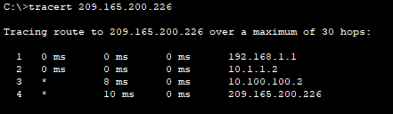
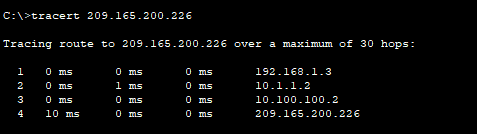
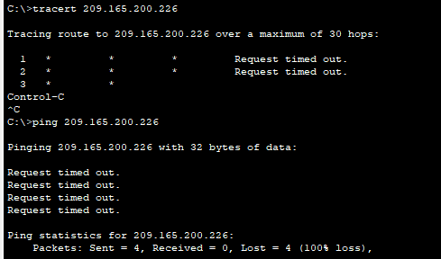
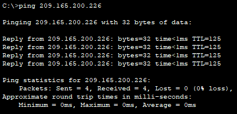
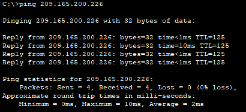
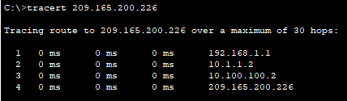
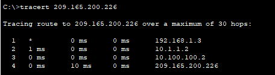
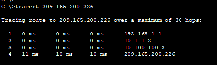

# Packet Tracer - HSRP Configuration Guide

## Addressing Table

| Device | Interface | IP Address        | Default Gateway |
|--------|-----------|-------------------|-----------------|
| R1     | G0/0      | 10.1.1.1/30       | N/A             |
| R1     | G0/1      | 192.168.1.1/24    | N/A             |
| R1     | G0/2      | 10.1.1.9/30       | N/A             |
| R2     | G0/0      | 10.1.1.2/30       | N/A             |
| R2     | G0/1      | 10.1.1.5/30       | N/A             |
| R2     | G0/2      | 10.100.100.1/30   | N/A             |
| R3     | G0/0      | 192.168.1.3/24    | N/A             |
| R3     | G0/1      | 10.1.1.6/30       | N/A             |
| R3     | G0/2      | 10.1.1.10/30      | N/A             |
| I-Net  | G0/1      | 10.100.100.2/30   | N/A             |
| HSRP Virtual Gateway | Virtual | 192.168.1.254/24 | N/A       |
| S1     | VLAN 1    | 192.168.1.11/24   | 192.168.1.1     |
| S3     | VLAN 1    | 192.168.1.13/24   | 192.168.1.3     |
| PC-A   | NIC       | 192.168.1.101/24  | 192.168.1.1     |
| PC-B   | NIC       | 192.168.1.103/24  | 192.168.1.3     |
| Web Server | NIC   | 209.165.200.226/27 | 209.165.100.225 |

**Note:** The I-Net router is present in the internet cloud and cannot be accessed in this activity.

## Objectives

In this Packet Tracer activity, you will learn how to configure Hot Standby Router Protocol (HSRP) to provide redundant default gateway devices to hosts on LANs. After configuring HSRP, you will test the configuration to verify that hosts are able to use the redundant default gateway if the current gateway device becomes unavailable.

1. Configure an HSRP active router.
2. Configure an HSRP standby router.
3. Verify HSRP operation.

## Background / Scenario

Spanning Tree Protocol provides loop-free redundancy between switches within a LAN. However, it does not provide redundant default gateways for end-user devices within the network if a gateway router fails. First Hop Redundancy Protocols (FHRPs) provide redundant default gateways for end devices with no additional end-user configuration necessary. By using a FHRP, two or more routers can share the same virtual IP address and MAC address and can act as a single virtual router. Hosts on the network are configured with a shared IP address as their default gateway. In this Packet Tracer activity, you will configure Cisco’s Hot Standby Router Protocol (HSRP), which is an FHRP.

You will configure HSRP on routers R1 and R3, which serve as the default gateways for the hosts on LAN 1 and LAN 2. When you configure HSRP, you will create a virtual gateway that uses the same default gateway address for hosts in both LANs. If one gateway router becomes unavailable, the second router will take over using the same default gateway address that was used by the first router. Because the hosts on the LANs are configured with the IP address of the virtual gateway as the default gateway, the hosts will regain connectivity to remote networks after HSRP activates the remaining router.

## Instructions

### Part 1: Verify Connectivity

#### Step 1: Trace the path to the Web Server from PC-A

1. Go to the desktop of PC-A and open a command prompt.

2. Trace the path from PC-A to the webserver by executing the tracert 209.165.200.226 command.

**Question:**
Which devices are on the path from PC-A to the Web Server? Use the addressing table to determine the device names.

**Answer:**



1st device : R1 G0/0
2nd device : R2 G0/0
3rd device : I-net G0/1
4th device : Web Server

#### Step 2: Trace the path to the Web Server from PC-B

Repeat the process in Step 1 from PC-B.

**Question:**
Which devices are on the path from PC-B to the Web Server?

**Answer:**



1st device : R3 G0/0
2nd device : R2 G0/0
3rd device : I-net G0/1
4th device : Web Server

#### Step 3: Observe the network behavior when R3 becomes unavailable

1. Select the delete tool from the Packet Tracer tool bar and delete the link between R3 and S3.

2. Open a command prompt on PC-B. Execute the tracert command with the Web Server as the destination.

3. Compare the current output with the output of the command from Step 2.

**Question:**
What are the results?

**Answer:**
The Web Server is unavailable



4. Click the Connections icon in the lower left corner of the PT window. Locate and select the Copper Straight-Through icon in the pallet of connection types.

5. Click on S3 and select port GigbitEthernet0/2. Click R3 and select port GigabitEthernet0/0.

6. After the link lights on the connection are both green, test the connection by pinging the Web Server. The ping should be successful.



### Part 2: Configure HSRP Active and Standby Routers

#### Step 1: Configure HSRP on R1

1. Configure HSRP on the G0/1 LAN interface of R1.

```js
R1(config)# interface g0/1
``` 

2. Specify the HSRP protocol version number. The most recent version is version 2.

**Note:** Standby version 1 only supports IPv4 addressing.

```js
R1(config-if)# standby version 2
```

3. Configure the IP address of the virtual default gateway. This address must be configured on any hosts that require the services of the default gateway. It replaces the physical interface address of the router that has been previously configured on the hosts.

Multiple instances of HSRP can be configured on a router. You must specify the HSRP group number to identify the virtual interface between routers in a HSRP group. This number must be consistent between the routers in the group. The group number for this configuration is 1.

```js
R1(config-if)# standby 1 ip 192.168.1.254
%HSRP-6-STATECHANGE: GigabitEthernet0/1 Grp 1 state Init -> Init

%HSRP-6-STATECHANGE: GigabitEthernet0/1 Grp 1 state Speak -> Standby

%HSRP-6-STATECHANGE: GigabitEthernet0/1 Grp 1 state Standby -> Active
```

4. Designate the active router for the HSRP group. It is the router that will be used as the gateway device unless it fails or the path to it becomes inactive or unusable. Specify the priority for the router interface. The default value is 100. A higher value will determine which router is the active router. If the priorities of the routers in the HSRP group are the same, then the router with the highest configured IP address will become the active router.

```js
R1(config-if)# standby 1 priority 150
```

R1 will operate as the active router and traffic from the two LANs will use it as the default gateway.

5. If it is desirable that the active router resume that role when it becomes available again, configure it to preempt the service of the standby router. The active router will take over the gateway role when it becomes operable again.

```js
R1(config-if)# standby 1 preempt
```

**Question:**
What will the HSRP priority of R3 be when it is added to HSRP group 1?

**Answer:**
I think the HSRP prority of R3 will be something like 200

#### Step 2: Configure HSRP on R3

Configure R3 as the standby router.

1. Configure the R3 interface that is connected to LAN 2.

2. Repeat only steps 1b and 1c above.

```js
R3(config)#
R3(config)#interface g0/0
R3(config-if)#standby version 2
R3(config-if)#standby 1 ip 192.168.1.254
%HSRP-6-STATECHANGE: GigabitEthernet0/0 Grp 1 state Init -> Init
%HSRP-6-STATECHANGE: GigabitEthernet0/0 Grp 1 state Speak -> Standby
```

### Step 3: Verify HSRP Configuration

1. Verify HSRP by issuing the show standby command on R1 and R3. Verify the values for HSRP role, group, virtual IP address of the gateway, preemption, and priority. Note that HSRP also identifies the active and standby router IP addresses for the group.

```js
R1# show standby

GigabitEthernet0/1 - Group 1 (version 2)
  State is Active
    8 state changes, last state change 00:19:42
  Virtual IP address is 192.168.1.254
  Active virtual MAC address is 0000.0C9F.F001
    Local virtual MAC address is 0000.0C9F.F001 (v2 default)
  Hello time 3 sec, hold time 10 sec
    Next hello sent in 0.21 secs
  Preemption enabled
  Active router is local
  Standby router is 192.168.1.3
  Priority 150 (configured 150)
  Group name is hsrp-Gig0/1-1 (default)

R3#show standby

GigabitEthernet0/0 - Group 1 (version 2)
  State is Standby
    11 state changes, last state change 00:24:47
  Virtual IP address is 192.168.1.254
  Active virtual MAC address is 0000.0C9F.F001
    Local virtual MAC address is 0000.0C9F.F001 (v2 default)
  Hello time 3 sec, hold time 10 sec
    Next hello sent in 1.145 secs
  Preemption disabled
  Active router is 192.168.1.1
  Standby router is local
  Priority 100 (default 100)
  Group name is hsrp-Gig0/0-1 (default)
```

Using the output shown above, answer the following questions:

**Questions:**
Which router is the active router? **A:** Active Router is R1
What is the MAC address for the virtual IP address? **A:** The MAC address for the virtual IP address is `0000.0C9F.F001`
What is the IP address and priority of the standby router? **The IP address of the Standby Router is `192.168.1.3`, its priority is `100`

2. Use the show standby brief command on R1 and R3 to view an HSRP status summary. Sample output is shown below.

```js
R1# show standby brief
R1#show standby brief
                     P indicates configured to preempt.
                     |
Interface   Grp  Pri P State    Active          Standby         Virtual IP
Gig0/1      1    150 P Active   local           192.168.1.3     192.168.1.254

R3# show standby brief
                     P indicates configured to preempt.
                     |
Interface   Grp  Pri P State    Active          Standby         Virtual IP
Gig0/0      1    100   Standby  192.168.1.1     local           192.168.1.254
```

3. Change the default gateway address for PC-A, PC-C, S1, and S3.

**Questions:**
Which address should you use? **A:** I should use `192.168.1.254` for the default gateway

Verify the new settings. Issue a ping from both PC-A and PC-C to the Web Server. Are the pings successful?

**A:**


Both pings are successful

### Part 3: Observe HSRP Operation

#### Step 1: Make the active router become unavailable

Open a command prompt on PC-B and enter the command tracert 209.165.200.226.



**Question:**
Does the path differ from the path used before HSRP was configured?

**Answer:**
The path differ form the path used before HSRP was configured, from `192.168.1.3` (R3) to `192.168.1.1` (R1)

#### Step 2: Break the link to R1

1. Select the delete tool from the Packet Tracer toolbar and delete the cable that connects R1 to S1.

2. Immediately return to PC-B and execute the tracert 209.165.200.226 command again. Observe the output of the command until the command completes execution. You may need to repeat the trace to see the full path.

**Question:**
How was this trace different from the previous trace?

**Answer:**



This trace is different from the previous trace, back to `192.168.1.1` from

HSRP undergoes a process to determine which router should take over when the active router becomes unavailable. This process takes time. Once the process is complete, the R3 standby router becomes active and is used as the default gateway for hosts on LAN 1 and LAN 2.

#### Step 3: Restore the link to R1

1. Re-connect R1 to S1 with a copper straight-through cable.

2. Execute a trace from PC-B to the Web Server. You may need to repeat the trace to see the full path.

**Questions:**
**Q:** What path is used to reach the Web Server?



**A:** The path is back again on R1

**Q:** If the preempt command was not configured for the HSRP group on R1, would the results have been the same?

**A:** If the preempt command was not configured for the HSRP group on R1, I guess the results wouldn't have been the same.
