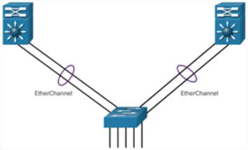
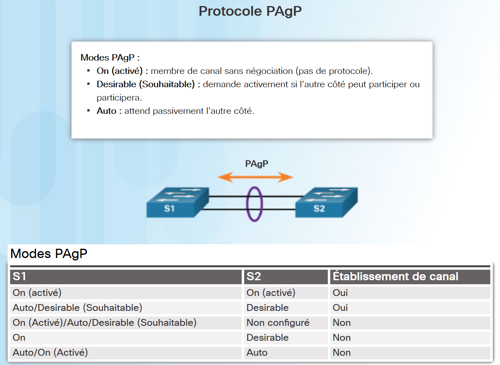
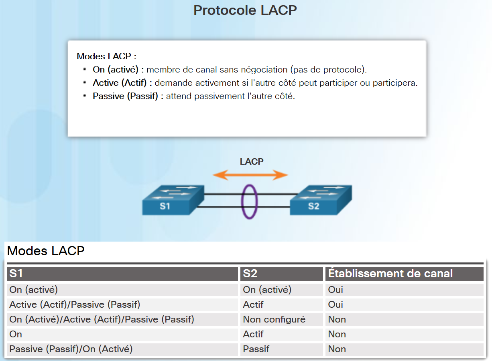

# Chapitre 6 : EtherChannel

## 6.1 Fonctionnement d'EtherChannel

### Agrégation de liaisons

- Initialement développée par Cisco comme une technique entre deux commutateurs **qui permet de regrouper plusieurs ports Fast Ethernet ou Gigabit Ethernet en un seul canal logique**.
- **Les avantages d'EtherChannel**:
  - La plupart des configurations sont faites sur l'interface d'EtherChannel (plutôt que sur chaque port) assurant la cohérence dans tous des liens.
  - Équilibrage de charge entre les liens d’un même EtherChannnel (2 méthodes: entre les adresses MAC source et de destination ou entre les adresses IP source et de destination)
  - EtherChannel crée une agrégation considérée comme une seule liaison logique
  - Fournit la redondance parce que le lien global est regardé en tant qu'une seule connexion logique. Si un lien physique dans le canal cesse de fonctionner, ce ci ne cause pas de changement dans la topologie et n'exige pas de recalcul par STP.



### Fonctionnement des EtherChannel

#### Les restrictions d'implémentation

- **Différents types d'interface ne peuvent pas être associés**, par exemple, Fast Ethernet et Gigabit Ethernet ne peuvent pas être associés dans un même canal de port.
- **Vous pouvez regrouper jusqu'à 8 ports physiques** pour atteindre jusqu'à 800Mbit/s (FastEtherChannel) ou 8Gbit/s (Gigabit EtherChannel).
- Le commutateur Cisco IOS prend en charge **jusqu'à six EtherChannel**.
- La configuration de chaque port du groupe EtherChannel **doit être cohérente sur les deux appareils**. Par exemple, si les ports physiques sont configurés en tant que trunks d'un côté, les ports physiques de l'autre côté doivent également être configurés en tant que trunks avec le même VLAN natif.
- Les interfaces ne sont **pas obligées d'être physiquement adjacentes**, ni sur le même module.
- Deux protocoles sont principalement utilisés pour configurer EtherChannel: **PAgP (Port Aggregation Protocol) et LACP (Link Aggregation Control Protocol)**.

#### Protocole PAgP–propriétaire Cisco



#### Protocole LACP -IEEE 802.3ad



## 6.2 Configurer la technologie EtherChannel

### Consignes de configuration

Les instructions et restrictions suivantes sont utiles pour la configuration d'EtherChannel:

- **Prise en charge d'EtherChannel** - les ports ne doivent pas obligatoirement être physiquement contiguës.
- **Débit et duplex** - configurez le même débit et le même mode duplex sur l'ensemble des ports de l'EtherChannel.
- **VLAN correspondant** - les ports d'une liaison EtherChannel doivent être attribués au même VLAN, ou être configurés en tant que trunk
- **Plage de VLAN** - la même plage autorisée de VLAN sur tous les ports d'un trunkEtherChannel.
Si la plage autorisée de VLAN n'est pas identique, les ports ne forment pas l'EtherChannel, même s’ils sont définis en mode auto ou desirable.

### Configuration d'interfaces LACP sur S1

```ruby
S1(config)# interface range fa0/1 - 2
S1(config-if-range)# speed 100
S1(config-if-range)# duplex full
S1(config-if-range)# channel-group 1 mode active
S1(config-if-range)# shutdown
%LINK-5-CHANGED: Interface FastEthernet0/1, changed state to administratively down
%LINK-5-CHANGED: Interface FastEthernet0/2, changed state to administratively down
S1(config-if-range)# exit
S1(config)#
S1(config)# interface port-channel 1
S1(config-if)# switchport mode trunk
S1(config-if)# switchport trunk native vlan 99
S1(config-if)# switchport trunk allowed vlan 2,20,99
S1(config-if)# exit
S1(config)#
S1(config)# interface range fa0/1 - 2
S1(config-if-range)# no shut
%LINK-5-CHANGED: Interface FastEthernet0/1, changed state to down
%LINEPROTO-5-UPDOWN: Line protocol on Interface FastEthernet0/1, changed state to down
%LINK-5-CHANGED: Interface FastEthernet0/2, changed state to down
%LINEPROTO-5-UPDOWN: Line protocol on Interface FastEthernet0/2, changed state to down
Creating a port-channel interface Port-channel 1
S1(config-if-range)#
```

### Configuration d'interfaces LACP sur S2

```ruby
S2(config)# interface range fa0/1 - 2
S2(config-if-range)# speed 100
S2(config-if-range)# duplex full
S2(config-if-range)# channel-group 1 mode active
S2(config-if-range)# shutdown
%LINK-5-CHANGED: Interface FastEthernet0/1, changed state to administratively down
%LINK-5-CHANGED: Interface FastEthernet0/2, changed state to administratively down
S2(config-if-range)# exit
S2(config)#
S2(config)# interface port-channel 1
S2(config-if)# switchport mode trunk
S2(config-if)# switchport trunk native vlan 99
S2(config-if)# switchport trunk allowed vlan 2,20,99
S2(config-if)# exit
S2(config)#
S2(config)# interface range fa0/1 - 2
S2(config-if-range)# no shut
S2(config-if-range)#
%LINK-5-CHANGED: Interface FastEthernet0/1, changed state to up
%LINEPROTO-5-UPDOWN: Line protocol on Interface FastEthernet0/1, changed state to up
%LINK-5-CHANGED: Interface FastEthernet0/2, changed state to up
%LINEPROTO-5-UPDOWN: Line protocol on Interface FastEthernet0/2, changed state to up
Creating a port-channel interface Port-channel 1
<OUTPUT OMITTED)
%LINEPROTO-5-UPDOWN: Line protocol on Interface Port-channel 1, changed state to up
```

### Vérification et dépannage d'un EtherChannel

#### Vérification d'EtherChannel

- `show interface Port-channel` – affiche l'état général de l'interface de port-channel..
- `show etherchannel port-channel` – pour afficher des informations concernant une interface port-channel spécifique.
- `show interfaces etherchannel` – peut fournir des informations sur le rôle de l'interface dans l'EtherChannel

- `show etherchannel summary` – pour afficher une ligne d'informations unique par canal de port.

```ruby
S1# show etherchannel summary
Flags: D - down P - in port-channel
I - stand-alone s - suspended
H - Hot-standby (LACP only)
R - Layer3 S - Layer2
U - in use f - failed to allocate aggregator
u - unsuitable for bundling
w - waiting to be aggregated
d - default port
Number of channel-groups in use: 1
Number of aggregators: 1
Group   Port-channel Protocol       Ports
------+-------------+-----------+---------------------------
1       Po1(SU)      LACP           Fa0/1(P) Fa0/2(P)
S1#
```
