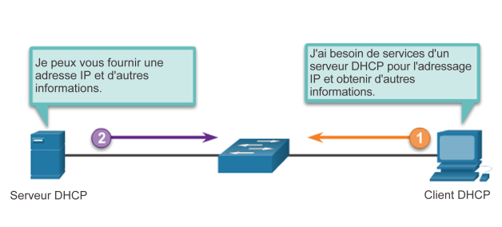
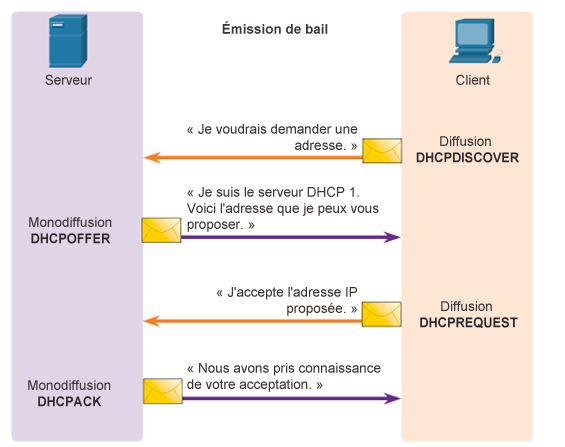
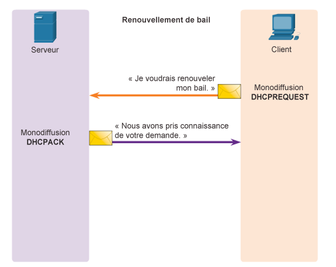
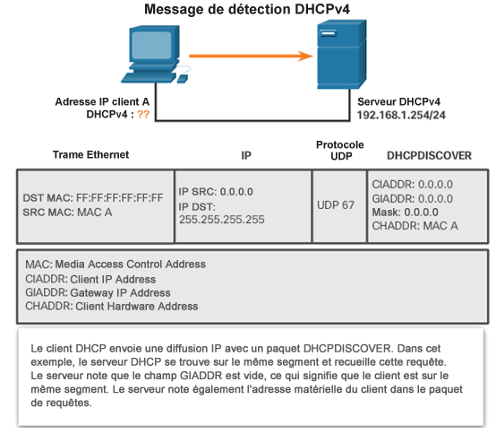
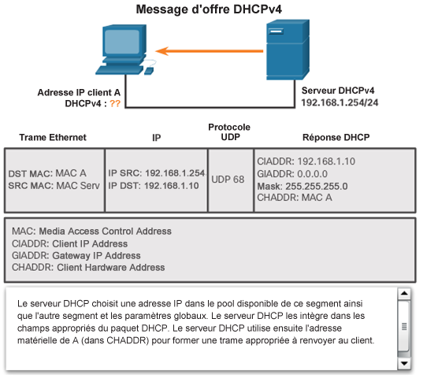
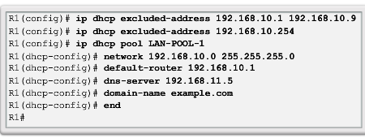
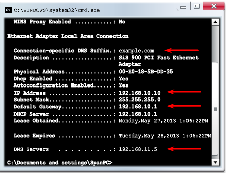
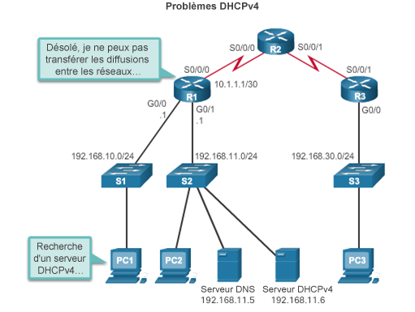
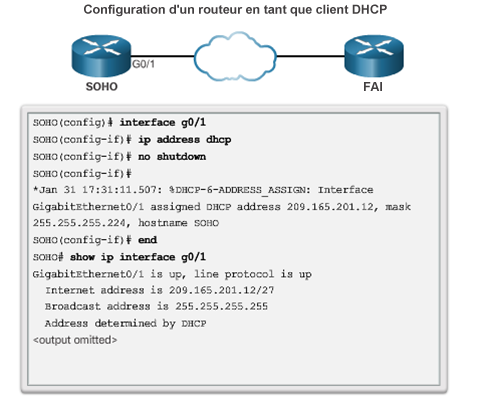
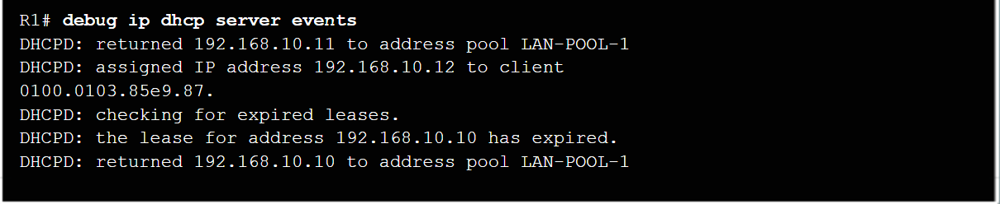

# Chapitre 7 - DHCPv4

## 7.1 Concepts du DHCPv4

### Présentation de DHCPv4

- DHCPv4:
  - Attribue des adressesIPv4 et d'autres informations de configuration réseau de façon dynamique
  - Est un outil utile pour les administrateurs réseau qui leur permet de gagner du temps
  - Attribue dynamiquement, ou loue, une adresseIPv4 depuis un pool d'adresses
- Un routeur Cisco peut être configuré pour fournir des servicesDHCPv4.
- Les administrateurs configurent des serveursDHCPv4 de sorte que le crédit-bail expire. Le client doit alors demander une autre adresse, même si en général c'est la même adresse qui lui est assignée.

### Fonctionnement de DHCPv4

### Message de détection et d'offre DHCPv4

## 7.2 Configurer un serveur Cisco IOS DHCPv4

- Un routeur Cisco qui exécute le logiciel CiscoIOS peut être configuré en tant que serveur DHCPv4. Pour configurer DHCP:
  1. Excluez des adresses du pool.
  2. Définissez le nom du pool DHCP.
  3. Définissez la plage d'adresses et le masque de sous-réseau. Utilisez la commande default-routerpour la passerelle par défaut. Paramètres facultatifs qui peuvent être inclus dans le pool: serveur DNS, nom de domaine.

Pour désactiverDHCP, utilisez lacommande noservice dhcp.

### La vérification de DHCPv4

- Les commandes qui permettent de vérifier DHCP:
  - `show running-config | section dhcp`
  - `show ipdhcp binding`
  - `show ipdhcp server statistics`
- Sur le PC, utilisez la commandeipconfig /all.

### Le relais DHCPv4

- La commande `ip helper-address` permet à un routeur de transférer les diffusions DHCPv4 au serveur DHCPv4. Elle sert à relayer les diffusions.

## 7.3 Configurer un client DHCPv4

- La commande `debug ip dhcp server events` indique les événements de serveur tels que les attributions d’adresses et les mises à jour des bases de données.
