# SLAAC et DHCPv6

## 8.1 Attribution de GUA IPv6

### Configuration de l'hôte IPv6

Sur un routeur, une adresse de monodiffusion globale (GUA) IPv6 est configurée manuellement à l'aide de la commande de configuration de l'interface `ipv6 address ipv6-address/prefix-length`.

- Un hôte Windows peut également être configuré manuellement avec une configuration d'adresse GUA IPv6, comme illustré sur la figure.
- Cependant, la saisie manuelle d'un GUA IPv6 peut prendre beaucoup de temps et est parfois susceptible de provoquer des erreurs.
- Par conséquent, la plupart des hôtes Windows sont activés pour acquérir dynamiquement une configuration GUA IPv6.

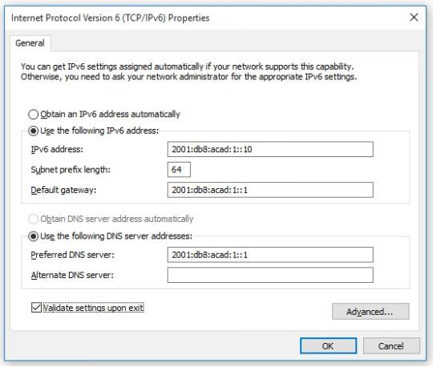

### IPv6 Adresse de link-local

Si l'adressage IPv6 automatique est sélectionné, l'hôte utilisera un message d'annonce du routeur (RA) de l'Internet Control Message Protocol version 6 (ICMPv6) pour l'aider à configurer automatiquement une configuration IPv6.

- L'adresse link-local IPv6 est automatiquement créée par l'hôte lorsqu'il démarre et que l'interface Ethernet est active.
- L'interface n'a pas créé de GUA IPv6 dans la sortie car le segment réseau n'avait pas de routeur pour fournir des instructions de configuration réseau pour l'hôte.
- **Remarque**:Le symbole "%" et le nombre à la fin de l'adresse link-local (affichés parfois par les systèmes d'exploitation hôtes) sont connus sous le nom d'ID de Zone ou d'ID de Scope et sont utilisés par le système d'exploitation pour associer le LLA à une interface spécifique.
- **Remarque**: Le protocole DHCPv6 est défini dans la norme RFC 3315.

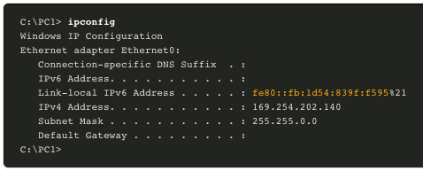

### Attribution de GUA IPv6

Par défaut, un routeur compatible IPv6 envoie périodiquement des annonces de routeur ICMPv6, ce qui simplifie la façon dont un hôte peut créer ou acquérir dynamiquement sa configuration IPv6.

- Un hôte peut être attribué dynamiquement à une GUA en utilisant des services sans état et avec état.
- Toutes les méthodes sans état et avec état utilisent des messages d'annonce de routeur (RA) ICMPv6 pour suggérer à l'hôte comment créer ou acquérir sa configuration IPv6.
- Bien que les systèmes d'exploitation hôtes suivent la suggestion de l'annonce de routeur (RA), la décision réelle revient finalement à l'hôte.

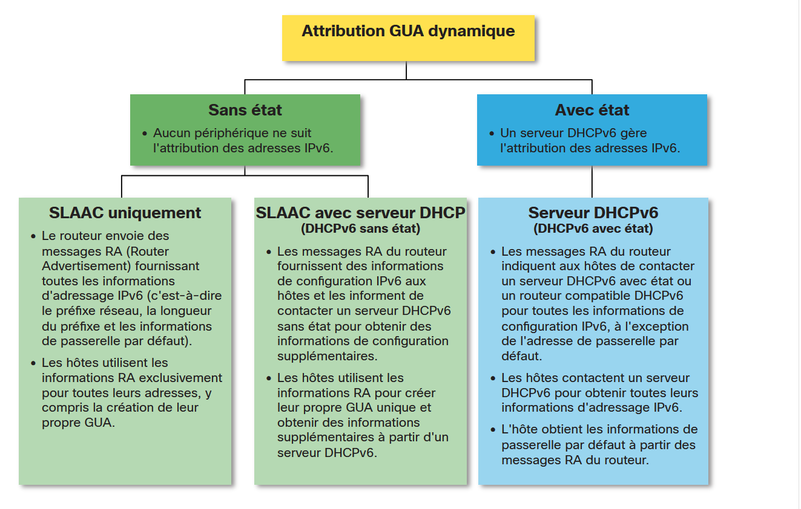

### Trois indicateurs de message RA

La façon dont un client obtient une GUA IPv6 dépend des paramètres du message d'annonce de routeur (RA).
Un message ICMPv6 RA comprend les trois indicateurs suivants:

- **Indicateur A** - L'indicateur de configuration automatique d'adresse signifie d'utiliser SLAAC (StatelessAddressAutoconfiguration) pour créer une GUA IPv6
- **Indicateur O** - Les autres indicateurs de configuration signifientque des informations supplémentaires sont disponibles auprès d'un serveur DHCPv6 sans état.
- **Indicateur M** - Un indicateur de configuration d'adresse gérée signifie qu'il faut utiliser un serveur DHCPv6 avec état pour obtenir un GUA IPv6.
En utilisant différentes combinaisons des indicateurs A, O et M, les messages RA informent l'hôte des options dynamiques disponibles.

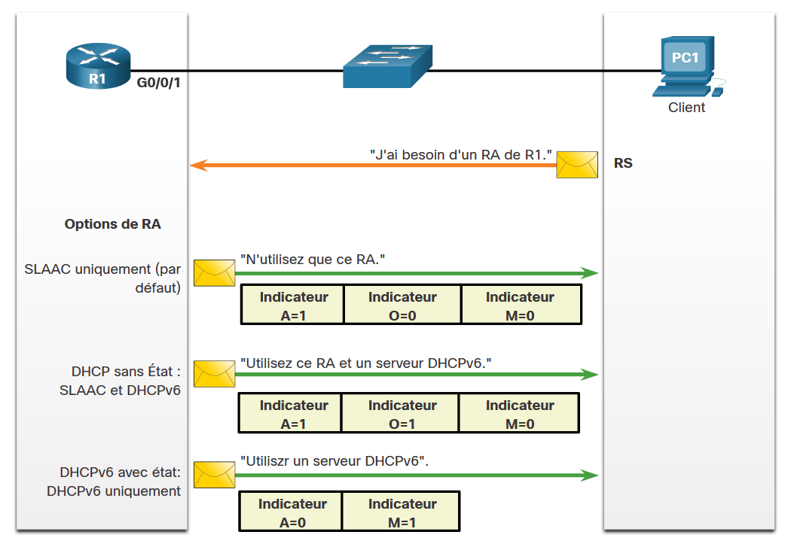

## 8.2 SLAAC

### Présentation du SLAAC

Tous les réseaux n'ont pas accès à un serveur DHCPv6, mais tous les périphériques d'un réseau IPv6 ont besoin d'une GUA. La méthode SLAAC permet aux hôtes de créer leur propre adresse de monodiffusion globale IPv6 unique sans les services d'un serveur DHCPv6.

- SLAAC est un service sans état, ce qui signifie qu'il n'y a pas de serveur qui conserve les informations d'adresse réseau pour savoir quelles adresses IPv6 sont utilisées et lesquelles sont disponibles.
- SLAAC envoie périodiquement des messages de RA ICMPv6 (c.-à-d. toutes les 200 secondes) fournissant des informations d'adressage et d'autres informations de configuration pour que les hôtes configurent automatiquement leur adresse IPv6 en fonction des informations contenues dans le message RA.
- Un hôte peut également envoyer un message de sollicitation de routeur (RS) demandant un message RA.
- SLAAC peut être déployé en tant que SLAAC uniquement, ou SLAAC avec DHCPv6.

### Activation de SLAAC

L'interface R1 G0/0/1 a été configuré avec les adresses GUA IPv6 et link-local indiquées.
Les adresses IPv6 de R1 G0/0/01 comprennent:

- **Adresse IPv6 link-local** - fe80::1
- **GUA / sous-réseau** - 2001:db8:acad:1::1, 2001:db8:acad:1::/64
- **Groupe tous les noeuds IPv6** - ff02::1
R1 est configuré pour rejoindre le groupe de multidiffusion IPv6 et commence à envoyer des messages RA contenant des informations de configuration d'adresse aux hôtes à l'aide de SLAAC.

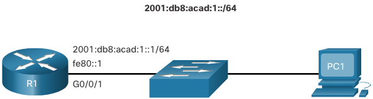
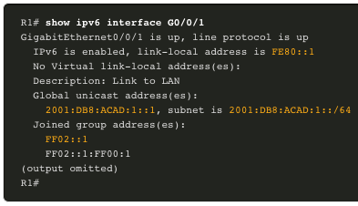
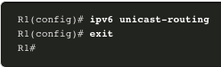

- La commande `show ipv6 interface` vérifie que R1 a rejoint le groupe de routeurs IPv6 (c'est-à-dire ff02::2).
- R1 va maintenant commencer à envoyer des messages RA toutes les 200 secondes à l'adresse de multidiffusion IPv6 tout-noeuds ff02::1.

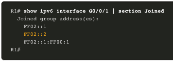

### SLAAC seule méthode

Les indicateurs suivants sont définis pour les messages RA de R1:

- **A = 1** - Informe le client d'utiliser le préfixe GUA IPv6 dans le message RA et de créer dynamiquement son propre ID d'interface.
- **O = 0** et **M = 0** - Informe le client d'utiliser également les informations supplémentaires contenues dans le message RA (c'est-à-dire le serveur DNS, le MTU et les informations de passerelle par défaut).
- La commande `ipconfig` de Windows confirme que PC1 a généré un GUA IPv6 à l'aide du message RA de R1.
- L'adresse de passerelle par défaut est LLA de l'interface R1 G0/0/1.

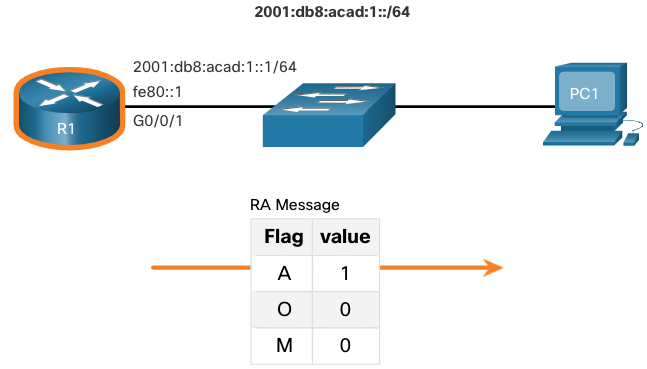
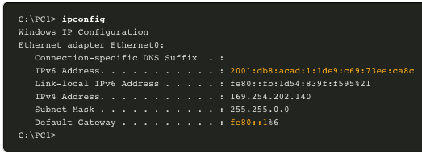

### Messages RS ICMPv6

Un routeur envoie des messages RA toutes les 200 secondes ou lorsqu'il reçoit un message RS d'un hôte.

- Les hôtes activés IPv6 souhaitant obtenir des informations d'adressage IPv6 envoient un message RS à l'adresse de multidiffusion IPv6 tout-routeur ff02::2.

La figure illustre comment un hôte commence la méthode SLAAC.

1. PC1 vient de démarrer et envoie un message RS à l'adresse de multidiffusion des tout-routeurs IPv6 ff02::2 demandant un message RA.
2. R1 génère un message RA, puis envoie le message RA à l'adresse de multidiffusion tout-noeuds IPv6 ff02::1. PC1 utilise ces informations pour créer une GUA IPv6 unique.

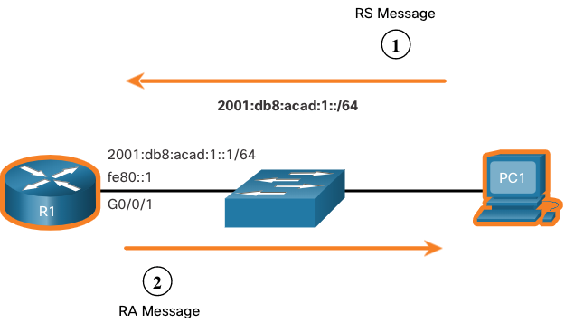

### Processus d'hôte pour générer l'ID d'interface

À l'aide de SLAAC, un hôte acquiert ses informations de sous-réseau du message RA du routeur et doit générer le reste de l'identificateur d'interface 64 bits à l'aide de l'un des éléments suivants:

- **Génération aléatoire** - L'ID de l'interface 64-bit est généré aléatoirement par le système d'exploitation du client. C'est la méthode maintenant utilisée par les hôtes Windows 10.
- **EUI-64** - L'hôte crée un ID d'interface en utilisant son adresse MAC 48 bits et insère la valeur hexadécimale de fffeau milieu de l'adresse. Certains systèmes d'exploitation utilisent par défaut l'ID d'interface généré aléatoirement plutôt que la méthode EUI-64, en raison de problèmes de confidentialité. En effet, l'adresse MAC Ethernet de l'hôte est utilisée par l'EUI-64 pour créer l'ID de l'interface.

**Remarque:** Windows, Linux et Mac OS permettent à l'utilisateur de modifier la génération de l'ID d'interface pour être généré aléatoirement ou pour utiliser EUI-64.

### Détection des adresses en double

Un hôte SLAAC peut utiliser le processus de détection des adresses en double (DAD) suivant pour s'assurer que la GUA IPv6 est unique.

- L'hôte envoie un message de sollicitation de voisin ICMPv6 (NS) avec une adresse de multidiffusion de noeud sollicité spécialement construite contenant les 24 derniers bits de l'adresse IPv6 de l'hôte.
- Si aucun autre périphérique ne répond par un message d'annonce de voisin (NA), alors l'adresse est virtuellement garantie d'être unique et peut être utilisée par l'hôte.
- Si un NA est reçu par l'hôte, l'adresse n'est pas unique et l'hôte doit générer un nouvel ID d'interface à utiliser.

**Remarque:** DAD n'est vraiment pas nécessaire car un ID d'interface 64 bits fournit 18 possibilités de quintillion. Par conséquent, le risque d'une adresse en double est réduit. Toutefois, l'IETF (Internet Engineering TaskForce) recommande d'utiliser la fonction DAD. Par conséquent, la plupart des systèmes d'exploitation exécutent DAD sur toutes les adresses de monodiffusion IPv6, quelle que soit la façon dont l'adresse est configurée.

## 8.3 DHCPv6

### Étapes du fonctionnement de DHCPv6

Le DHCPv6 avec état n'exige pas le SLAAC, alors que le DHCPv6 sans état l'exige.

Quoi qu'il en soit, lorsqu'un RA indique d'utiliser DHCPv6 ou DHCPv6 avec état:

1. L'hôte envoie un message RS.
2. Le routeur répond avec un message RA.
3. L'hôte envoie un message DHCPv6 SOLICIT.
4. Le serveur DHCPv6 répond par un message ANNONCE.
5. L'hôte répond au serveur DHCPv6.
6. Le serveur DHCPv6 envoie un message REPONSE.
**Remarque**: Les messages DHCPv6 serveur à client utilisent le port de destination UDP 546 tandis que les messages DHCPv6 client à serveur utilisent le port de destination UDP 547.

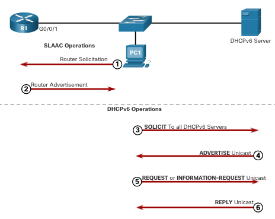

### Fonctionnement du DHCPv6 **sans** état

Si une RA indique la méthode DHCPv6 sans état, l'hôte utilise les informations contenues dans le message RA pour l'adressage et contacte un serveur DHCPv6 pour obtenir des informations supplémentaires.

Par exemple, PC1 reçoit un message RA sans état contenant:

- Le préfixe de réseau IPv6 GUA et la longueur du préfixe.
- Indicateur A défini sur 1 indiquant à l'hôte d'utiliser SLAAC.
- Indicateur O défini sur 1 pour informer l'hôte de rechercher ses informations de configuration supplémentaires auprès d'un serveur DHCPv6.
- Indicateur M défini sur la valeur par défaut 0.
- PC1 envoie un message DHCPv6 SOLICIT demandant des informations supplémentaires à partir d'un serveur DHCPv6 sans état.

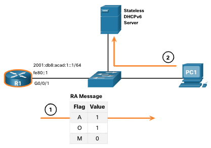

### Activer DHCPv6 **sans** état sur une interface

DHCPv6 sans état est activé à l'aide de la commande de configuration de l'interface `ipv6 nd other config-flag` définissant l'indicateur O sur 1.

Le résultat surligné confirme que le RA indiquera aux hôtes récepteurs d'utiliser la configuration automatique sans état ( indicateur A = 1) et de contacter un serveur DHCPv6 pour obtenir d'autres informations de configuration (indicateur O = 1).

**Remarque**: Vous pouvez utiliser la commande `no ipv6 nd other config-flag` pour réinitialiser l'interface à l'option SLAAC par défaut uniquement (O flag = 0).

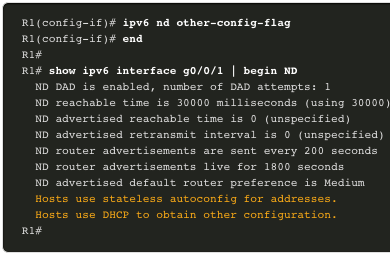

### Fonctionnement du DHCPv6 **avec** état

Si un message RA indique la méthode DHCPv6 avec état, l'hôte contacte un serveur DHCPv6 pour obtenir toutes les informations de configuration.

**Remarque**: le serveur DHCPv6 est doté avec état et gère une liste de liaisons d'adresses IPv6.

Par exemple, PC1 reçoit un message RA avec état contenant:

- Indicateurs A et O définissur 0 indiquant à l'hôte de contacter un serveur DHCPv6.
- Indicateur M défini sur la valeur 1.
- PC1 envoie un message DHCPv6 SOLICIT demandant des informations supplémentaires à partir d'un serveur DHCPv6 avec état.

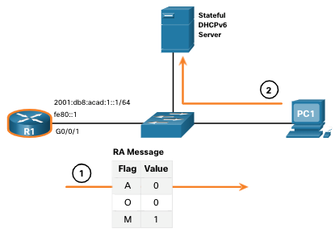

### Activer DHCPv6 avec état sur une interface

DHCPv6 avec état est activé à l'aide de la commande de configuration de l'interface `ipv6 nd managed-config-flag` définissant l'indicateur M sur 1.

Le résultat surligné dans l'exemple confirme que le RA dira à l'hôte d'obtenir toutes les informations de configuration IPv6 d'un serveur DHCPv6 ( indicateur M = 1).

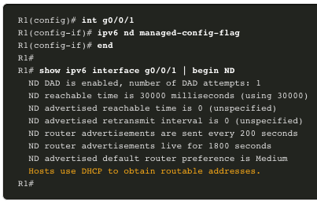

## 8.4 Configurer le serveur DHCPv6

### La configuration d'un routeur en tant que serveur DHCPv6 **sans** état

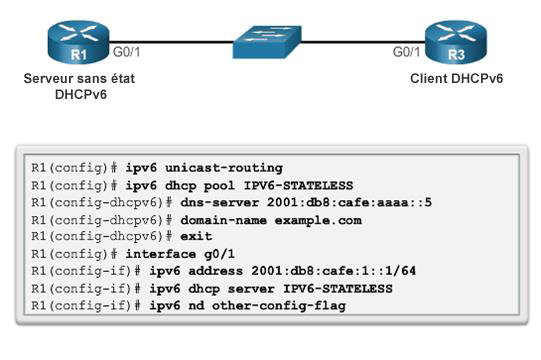

### La configuration d'un routeur en tant que client DHCPv6 **sans** état

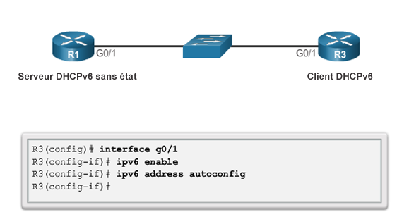

### La configuration d'un routeur en tant que serveur DHCPv6 **avec** état

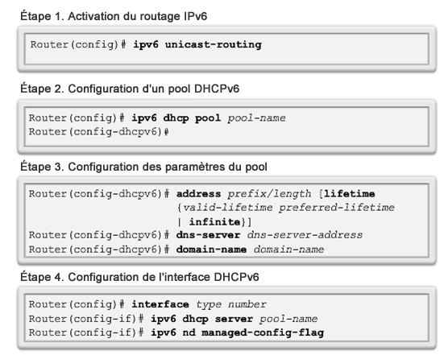
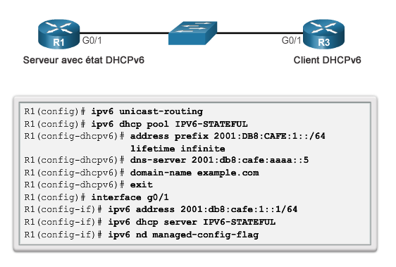

### La configuration d'un routeur en tant que client DHCPv6 **avec** état

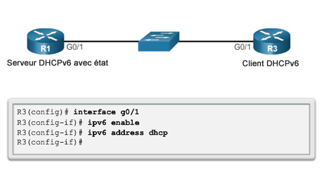

### Configuration d'un routeur en tant qu'agent de relais DHCPv6

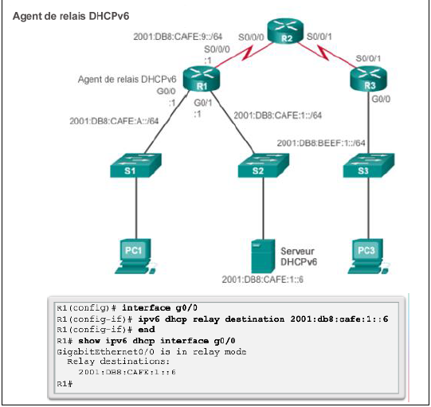
