# Présentation de Microsoft Graph

## Introduction (source : [Microsoft Learn])

Microsoft Graph est une passerelle qui vous permet d’accéder aux données et aux renseignements dans Microsoft 365. Elle fournit un modèle de programmabilité unifié qui vous permet d’accéder à la quantité impressionnante de données disponibles dans Microsoft 365, Windows et Enterprise Mobility + Security. Utiliser la richesse des données accessibles via Microsoft Graph pour créer des applications pour les organisations et les consommateurs qui interagissent avec des millions d’utilisateurs

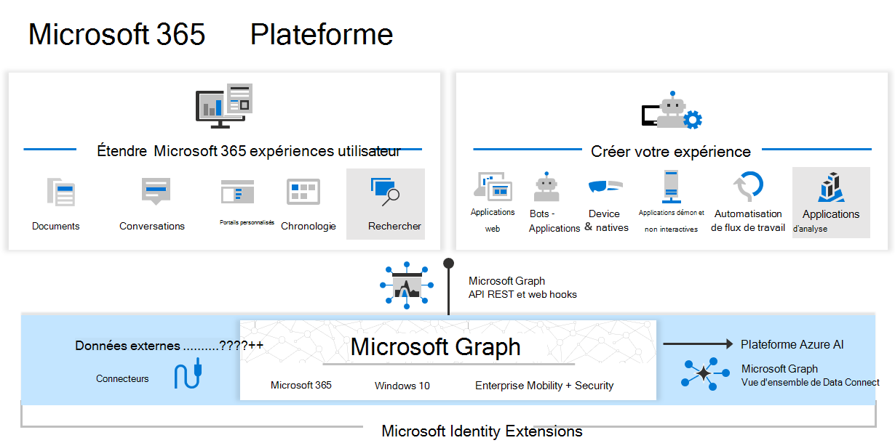

Il existe un point de terminaison unique à Microsoft Graph : [Microsoft Graph], permettant de regrouper toutes ses actions dans l'environnement Microsoft

"Ensemble, l’API Microsoft Graph, les connecteurs et Connexion aux données alimentent la plateforme Microsoft 365. Dans la mesure où vous avez la possibilité d’accéder aux données Microsoft Graph et à d’autres jeux de données, vous pouvez en extraire des insights et des analyses, vous pouvez étendre les expériences Microsoft 365 et créer des applications uniques et intelligentes."

## Nouveautés de Microsoft Graph

Microsoft Graph propose des **API REST** et des bibliothèques clientes pour accéder à des données sur les services cloud Microsoft suivants :

**Services principaux Microsoft 365** : Bookings, Calendrier, Delve, Excel, Microsoft 365 compliance eDiscovery, Microsoft Search, OneDrive, OneNote, Outlook/Exchange, Personnes (contacts Outlook), Planificateur, SharePoint, Teams, To Do, Viva Insights
    Enterprise Mobility + Security services : Advanced Threat Analytics, Advanced Threat Protection, Microsoft Entra ID, Identity Manager et Intune
    Services Windows : activités, appareils, notifications, Impression universelle
    Services Dynamics 365 Business Central

Pour en savoir plus, consultez [Principaux services et fonctionnalités dans Microsoft Graph].

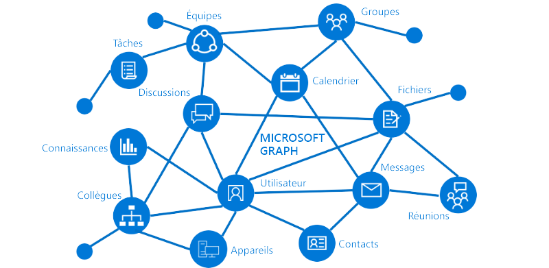

## Installation de Microsoft Graph SDK

### Pré-requis

**PowerShell 7** est conseillé pour utiliser Graph sur toutes les plateformes. Il n'y a pas d'autre prérequis à l'installation de **Graph SDK** sous cette version de PowerShell

Sous **Windows PowerShell**, il y a des prérequis :

- Avoir Windows PowerShell 5.1 minimum
- Installer .NET Framework 4.7.2 minimum
- Mettre à jour PowerShellGet vers la dernière version en utilisant : 
  
```powershell 
Install-Module PowerShellGet
```

- La restriction d'execution des scripts PowerShell doit être à `remote signed` ou moins restrictif en utilisant :
  
 ```powershell
Set-ExecutionPolicy -ExecutionPolicy RemoteSigned -Scope CurrentUser
```

Le SDK Microsoft Graph PowerShell se présente sous la forme de **deux modules**, Microsoft.Graph et Microsoft.Graph.Beta, que vous installerez séparément. Ces modules appellent respectivement les points de terminaison Microsoft Graph v1.0 et Microsoft Graph beta. Vous pouvez installer les deux modules sur la même version de PowerShell.

>[!CAUTION] 
L'installation des modules principaux du SDK, Microsoft.Graph et Microsoft.Graph.Beta, entraînera l'installation des 38 sous-modules de chaque module. Pensez à n'installer que les modules nécessaires, y compris **Microsoft.Graph.Authentication** qui est installé par défaut lorsque vous choisissez d'installer les sous-modules individuellement. Pour obtenir une liste des modules Microsoft Graph disponibles, utilisez `Find-Module Microsoft.Graph*`. Seules les cmdlets des modules installés seront disponibles.

Pour installer la v1 du module **Microsoft.Graph**, sur Windows PowerShell ou PowerShell Core, lancer la commande suivante.

```PowerShell
Install-Module Microsoft.Graph -Scope CurrentUser
```

En option, vous pouvez modifier l'**étendue de l'installation** à l'aide du paramètre -Scope. Cela nécessite des droits d'administrateur.

```PowerShell
Install-Module Microsoft.Graph -Scope AllUsers
```

Pour installer le module en beta, utilisez la commande suivante.

```PowerShell
Install-Module Microsoft.Graph.Beta
```

>[!NOTE]
Nous vous recommandons de toujours utiliser **Microsoft Graph v1.0** lorsque vous écrivez des scripts. Il est parfois nécessaire d'utiliser le point de terminaison bêta à des fins de test ou d'adoption anticipée avant qu'une fonctionnalité ne soit disponible dans la version 1.0. Le point de terminaison bêta de Microsoft Graph et toute fonctionnalité qui s'y trouve sont encore à **l'état d'avant-première** et peuvent changer. Les points de terminaison bêta ne sont donc pas fiables pour une utilisation en production, car ils peuvent interrompre des scénarios existants sans préavis.

L'installation du SDK dans une version de PowerShell ne l'installe pas dans l'autre. **Exécutez la commande d'installation dans la version de PowerShell dans laquelle vous avez l'intention de l'utiliser.**

### Vérification de l'installation

Lorsque l'installation est fini, il est possible de vérifier la version installée avec la commande suivante.

```PowerShell
Get-InstalledModule Microsoft.Graph
```

Pour vérifier les sous-modules installés et leurs versions, lancer la commande suivante :

```PowerShell
Get-InstalledModule
```

La version dans le résultat de la commande doit correspondre à la dernière version publiée sur la [PowerShell Gallery].

## Mettre à jour le SDK

Il est possible de mettre à jour le SDK et ses dépendances en utilisant la commande suivante.

```PowerShell
Update-Module Microsoft.Graph
```

## Désinstaller le SDK

Premièrement, utiliser la commande suivante pour désinstaller le module principal

```PowerShell
Uninstall-Module Microsoft.Graph -AllVersions
```

Puis, désinstaller toutes ses dépendances en utilisant les commandes suivantes.

```PowerShell
Get-InstalledModule Microsoft.Graph.* | ? Name -ne "Microsoft.Graph.Authentication" | Uninstall-Module
Uninstall-Module Microsoft.Graph.Authentication
```

## Se connecter à Microsoft Graph via PowerShell (source : [IT-Connect])

Lors de l'utilisation du module Microsoft Graph et du cmdlet Connect-MgGraph pour établir une connexion à votre tenant, vous avez le choix entre deux modes de connexion :

### Une connexion avec un accès délégué

Avec le mode **"accès délégué"**, il faut préciser les permissions dont vous avez besoin au moment de la connexion au tenant, et c'est en se connectant avec un compte qui a les droits que vous allez pouvoir créer cette délégation et permettre l'accès aux ressources.

### Une connexion avec un accès application

Avec le mode **"accès application"**, il est nécessaire d'**inscrire une nouvelle application** dans Entra ID afin de créer un **point de connexion**. Ensuite, il faudra accorder des autorisations à cette application pour que les scripts qui l'utilisent soient en mesure d'effectuer les actions déclarées dans votre code PowerShell. Pour se connecter via cette méthode, il faudra spécifier plusieurs informations : **ID du tenant**, **ID de l'application** et un **nom de certificat** ou **une empreinte de certificat** (qu'il faudra générer en amont).

## PowerShell : Microsoft Graph via l'accès délégué

Commençons par étudier le principe de connexion via **l'accès délégué**, à partir de la commande `Connect-MgGraph`. Je vous rappelle que cette commande sert à établir une connexion à Microsoft Graph via PowerShell.

Lors de la connexion à Microsoft Graph, il faut spécifier **un ou plusieurs scopes (étendues)** en fonction de ce que vous cherchez à effectuer. Afin de pouvoir utiliser les étendues sélectionnées, une délégation d'accès sera créée au moment de la connexion.

Par exemple, si l'on souhaite **récupérer la liste des utilisateurs de notre tenant**, on a besoin d'un **accès en lecture aux utilisateurs**. Cela se traduit par le nom d'étendue suivant :

`User.Read.All`

Dans le cas où l'on aurait besoin de **créer un nouvel utilisateur**, l'étendue serait différente puisqu'il faudrait des **droits d'écriture**. L'étendue à utiliser serait :

`User.ReadWrite.All`

Je vais vous donner quelques astuces par la suite pour identifier les étendues. Il faut savoir que l'on peut sélectionner plusieurs étendues, et que ce n'est pas anormal d'en sélectionner entre 5 et 10.

Continuons sur l'idée suivante : **récupérer la liste des utilisateurs, à partir de l'étendue "User.Read.All"**. La commande Connect-MgGraph à exécuter sera :

```powershell
Connect-MgGraph -Scopes "User.Read.All"
```

Cette commande va **ouvrir un navigateur sur votre machine** afin d'effectuer la connexion et d'accorder l'accès à l'application "Microsoft Graph PowerShell". Cela nécessite un accès avec des droits administrateur. Il faudra **accepter la requête**, comme sur l'exemple ci-dessous.

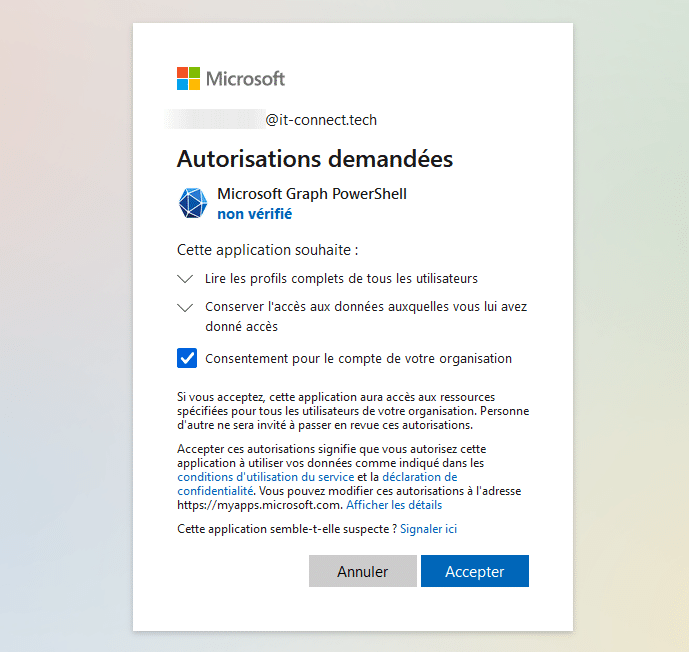

Ensuite, un message s'affiche pour indiquer que la fenêtre peut être fermée : Authentication complete. You can return to the application. Feel free to close this browser tab.

Retour dans la console PowerShell. Un message **"Welcome To Microsoft Graph!"** doit être visible !

Pour **lister les utilisateurs**, on va tout simplement utiliser cette commande :

```powershell
Get-MgUser

PS C:\Users\Administrateur> Get-MgUser

DisplayName         Id                                   Mail                             UserPrincipalName               
-----------         --                                   ----                             -----------------               
Alonso Balmasque    d04b0890-aef3-496e-bb26-c193b3056917 a.Balmasque@h122-16.lab-eni.fr   a.Balmasque@h122-16.lab-eni.fr  
Agnes Moitrankil    e9dfa9a3-6496-4759-a48d-fae80e1e4d72 a.Moitrankil@h122-16.lab-eni.fr  a.Moitrankil@h122-16.lab-eni.fr 
Globabl Admin       582ff086-8685-477c-aa72-460d48838ef0 admin@h122-16.lab-eni.fr         admin@h122-16.lab-eni.fr        
MOD Administrator   f22d7cdd-caef-4a0f-88e9-967570615160 admin@WWLx172224.onmicrosoft.com admin@WWLx172224.onmicrosoft.com
Brian May           16e6ba44-d234-4226-83df-d35c371660dd                                  B.May@h122-16.lab-eni.fr        
Daisy Drate         f22e4978-05dc-4679-b710-ac0078e709f3 d.Drate@h122-16.lab-eni.fr       d.Drate@h122-16.lab-eni.fr      
Freddie Mercury     38158011-a6e5-4494-91d6-3d326fd9d171                                  f.mercury@h122-16.lab-eni.fr    
Jean-Pierre Adressa 9c6e30b1-7821-41d9-b63d-91c7be5865a4 j.Adressa@h122-16.lab-eni.fr     j.Adressa@h122-16.lab-eni.fr    
John Deacon         111d5103-5dfe-47fd-bf88-a097850bfa18                                  J.Deacon@h122-16.lab-eni.fr     
Jean Tanrien        753ebc09-40b3-4904-ad6f-c501648d0184 j.Tanrien@h122-16.lab-eni.fr     j.Tanrien@h122-16.lab-eni.fr    
labeni              60dfdb04-35c9-403f-b74c-50a740bec38c                                  labeni@h122-16.lab-eni.fr       
Oussama LAIRBON     89c9951b-f901-40b1-a465-7df43447da26 oussama@h122-16.lab-eni.fr       oussama@h122-16.lab-eni.fr      
Roger Taylor        136c574f-fec1-4870-8a87-4bf5d3242286                                  R.taylor@h122-16.lab-eni.fr     
Sacha Touille       c350720b-1738-4cab-b74a-4f77a7767a7a                                  sacha@h122-16.lab-eni.fr        
Xavier Kafairgaf    92702c46-cb0b-4ed7-a199-d0adc72dcf91 x.Kafairgaf@h122-16.lab-eni.fr   x.Kafairgaf@h122-16.lab-eni.fr  
Yves Remord         03a12f39-1d05-48cc-ab84-c4c4ce897bd9 y.Remord@h122-16.lab-eni.fr      y.Remord@h122-16.lab-eni.fr     
Zachary Ramablag    b532204a-506c-4832-bfc9-da9450de3c8e zachary@h122-16.lab-eni.fr       zachary@h122-16.lab-eni.fr 
```

Si on essaye de lister les groupes présents, une erreur est retournée :

```powershell
Get-MgGroup

Get-MgGroup : Insufficient privileges to complete the operation.
Status: 403 (Forbidden)
ErrorCode: Authorization_RequestDenied
Date: 2024-02-27T13:41:33
...
```

En fait, nous n'avons **pas le droit** de lister les groupes puisqu'on n'a pas précisé l'étendue qui permet de lire les groupes au moment de la connexion.

Dans la console PowerShell en cours, on peut exécuter une seconde fois `Connect-MgGraph` pour ajouter l'étendue **"Group.Read.All"** qui permettra de lire les informations des groupes.

```powershell
Connect-MgGraph -Scopes "Group.Read.All"
```

Cela va venir **s'ajouter à la session déjà ouverte** et donc **conserver l'étendue "User.Read.All"**. Suite à l'exécution de cette commande, il faut de nouveau **approuver la connexion via le navigateur**. Désormais, on peut récupérer la liste des groupes.

La prochaine fois, **vous pouvez appeler directement les deux étendues** :

```powershell
Connect-MgGraph -Scopes "User.Read.All","Group.Read.All"
```

Du fait que cette méthode nécessite une interaction et une validation via le navigateur, **elle n'est pas faite pour être utilisée dans des scripts**. La seconde méthode que nous allons voir dès maintenant sera plus adaptée.

Juste avant cela, on va **se déconnecter proprement** de Microsoft Graph :

```powershell
Disconnect-MgGraph
```

## PowerShell : Microsoft Graph via l'accès application

Nous devons **inscrire une nouvelle application au sein d'Entra ID**, puis ensuite lui **accorder des autorisations**. Cette application sera notre point d'entrée avec PowerShell.

À partir du portail Identity, dans Entra ID, cliquez sur **"Inscriptions d'applications"** à gauche puis sur le bouton **"Nouvelle inscription"**.

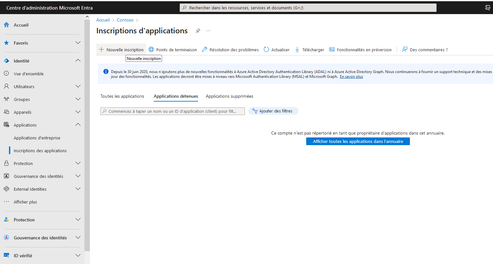

Donnez un nom à cette application, par exemple "Script-PowerShell-Graph". Conserver l'option "Comptes dans cet annuaire d'organisation uniquement" pour l'option "Types de comptes pris en charge" et pour l'URI de redirection, laissez vide.

Cliquez sur le bouton "S'inscrire".

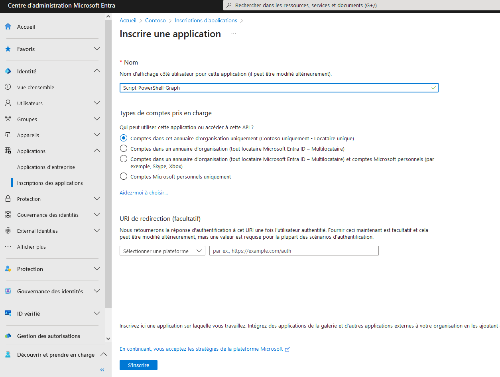

L'application est inscrite. Il y a deux informations qu'il faudra récupérer par la suite, car nous en aurons besoin lors de la connexion avec PowerShell : **ID d'applications (client)** et **ID de l'annuaire (locataire)**.

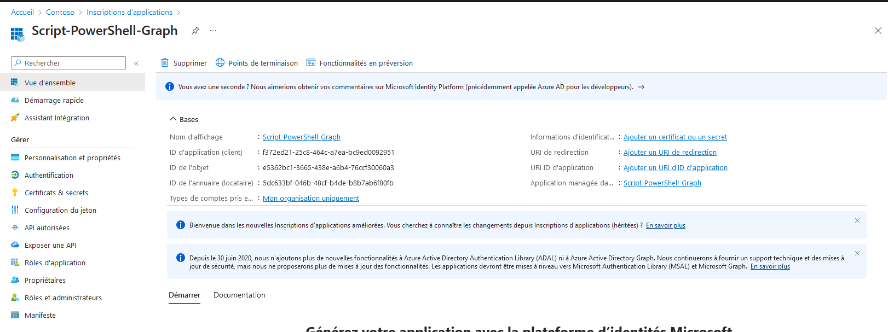

Désormais, nous devons accorder des autorisations à notre application

### Attribuer des autorisations Microsoft Graph à l'application

Toujours sur le portail Entra ID, au sein de notre application, cliquez sur **"API autorisées"** à gauche puis au centre sur **"Ajouter une autorisation"**.

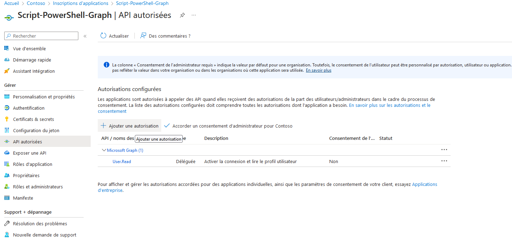

Nous souhaitons ajouter une autorisation **"Microsoft Graph"** et cela tombe bien c'est proposé directement.

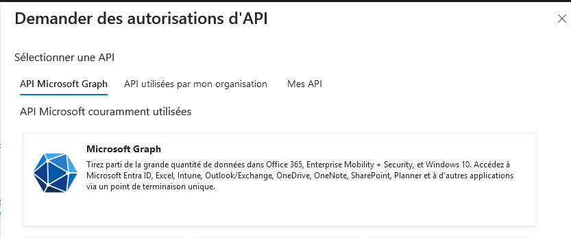

Cliquez sur **"Autorisations de l'application"**.

Ensuite, il faut rechercher les autorisations. Cela fonctionne sur le même principe que les étendues de la première méthode de connexion étudiée. Pour trouver l'autorisation qui permet de consulter la liste des groupes, il suffit de rechercher **"group"** et de cocher l'option **"Group.Read.All"**. Pour les utilisateurs, suivez le même principe.

Cliquez sur **"Ajouter des autorisations"** pour ajouter toutes les autorisations sélectionnées.

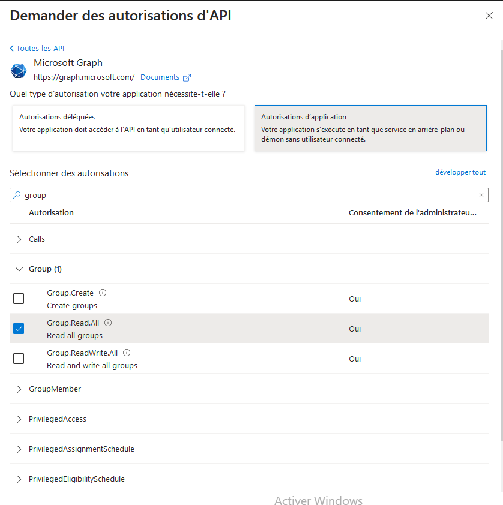

Il faut que l'on accorde un **consentement administration** au niveau de l'organisation pour pouvoir bénéficier de ces droits dans notre application, à savoir notre script PowerShell. Cliquez sur le bouton **"Accorder un consentement d'administrateur pour Contoso"** et validez.

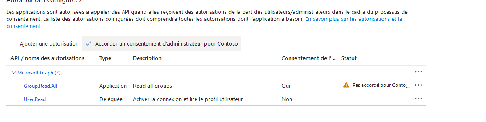

Passons à la troisième étape : la gestion du certificat.

### Générer un certificat auto-signé avec PowerShell

Nous allons créer un **certificat auto-signé** puis l'exporter au format CER puis PFX.

Le format **PFX** est intéressant pour transférer le certificat et sa clé privée sur un autre serveur : **une étape indispensable** si vous souhaitez vous authentifier auprès de votre application depuis plusieurs serveurs différents. Le certificat (et sa clé privée) devra être déployé sur chaque machine devant se connecter à l'application.

Grâce à la commande ci-dessous, nous allons créer un certificat auto-signé et le stocker dans le magasin de certificat personnel local. Remplacez seulement "Contoso" par le nom de votre organisation.

```powershell
$cert = New-SelfSignedCertificate -Subject "CN=Contoso" -CertStoreLocation "Cert:\CurrentUser\My" -KeyExportPolicy Exportable -KeySpec Signature -KeyLength 2048 -KeyAlgorithm RSA -HashAlgorithm SHA256
```

Ensuite, il faut exporter ce certificat sur notre machine, car il va falloir le charger sur Entra ID. En PowerShell toujours, c'est faisable avec la commande "Export-Certificate". Pour ma part, je l'exporte dans "C:\TEMP" mais adaptez le chemin dans la commande ci-dessous.

```powershell
Export-Certificate -Cert $cert -FilePath "C:\TEMP\contoso.cer"
```

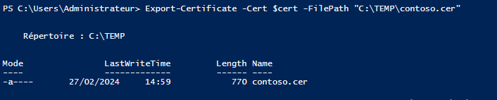

Si vous avez besoin d'**utiliser ce certificat sur d'autres serveurs** (ce qui sera le cas si un autre serveur doit s'authentifier sur Microsoft Graph via PowerShell), vous devez l'**exporter au format PFX**. Si vous n'avez pas ce besoin, vous pouvez ignorer les deux commandes qui suivent.

Commençons par créer un mot de passe pour la clé privée associée à notre certificat :

```powershell
$mdp = ConvertTo-SecureString -String "MotDePasse" -Force -AsPlainText
```

Ensuite, on **exporte au format PFX** avec `Export-PfxCertificate` en précisant le certificat via **$cert**, le mot de passe via **$mdp** et le chemin vers le **fichier de sortie au format PFX**.

```powershell
Export-PfxCertificate -Cert $cert -FilePath "C:\temp\Contoso.pfx" -Password $mdp
```

Une fois que c'est fait, il suffira de **copier le PFX** sur les autres serveurs et de l'importer. Pensez à **stocker le mot de passe de la clé privée** dans votre gestionnaire de mots de passe préféré...

Retournez sur l'interface **Entra ID**, toujours dans notre application, et cliquez sur **"Certificats & secrets"** sur la gauche. Ensuite, cliquez sur **"Télécharger le certificat"** et chargez le fichier CER. Validez et il va apparaître dans la liste des certificats comme ceci :

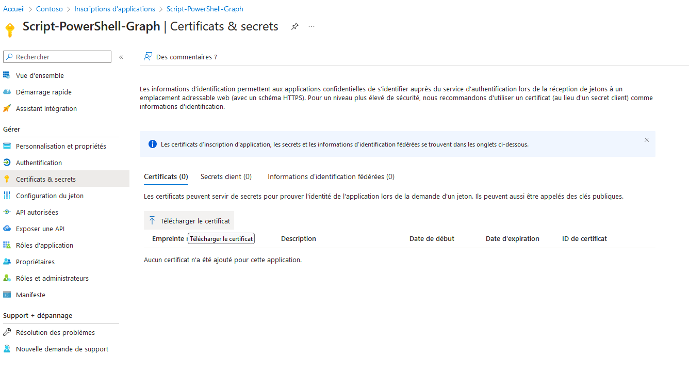

Copiez la valeur **"Empreinte numérique"** (Thumbprint), car nous allons en avoir besoin pour la suite.

### Connexion à Microsoft Graph avec le certificat

Voilà, la configuration est prête : nous allons pouvoir nous connecter à Microsoft Graph via PowerShell. Pour cela, il nous faut **trois informations** :

- L'ID d'applications (client) pour le paramètre `-ClientID`
- L'ID de l'annuaire (locataire) pour le paramètre `-TenantId`
- L'empreinte numérique du certificat pour le paramètre `-CertificateThumbprint`

Ce qui donne la commande `Connect-MgGraph` suivante :

```powershell
Connect-MgGraph -ClientID f372ed21-aaaaaa-aaaa-aaaaaaa-bc9ed0092951 -TenantId 5dc633bf-aaaaaaa-aaaaa-aaaaa-b8b7ab6f80fb -CertificateThumbprint 5B5EB9E5xxxxxxxxxxxxxxxx971D273879591
```

Exécutez cette commande, et là, c'est magique on est directement authentifié ! Aucune action n’est nécessaire, c'est la combinaison de ces trois valeurs (et la présence du certificat sur la machine) qui permet de s'authentifier sur Microsoft Graph.

En termes de droits, on est limité à ce qui est déterminé au niveau des autorisations de l'application. Si l'on ajoute des droits à notre application via le portail Entra ID, il faudra se déconnecter et se reconnecter pour que ce soit pris en compte.

```powershell
Disconnect-MgGraph
Connect-MgGraph -ClientID f372ed21-aaaaaa-aaaa-aaaaaaa-bc9ed0092951 -TenantId 5dc633bf-aaaaaaa-aaaaa-aaaaa-b8b7ab6f80fb -CertificateThumbprint 5B5EB9E5xxxxxxxxxxxxxxxx971D273879591
```

## Microsoft Graph : comment identifier les permissions ?

Sur le principe, Microsoft Graph est prometteur notamment sur la gestion très fine des permissions, mais cela peut rapidement devenir un casse-tête pour trouver les bonnes permissions. Je crois que chez Microsoft ils en ont conscience, car il y a un cmdlet qui permet de rechercher plus facilement des permissions : `Find-MgGraphPermission`

Si l'on souhaite obtenir toutes les permissions Microsoft Graph relatives à Microsoft Teams, on pourra exécuter la requête suivante (cela ne nécessite pas d'être authentifié auprès de Microsoft Graph).

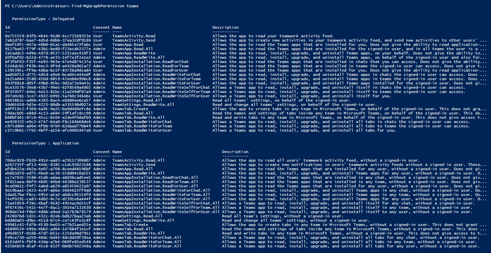

```powershell
Find-MgGraphPermission teams
```

Vous allez voir que cette commande retourne deux sections : **Delegated** pour l'accès délégué et **Application** pour l'accès application. En fonction de ce que vous recherchez, **précisez le type de permissions, car le nom peut varier** :

```powershell
Find-MgGraphPermission teams -PermissionType Delegated
```

ou

```powershell
Find-MgGraphPermission teams -PermissionType Application
```

Grâce à la sortie de cette commande et le filtre, on peut trouver plus facilement le nom des permissions. Pour les groupes, les utilisateurs, etc... On peut rechercher.

```powershell
Find-MgGraphPermission groups
Find-MgGraphPermission user
```

En complément, vous pouvez retrouver des informations sur cette page qui référence l'ensemble des permissions (un CTRL+F sera inévitable pour rechercher dans la page) :

- [Microsoft Docs - Référentiel des permissions]

Document rédigé grâce au site [Microsoft Learn] et [IT-Connect]

axid - 27/02/24

[Microsoft Learn]: https://learn.microsoft.com/fr-fr/graph/overvie
[Microsoft Graph]: https://graph.microsoft.com
[Principaux services et fonctionnalités dans Microsoft Graph]: https://learn.microsoft.com/fr-fr/graph/overview-major-services
[PowerShell Gallery]: https://www.powershellgallery.com/
[IT-Connect]: https://www.it-connect.fr/powershell-comment-se-connecter-a-microsoft-graph-api/
[Microsoft Docs - Référentiel des permissions]: https://docs.microsoft.com/fr-fr/graph/permissions-reference?WT.mc_id=AZ-MVP-5004580
