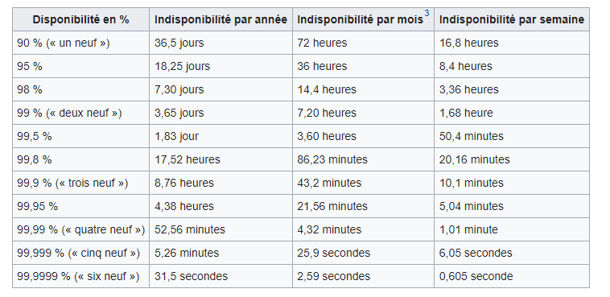

# Concept, enjeux et définition

- Concept & enjeux
- Bonnes pratiques
- Sauvegarde et archivage
- Restauration
- Disponibilité
- Règle 3 2 1
- PCA / PRA / Plan de sauvegarde

## Concepts

L’objectif des sauvegardes est de :

- garantir la pérennité des données
- assurer la récupération des informations indispensables au
fonctionnement du système d’information à la suite d’un incident ou
d’un sinistre
- répondre aux demandes de disponibilité des données

## Enjeux

- Prévenir la perte de données
- Avoir un plan de secours en cas de défaillance matérielle ou logicielle
- Garantir la rétention des données réglementaires
- Avoir une protection contre les cyberattaques
- Prévenir l'intrusion, l'incendie ...

## Bonnes pratiques

- Créer un compte dédié à la sauvegarde sur votre AD :
  - plus sécurisé, ce compte n’a aucune permission NTFS sur les dossiers
à sauvegarder
  - en cas de problème, il procure une meilleure traçabilité dans les logs
- Pour les clients Windows, utiliser le groupe **opérateur de sauvegarde**
qui permet de sauvegarder et restaurer des fichiers sans condition
d'accès aux fichiers en lecture ou écriture.
- Renseigner et générer un plan de sauvegarde.

## Sauvegarde et Archivage

Ne pas confondre ces deux notions : **Sauvegarde ≠ Archivage**

### Sauvegarde

Opération qui consiste à dupliquer et à conserver de manière sécurisée
des données d’un système d’information sur un support de stockage
autre que celui qui les contient actuellement afin d'en assurer et d'en
garantir la disponibilité même en cas d’incident ou d’erreur de
manipulation portant atteinte à leur intégrité.

### Archivage

- Processus qui gère la conservation des données de production,
applicatives ou systèmes pour des raisons juridiques, fiscales,
administratives, sociales ou opérationnelles.
- La conservation des équipements logiciels et matériels nécessaires à
la bonne exploitation des archives fait également partie du périmètre
de l'archivage

## Restauration (définition Wikipédia)

La "restauration de données" ou "récupération de données" est une
opération qui consiste à **retrouver les données perdues** à la suite d'une
erreur humaine, une défaillance matérielle, un accident ou au moment
opportun d'un test de récupération de données défini dans une procédure de
stratégie de sauvegarde et d'archive (également appelé **plan de sauvegarde**).
La difficulté de la restauration de données varie beaucoup, pouvant être une
simple formalité ou, au contraire, un défi technologique.
Des logiciels spécifiques existent et plusieurs entreprises se spécialisent dans le domaine.

## Disponibilité

Notion basée sur la probabilité qu’un système informatique soit en
état de fonctionner correctement à un instant donné. L’évaluation de
la disponibilité du SI s'exprime en pourcentage

**Disponibilité = MTBF / (MTBF + MTTR)**

**MTBF** *(Mean Time Between Failure)* : mesure du temps estimé entre 2
défaillances d’un élément du système.

**MTTR** *(Mean Time to Resolution)* : mesure du temps estimé pour
restaurer l’élément en cas d’incident.

## Disponibilité en pourcentage

## Règle 3-2-1

## PCA, PRA

### PCA : Plan de Continuité d'Activité

Regroupe tous les processus mis en place avant et après une
situation de crise, il concerne :

- Le rétablissement du système d'information
- La gestion de la communication interne et externe
- Le repli physique des utilisateurs
- La gestion de la sécurité et des risques sanitaires
- La gouvernance de la gestion de crise

>[!NOTE]
   >
   >Le PCA englobe toute l'entreprise, pas seuelement le SI.

### PRA : Plan de Reprise d'Activité

Regroupe l'ensemble des procédures et moyens
nécessaires à la
continuité du système d'information, il comprend :

- La politique ou plan de sauvegarde
- La gestion du stockage des éléments nécessaires à la restauration
- La procédure de restauration du système et des données
- Les licences des différentes application utilisées

>[!NOTE] 
Le **plan de reprise d'activité** n'est qu'une des composantes du **plan de continuité d'activité**.

>TP1 - Mise en place de l'environnement
