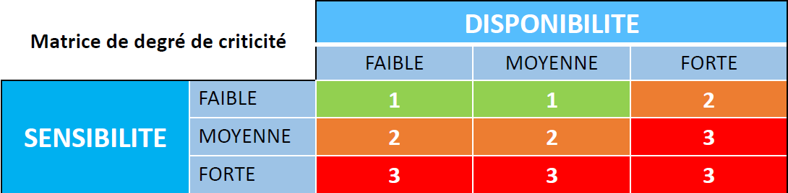
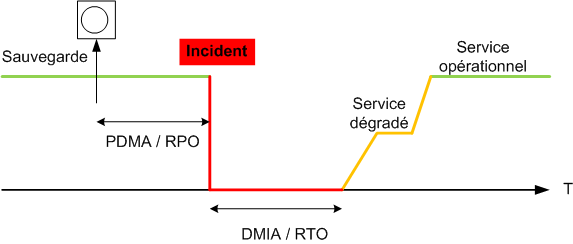
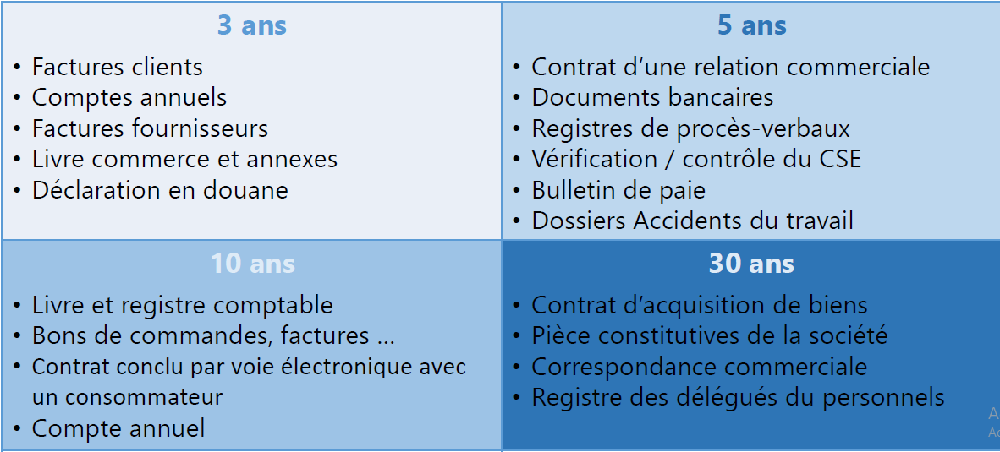
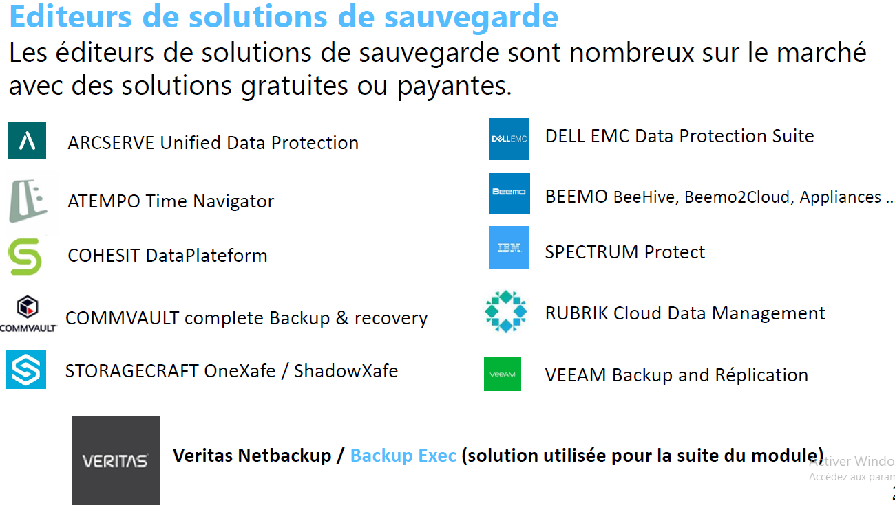
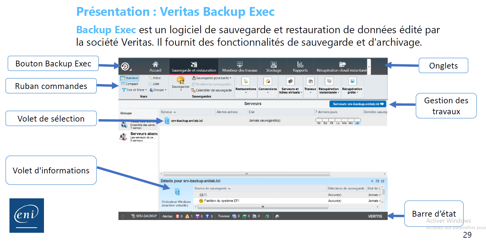

# Module 2 - Le plan de sauvegarde

- Plan de sauvegarde
- Périmètre de sauvegarde
- Périmètre du Système d’information
- Niveau de criticité des données
- La tolérance aux pertes
- Fenêtre, fréquence et périodicité
- Editeur de solutions de sauvegarde
- VERITAS Backup Exec
- VEEAM Backup & Réplication
  
## Le plan de sauvegarde

Le plan de sauvegarde est une **procédure** qui détaille les **données**
informatiques qui doivent être sauvegardées, l' **infrastructure** de sauvegarde, le **calendrier** des copies à réaliser et les **méthodes** de récupération et
restauration.

Il intègre
*a minima* les éléments suivants :

- Le périmètre (liste des ressources à sauvegarder)
- Les contraintes
- Les différents types de sauvegarde
- La fréquence/périodicité des sauvegardes
- Les informations de stockage
- Les procédures de test de restauration
- La destruction des supports ayant contenu les sauvegardes

## Le périmètre de sauvegarde (quelles données sauvegarder ?)

Identifier le périmètre passe par un inventaire des éléments à sauvegarder :

- Documents / Fichiers
- Bases de données
- Systèmes d’exploitation
- Applications, courriels, etc.

## Le périmètre du système d'information

- Les applications *(OS, suites bureautiques, logiciels métiers...)*
- Les serveurs / l'environnement réseau
- Les postes de travail informatique *(fixes ou nomades)*
- Toutes les informations détenues par l'entreprise *(BDD, fichiers…)*

## Niveau de criticité des données

Identifier les données vitales, qui mettent en péril l’entreprise l’activité en cas d'indisponibilité.

Le classement de criticité est basé sur deux caractéristiques :

- <u>La sensibilité de l'information</u> : confidentiel, unique et difficile à reconstituer en
opposition aux informations de routine, de confort.
- <u>La disponibilité de l'information</u> : fréquence et urgence

## La tolérance aux pertes

**PDMA** (**P**erte de **D**onnées **M**aximale **A**dmissible) / **RPO** (**R**ecovery **P**oint **O**bjective)

Quantifie les données qu'un système d'information peut être amené à perdre
suite à un incident. Elle correspond à la durée e ntre l’incident provoquant la
perte de données et la date la plus récente des données qui seront utilisées
en remplacement des données perdues.

## La tolérance aux pannes

**DMIA** (**D**urée **M**aximale d'**I**nterruption **A**dmissible) / **RTO** (**R**ecovery **T**ime **O**bjective)

Constitue le temps maximal acceptable durant lequel une ressource peut ne pas
être disponible après une interruption du service.
Dans le cadre de la sauvegarde cela correspond au temps maximal accepté de
restauration des données.

## Fenêtre de sauvegarde

Désigne la
**plage de temps** durant laquelle le **processus de sauvegarde** se
déroule :

- Définir quand les **accès*** utilisateurs et applicatifs sont les plus
**restreints** : nuit, week end...
- **Limiter** au maximum l'**impact** de performance des serveurs et du
réseau.

## Fréquence ou périodicité de sauvegarde

Définie en fonction de plusieurs paramètres liés au contexte de l'entreprise
ou aux éléments suivants :

- La tolérance aux pertes en cas de sinistre (PDMA)
- Le volume de données à sauvegarder
- La vitesse d'évolution des données
- Le coût engendré par le processus de sauvegarde

## Durée de rétention des données

Certaines données ont une durée légale de conservation : les sauvegardes
permettent de garantir cette rétention, cela viendra questionner le choix
des supports de stockage.

## Éditeurs de solutions de sauvegarde

## Présentation du logiciel Veritas Backup Exec

### Onglets

- **Accueil** : Offre un accès rapide aux informations de Backup Exec
- **Sauvegarde et restauration** : Créez un travail de sauvegarde ou de
restauration.
- **Moniteur des travaux** : Surveillez et gérez les opérations.
- **Stockage** : Configurez le stockage, exécutez des opérations de stockage et
gérez les médias.
- **Rapports** : Rapports relatifs au serveur Backup Exec
- **Ruban de commande** : Contient les commandes d'actions qui varient en fonction de chaque onglet.
- **Volet de sélection** : Sélectionnez les éléments avec lesquels vous souhaitez travailler.
- **Gestion des Travaux** : Permet d'accéder à la gestion de toutes les opérations pour le serveur sélectionné.
- **Volet Détails** : Les détails supplémentaires s'affichent pour le serveur sélectionné.
- **Barre d'état** : Fournit des informations au sujet du serveur Backup Exec , des travaux qui sont en cours d'exécution ou sont planifiés, des alertes et des services.
- **Actualiser** : Cliquez sur F5 pour réactualiser l'interface utilisateur de la console d'administration.

## Etape pour la sauvegarde d'un serveur :

### 1. Ajout d'un magasin de stockage

- Onglet "Stockage" Stockage" ==> "configurer le stockage"
- Valider l'assistant en fonction du type de stockage souhaité
  
### 2. Ajout du serveur à sauvegarder

- Onglet "sauvegarde et restauration"
- Clic droit dans l'espace vide du "volet de sélection" ==> "ajouter
un serveur"
- Valider l'assistant en fonction du type du serveur cible
  
### 3. Mise en place du job de sauvegarde

- Onglet "sauvegarde et restauration" => =>"Sauvegarder"
- Valider l'assistant en fonction du type de sauvegarde à réaliser

>TP2 - Installation et configuration de Veritas Backup-Exec
