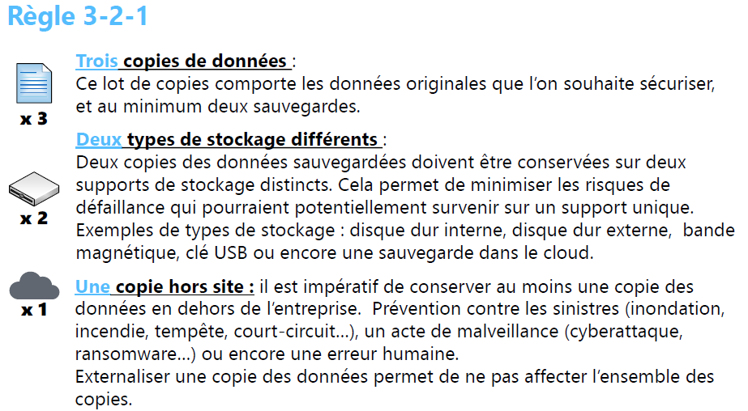
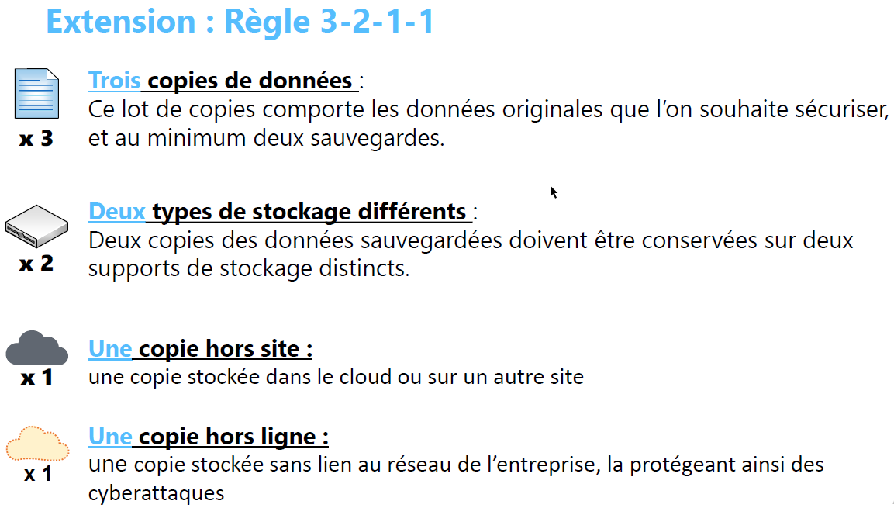
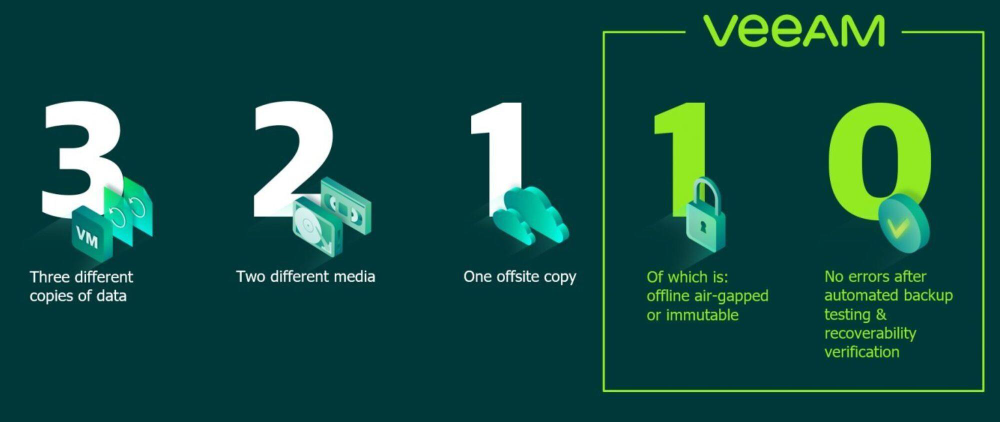
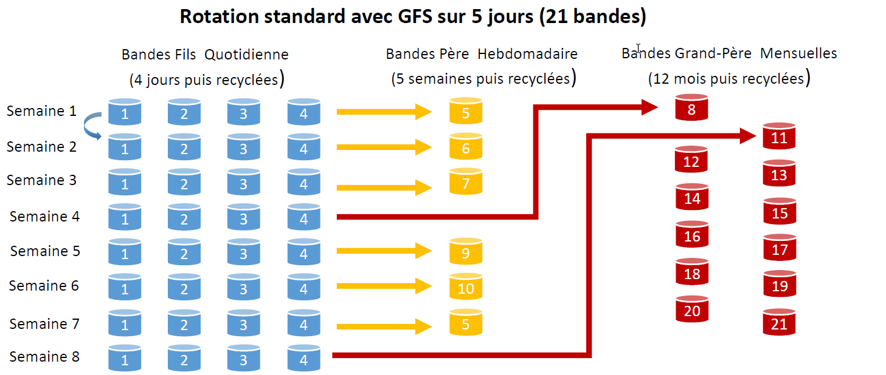
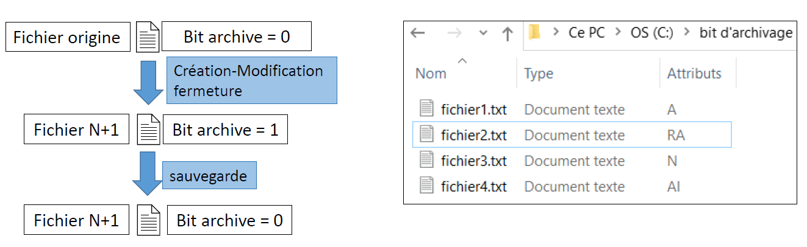
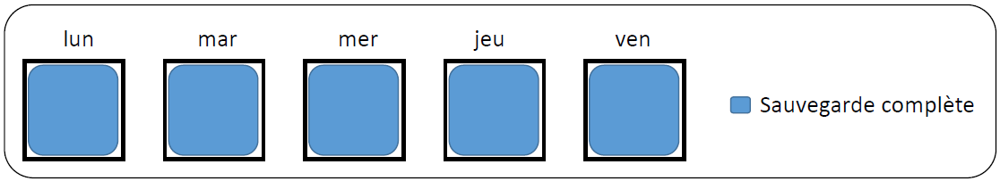
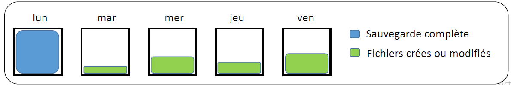
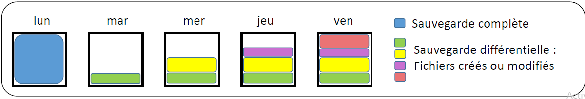
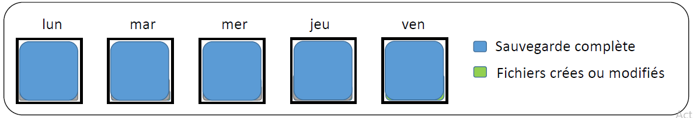
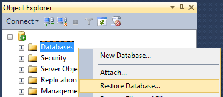

# Module 03 – Type de sauvegarde et impact de la restauration

- Rappel 3.2.1
- Rotation des supports et Système GPF
- Sauvegarde à chaud, à froid
- Méthodes de sauvegardes (bit d’archivage, système date)
- Complète, incrémental, différentielle
- Restauration

## Rappel : Règle 3-2-1



## Extension : Règle 3-2-1-1



## La vision VEEAM : Règle 3-2-1-1-0

### Ajout de la notion **Zéro** erreurs



## Rotation des supports de sauvegard

### Scénario de sauvegarde traditionnel GPF (Grand-père/Père/Fils)

#### En anglais : **GFS** *(Grand-father/father/son)*

La rotation Grand-père/Père/Fils est la planification de rotation des médias la plus couramment utilisée :

- Support quotidien ➔ Fils
- Support hebdomadaire ➔ Père
- Support mensuel ➔ Grand-Père
- Une stratégie de rotation **GFS** sur 5 jours nécessite environ 21 bandes par an.
- Une stratégie sur 7 jours nécessite environ 23 bandes par an (deux bandes quotidiennes de plus).

➢ Pour ces deux planifications, le nombre de médias nécessaires varie selon les
critères de conservation spécifiés et le nombre de données sauvegardées.



## Sauvegarde à chaud et à froid

Lors du processus de sauvegarde, les données peuvent être accessibles aux utilisateurs ou non.

### Sauvegarde à chaud

Les données sont sauvegardées en même temps qu'elles sont utilisées par l'utilisateur :

<span style="color:green">**+ Immédiatement accessibles**</span>

<span style="color:green">**+ Facilement modifiables**</span>

<span style="color:red">**- Mise en oeuvre complexe**</span>

### Sauvegarde à froid

L'utilisateur n'a pas accès aux données durant tout le processus de sauvegarde :

<span style="color:green">**+ Mise en oeuvre simple**</span>

<span style="color:green">**+ Facile à restaurer**</span>

<span style="color:red">**- Interruption du service le temps de la sauvegarde**</span>

## Méthodes de sauvegardes

Il existe plusieurs méthodes de sauvegarde, chacune des méthodes définies ci-après fonctionne avec des attributs de fichiers spécifiques, attribut d'archive : Microsoft, ... ou attribut date : Unix, ...

- <u>Système de Date</u>

Beaucoup plus simple que le bit d'archivage, une comparaison est réalisée entre la date de création, ou de modification, et la date de la dernière sauvegarde.

- <u>Attribut d'archive : Le bit d'archivage</u>



- <u>Sauvegarde Complète</u>

Copie l'ensemble des fichiers et dossiers d'un système : impact sur le stockage important.

- <u>Sauvegarde Incrémentale</u>

L'incrémentale effectue d'abord une première copie complète et chaque sauvegarde suivante prendra en compte les modifications apportées depuis la sauvegarde précédente (complète ou différentielle).

- <u>Sauvegarde Différentielle</u>

La différentielle effectue d'abord une première copie complète et chaque sauvegarde suivante prendra en compte les modifications apportées depuis la dernière sauvegarde Complète.

### <u>Sauvegarde Complète</u>

Sauvegarde la totalité des fichiers, modifiés ou non. Elle est la base de toute solution de sauvegarde.

#### Fonctionnement

• Ne se base pas sur l'attribut pour savoir quoi sauvegarder, elle sauvegarde tout !
• Modifie l'attribut en fin de sauvegarde pour marquer le fichier



#### Avantages

- Restauration rapide et simple
- Sauvegarde la plus fiable
- Permet de supprimer très facilement les anciennes sauvegardes

#### Inconvénients

- Très gourmant en espace de stockage si l'on souhaite garder les anciennes sauvegardes
- Les fichiers qui n'ont pas été modifiés seront sauvegardés plusieurs fois

### <u>Sauvegarde Incrémentale</u>

La sauvegarde incrémentale, sauvegarde les données modifiées ou ajoutées depuis la dernière sauvegarde complète puis incrémentale.

#### Fonctionnement

- Prend tous les fichiers ayant leurs attributs Archive à 1
- Après la sauvegarde l'attribut est remis à 0.



#### Avantages

- L'espace de stockage
- Le temps de sauvegarde
- La consommation de la bande passante

#### Inconvénients

- Temps
- Complexité et fiabilité de la restauration des données

### <u>Sauvegarde Différentielle - cumulative ou T1</u>

Sauvegarde les données modifiées ou ajoutées depuis la dernière sauvegarde complète appelée "Base différentielle".

#### Fonctionnement

- Prend tous les fichiers ayant leur attribut Archive à 1.
- Après la sauvegarde l'attribut n'est pas remis à 0, méthode dite 
cumulative.



#### Avantages

- Restauration simple et rapide
- Temps de sauvegarde modéré
- Plus fiable qu'une sauvegarde  incrémentielle

#### Inconvénients

- Plus lente et couteuse qu'une sauvegarde incrémentielle
- Pas de rémanence sur les fichiers si un seul support de sauvegarde est utilisé
  
### Sauvegarde Incrémentielle Inversée

Elle se base sur une incrémentielle, mais va construire une sauvegarde complète chaque jour (ou à chaque occurrence)

#### Fonctionnement

- Sauvegarde en mode incrémentielle
- les données sont ensuite  fusionnées avec la sauvegarde antérieure
- Cela crée une sauvegarde complète « reconstruite ».



#### Avantages

- Rapidité d’accès aux sauvegardes car la plus proche est une complète
- Consommation de stockage identique à celle du mode incrémentielle
- La consommation de la bande passante

#### Inconvénients

- Temps et ressources machines supplémentaires pour la fusion des sauvegardes

### Méthodes de sauvegarde : synthèse

|Méthode de sauvegarde    | Données sauvegardées                                                | Temps de sauvegarde | Temps de restauration | Espace disque occupé | Atouts                  | Limites                            |
|:--------------------------:|:---------------------------------------------------------------------:|:----------------------:|:----------------------:|:----------------------:|:-------------------------:|:------------------------------------:|
| Sauvegarde complète      | Toutes                                                              | Lent                 | Rapide               | Élevé                | Fiabilité               | Espace de stockage important      |
| Sauvegarde incrémentale | Uniquement les données modifiées par rapport à la précédente sauvegarde | Rapide               | Modéré/long         | Le plus faible       | Volume de sauvegarde réduit | Nécessite toutes les sauvegardes |
| Sauvegarde différentielle| Uniquement les données modifiées depuis la précédente sauvegarde complète | Modéré            | Rapide               | Modéré               | Restauration à partir de la dernière sauvegarde |Sauvegarde volumineuse |
| Sauvegarde incrémentielle inversée                                 | Toutes               | Modéré               | Rapide               | Plus faible             | Une sauvegarde complète au plus proche des données de production | Performance supplémentaire pour reconstruire les backups full.|

## Restauration

La restauration d'éléments, que ce soit un fichier, une application, une base de données, ou un système complet est la finalité de tous plan de sauvegarde.

>[!CAUTION]
>On n'a jamais de problème de sauvegarde, que des problèmes de restauration !

Les sauvegardes que l'on réalise doivent **OBLIGATOIREMENT ÊTRE TESTÉE** à intervalle régulier.

Un plan de sauvegarde ne sera considéré comme complet qu'après avoir effectué ces tests.

### <u>La restauration à la demande</u>

Concerne des fichiers perdus, effacés ou altérés. Plusieurs possibilités 
sont disponibles :

- Restaurer sur l'original (risque de perte des données actuelles)
- **Restaurer sur un emplacement différent** du même système
  - Protection contre l'écrasement
  - Le plus couramment utilisé
- Restaurer sur un autre système
  - Contrôle avant retour en production
  - Palier des problèmes de stockage
  - Restauration complète de machines virtuelles
- Restaurer une ancienne version via le **versionning**

### <u>La restauration d'une base de données</u>

Il n'y a pas de règle, chaque type de BDD dispose d’une ou plusieurs méthodes de restauration qui lui est propre. Exemples :

- Base SQL Server => restauration via SQL Server Management Studio



- Base MySQL => restauration via l'import d'un fichier DUMP.sql

```bash
mysql user= mon_user password mon_password < fichier_source.sql
```

- Base Oracle => restauration des fichiers depuis une sauvegarde à froid ; import datapump ; utilisation de RMAN...

### <u>La restauration du système d'exploitation complet d'un serveur</u>

Les solutions utilisant une méthode appelée **Bare-Metal-Recovery** permettent la reconstruction d’un système complet à partir d’une nouvelle unité de disques

#### <u>Condiditons et étapes</u>

1. Architecture cible identique à l’architecture source
2. Restauration de l'image de sauvegarde
3. Restauration des données correspondant au Delta entre la création de l'image source et la date de la restauration

>TP3 - Mise en place d'un plan de sauvegarde : Sauvegarde / Restauration