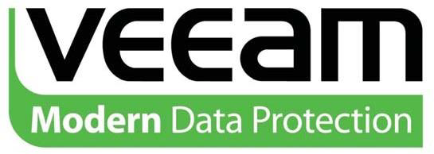
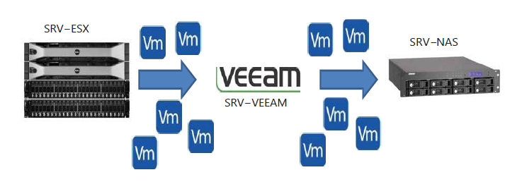
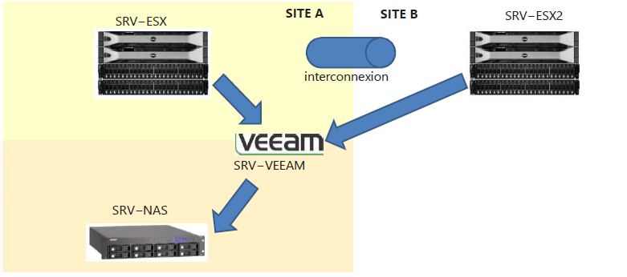
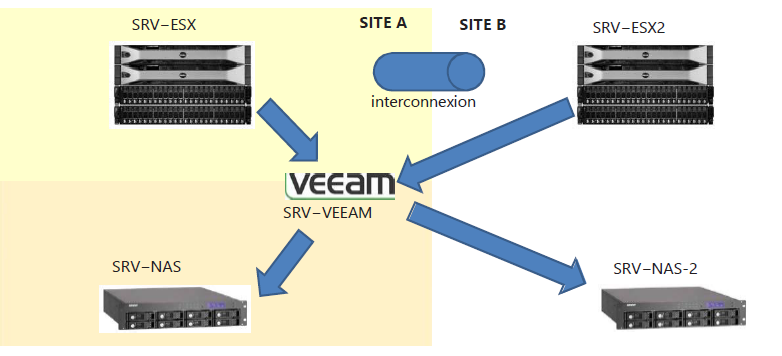
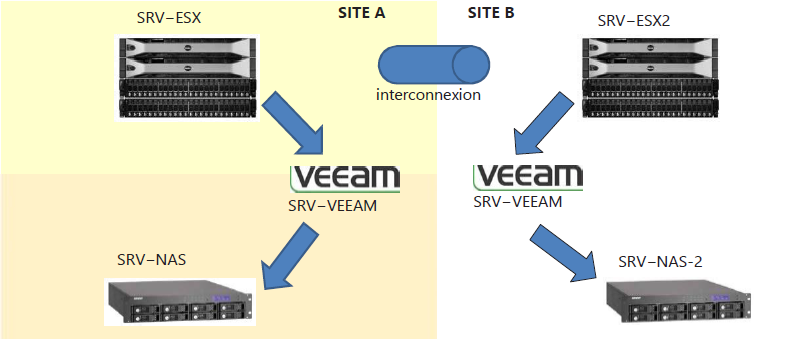
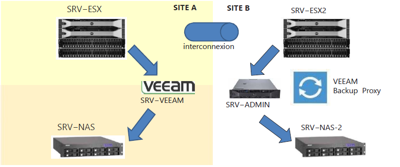
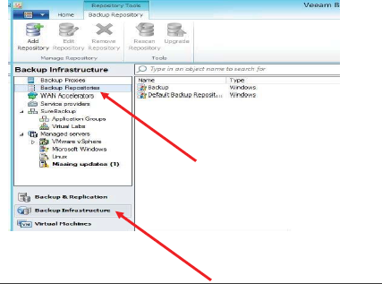
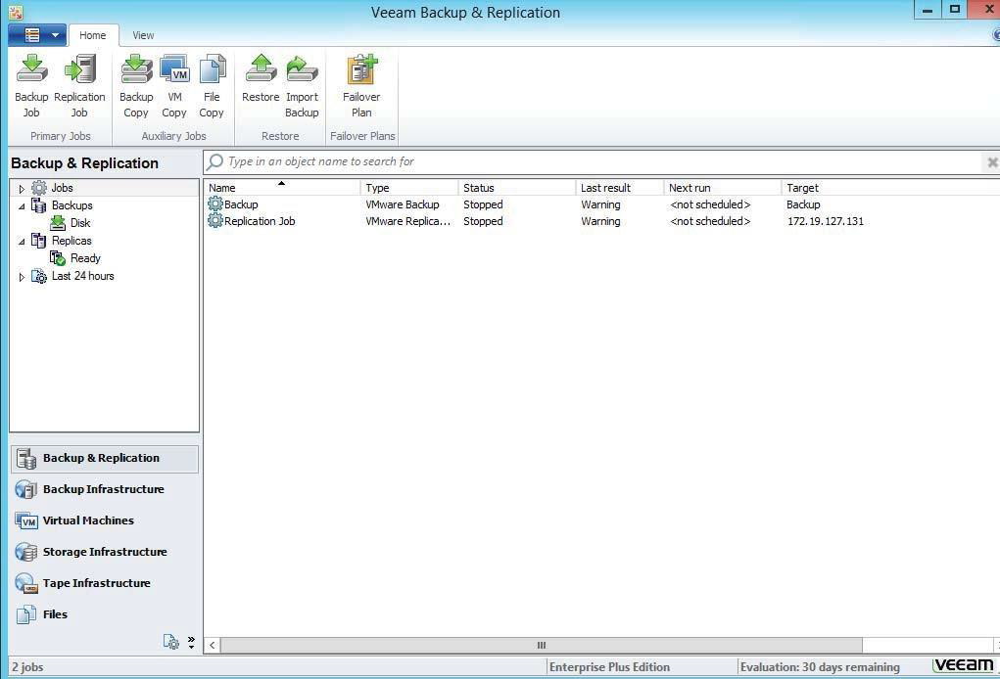
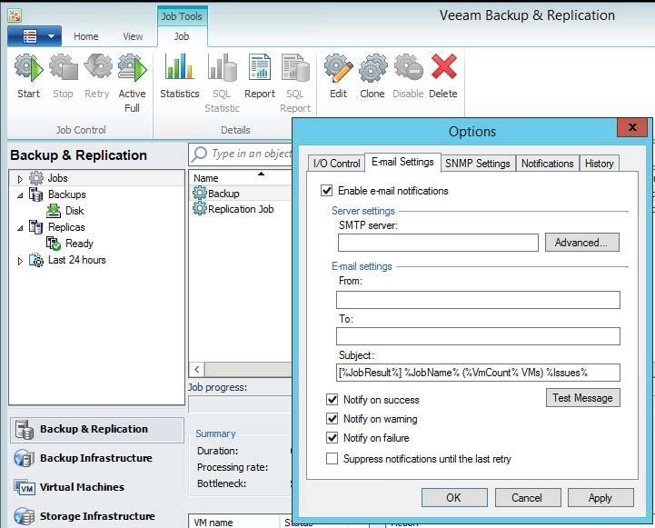

# Module 4 - Sauvegarder des machines virtuelles sous Veeam

- **Veeam Backup & Replication** est un logiciel de sauvegarde des données et de reprise d’activité pour les machines virtuelles **VMware vSphere** et **Microsoft Hyper−V**.
- Prise en charge du protocole **VSS** pour la sauvegarde de bases de données Microsoft (protocole de snapshot de Microsoft)
- De nombreuses fonctionnalités de sauvegarde sont prises en charge

>[!IMPORTANT]
**Point faible** : Le protocole de VSS de Microsoft est instable et peut amener des conflits avec le protocole de VSS de Veeam

## Veeam Backup & Replication dans un cadre multi-site

- Rapatrier les sauvegardes de l'ESXi du site B vers le site A par l'intermédiaire du lien WAN.

- Mise en place d'un NAS supplémentaire sur le site et utilisation du serveur Veeam du site A

- On pourrait potentiellement ajouter un serveur Veeam sur le deuxième site,  entraînant par la même occasion un surcoût de licences

## Backup Veeam

- Avant toute chose, il faudra définir les différents supports de stockage dans la  partie Backup Repositories et les assigner.
  - Disques locaux
  - Partages NFS
  - Partages CIFS / SMB
  - Disques durs externes...

- Il est possible de :
  - Sauvegarde l’intégralité des VM
  - Exclure certains disques
  - Choisir le mode de Backup
    - Incremental
    - Reverse Incremental

### Mise en place des Jobs

- La configuration des alertes mail permet d’envoyer des rapports pour les Backups et Réplications (module 08).

> TP4 - Sauvegarde/Restauration avec Veeam